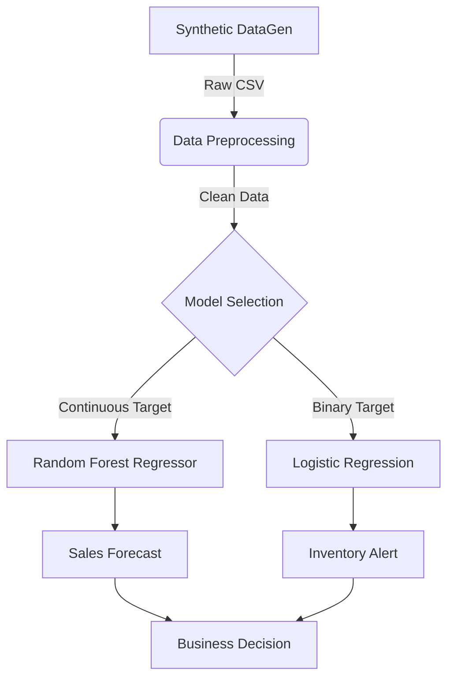

# Capstone Project: Amazon Sales Prediction & Demand Analysis

## Overview
This Capstone Project addresses a critical challenge in e-commerce: **Inventory Optimization**. By predicting future sales sales volume and classifying high-demand days, businesses can avoid stockouts and reduce storage costs.

### Research Goals
1.  **Regression:** Predict the exact number of units sold based on Price, Marketing Spend, and Promotions.
2.  **Classification:** Flag days as "High Demand" to trigger automated restocking alerts.

## Key Formulas & Metrics

### 1. Regression Evaluation
To measure the accuracy of our sales predictions.

*   **Mean Squared Error (MSE):** The average squared difference between predicted and actual sales.
$$ MSE = \frac{1}{n} \sum_{i=1}^{n} (y_i - \hat{y}_i)^2 $$

*   **R-squared ($R^2$):** The proportion of variance in sales explained by the model.
$$ R^2 = 1 - \frac{\sum (y_i - \hat{y}_i)^2}{\sum (y_i - \bar{y})^2} $$

### 2. Logistic Regression (Classification)
Used for the "High Demand" binary classification. It estimates the probability $P(y=1)$ using the **Sigmoid Function**:

$$ \sigma(z) = \frac{1}{1 + e^{-z}} $$
*   **Pronunciation:** "Sigma of z comes to one over one plus e to the negative z."

## System Architecture



## Code for Learning

### 1. Synthetic Data Generation
If you don't have the Kaggle dataset, run this to generate your own training data.

```python
import pandas as pd
import numpy as np

# Reproducible results
np.random.seed(42)
n_samples = 1000

# Generate Features
data = {
    'Date': pd.date_range(start='2023-01-01', periods=n_samples, freq='D'),
    'Price': np.random.uniform(10, 100, n_samples).round(2),
    'Marketing_Spend': np.random.uniform(50, 5000, n_samples).round(2),
    'Discount': np.random.choice([0, 0.10, 0.20], n_samples),
    'Promotion': np.random.choice([0, 1], n_samples)
}
df = pd.DataFrame(data)

# Generate Target (Units Sold)
# Logic: Sales go UP with Marketing/Promo, DOWN with Price
base_demand = 50
df['Units_Sold'] = (
    base_demand + 
    (df['Marketing_Spend'] * 0.05) - 
    (df['Price'] * 1.5) + 
    (df['Discount'] * 200) + 
    (df['Promotion'] * 20) +
    np.random.normal(0, 10, n_samples) # Add Noise
).astype(int).clip(lower=0)

# Create "High Demand" Flag (Top 30% of sales days)
threshold = df['Units_Sold'].quantile(0.70)
df['High_Demand'] = (df['Units_Sold'] > threshold).astype(int)

print(df.head())
```

### 2. Model Training Loop
Training both models in one pipeline.

```python
from sklearn.model_selection import train_test_split
from sklearn.ensemble import RandomForestRegressor
from sklearn.linear_model import LogisticRegression
from sklearn.metrics import mean_squared_error, accuracy_score

# Features (X) and Targets (y)
X = df[['Price', 'Marketing_Spend', 'Discount', 'Promotion']]
y_reg = df['Units_Sold']
y_class = df['High_Demand']

# Split Data
X_train, X_test, y_reg_train, y_reg_test, y_class_train, y_class_test = train_test_split(
    X, y_reg, y_class, test_size=0.2, random_state=42
)

# 1. Train Regressor
rf_model = RandomForestRegressor(n_estimators=100)
rf_model.fit(X_train, y_reg_train)
reg_preds = rf_model.predict(X_test)
print(f"Regression RMSE: {np.sqrt(mean_squared_error(y_reg_test, reg_preds)):.2f}")

# 2. Train Classifier
lr_model = LogisticRegression()
lr_model.fit(X_train, y_class_train)
class_preds = lr_model.predict(X_test)
print(f"Classification Accuracy: {accuracy_score(y_class_test, class_preds):.2%}")
```
