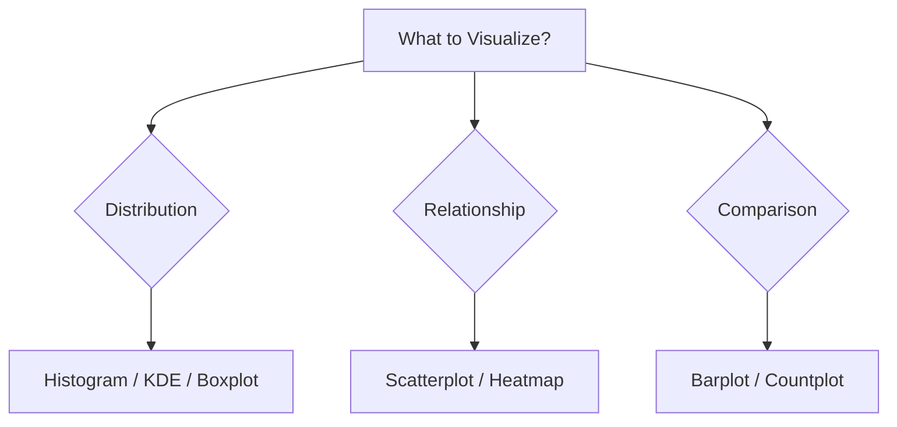

# Module 3: Data Visualization Summary

## Overview
Data Visualization is the art of communicating data insights effectively. We use **Matplotlib** for low-level control and **Seaborn** for high-level statistical plots.

## Key Concepts

### Chart Selection Guide



### 1. Types of Plots
*   **Univariate (One Variable):**
    *   *Histogram / KDE:* Distribution of numerical data.
    *   *Boxplot:* Outliers and quartiles.
    *   *Countplot:* Frequency of categorical data.
*   **Bivariate (Two Variables):**
    *   *Scatterplot:* Relationship between two numbers.
    *   *Barplot:* Comparison of category vs number.
    *   *Heatmap:* Correlation matrix.

### 2. Matplotlib vs Seaborn
*   **Matplotlib:** The foundation. Good for precise customization.
*   **Seaborn:** Built on top. Good for beautiful default styles and statistical aggregation.

## Code for Learning

### Setup and Import
```python
import matplotlib.pyplot as plt
import seaborn as sns
import pandas as pd

# Load dataset
df = sns.load_dataset('tips')

# Set Style
sns.set_style("whitegrid")
```

### 1. Advanced Subplots
Creating multiple plots in one figure.

```python
# Create a figure with 1 row and 2 columns
fig, axes = plt.subplots(1, 2, figsize=(12, 5))

# Plot 1: Histogram
sns.histplot(data=df, x='total_bill', kde=True, ax=axes[0], color='skyblue')
axes[0].set_title("Total Bill Distribution")

# Plot 2: Boxplot
sns.boxplot(data=df, x='day', y='total_bill', ax=axes[1], palette='Set2')
axes[1].set_title("Bill by Day")

plt.tight_layout()
plt.show()
```

### 2. Customizing Aesthetics
Making plots publication-ready.

```python
plt.figure(figsize=(8, 6))

# Scatterplot with Size and Hue
sns.scatterplot(
    data=df, 
    x='total_bill', 
    y='tip', 
    hue='time', 
    style='time', 
    s=100, # Marker size
    palette='deep'
)

plt.title("Tips vs Total Bill (Styled)", fontsize=16, fontweight='bold')
plt.xlabel("Total Bill ($)", fontsize=12)
plt.ylabel("Tip Amount ($)", fontsize=12)
plt.legend(title="Time of Day", loc='upper left')

# Saving the plot
# plt.savefig('cool_plot.png', dpi=300)

plt.show()
```

### 3. FacetGrid (Small Multiples)
Plotting the same graph for different subsets of data.

```python
# Create a grid of plots separated by 'col' (Time) and 'row' (Sex)
g = sns.FacetGrid(df, col="time", row="sex")

# Map a histogram to each location
g.map(sns.histplot, "total_bill")

plt.show()
```
