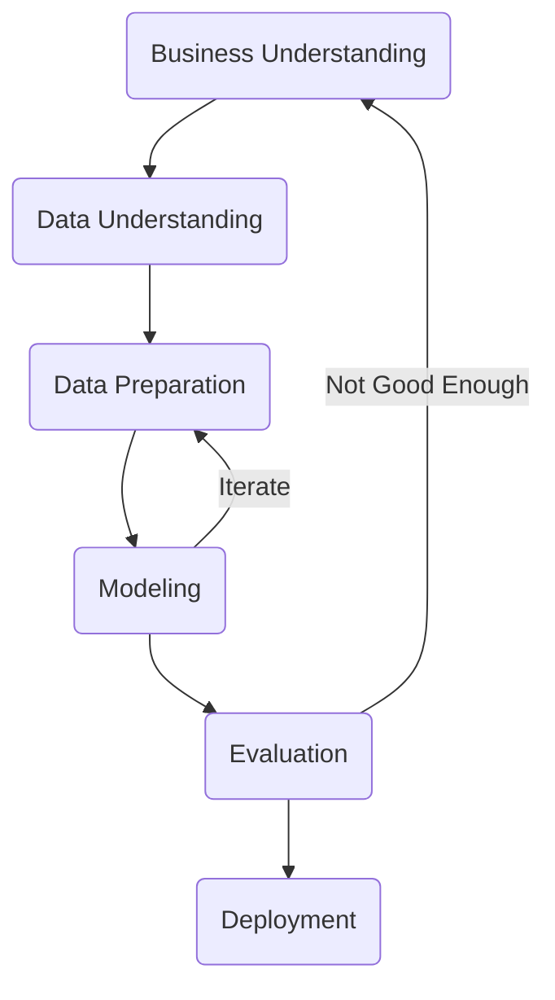
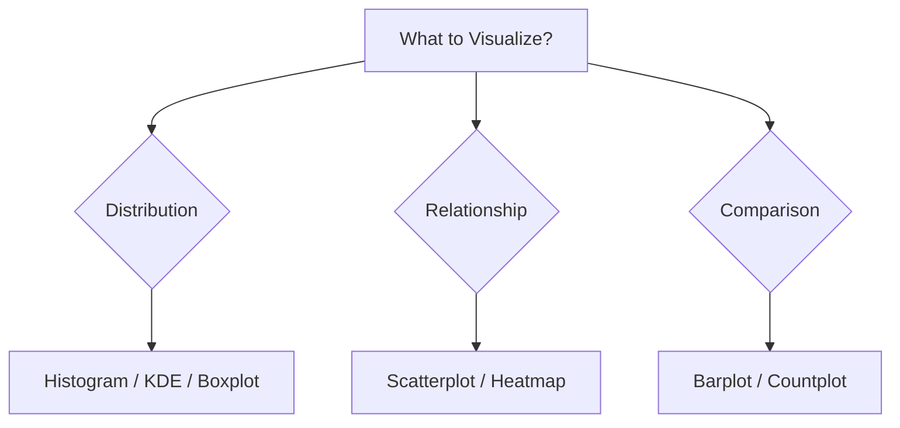
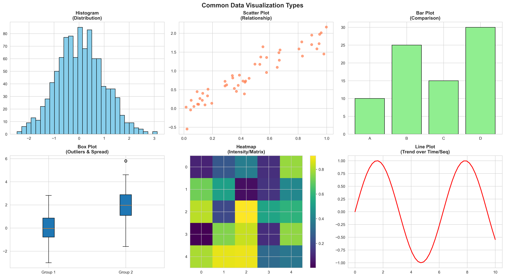
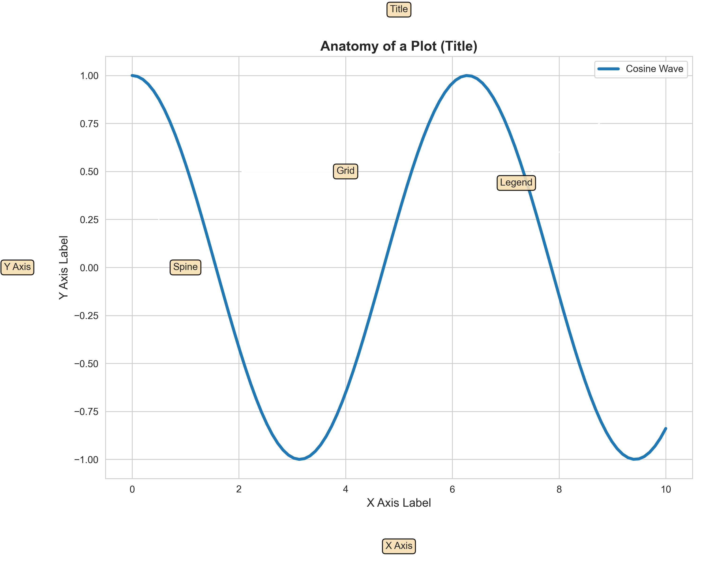

# Module 3: Data Visualization Summary

## Overview
Data Visualization is the art of communicating data insights effectively. We use **Matplotlib** for low-level control and **Seaborn** for high-level statistical plots.

## Key Concepts

### 1. Data Science Methodologies
Structured approaches to solving data problems.

#### CRISP-DM (Cross-Industry Standard Process for Data Mining)
The most widely used open standard process model. It is hierarchical with four levels of abstraction: **Phases**, **Generic Tasks**, **Specialized Tasks**, and **Process Instances**.

**The 6 Phases:**
1.  **Business Understanding:** Focuses on understanding project objectives and requirements from a business perspective.
    *   *Tasks:* Determine Business Objectives, Assess Situation, Determine Data Mining Goals, Produce Project Plan.
2.  **Data Understanding:** Initial data collection and familiarization. Identify data quality problems.
3.  **Data Preparation:** Construct the final dataset (clean, transform, format). This is often the most time-consuming phase.
4.  **Modeling:** Select and apply modeling techniques. Calibrate parameters.
5.  **Evaluation:** Evaluate the model against business objectives. Determine if there is an important business issue not sufficiently considered.
6.  **Deployment:** Organize and present the results (report or repeatable process).



#### OSEMN (Obtain, Scrub, Explore, Model, Interpret)
A concise framework often used for individual contributors.
*   **Obtain:** Gather data from sources (APIs, CSVs, DBs).
*   **Scrub:** Clean data (Handle missing values, outliers).
*   **Explore:** EDA (Exploratory Data Analysis) to find patterns.
*   **Model:** Train Machine Learning algorithms.
*   **Interpret:** Explain results to stakeholders (Storytelling).

#### TDSP (Team Data Science Process)
Microsoft's agile, iterative data science methodology for teams. Key components:
*   **Business Understanding**
*   **Data Acquisition and Understanding**
*   **Modeling**
*   **Deployment**
*   **Customer Acceptance**
*   *Emphasis on collaboration, version control, and reproducible analysis.*

### 2. Chart Selection Guide



### 1. Types of Plots



*   **Univariate (One Variable):**
    *   *Histogram / KDE:* Distribution of numerical data.
    *   *Boxplot:* Outliers and quartiles.
    *   *Countplot:* Frequency of categorical data.
*   **Bivariate (Two Variables):**
    *   *Scatterplot:* Relationship between two numbers.
    *   *Barplot:* Comparison of category vs number.
    *   *Heatmap:* Correlation matrix.

### 2. Visualization Libraries
*   **Matplotlib:** The foundation. Good for precise customization.
*   **Seaborn:** Built on top of Matplotlib. Excellent for statistical plots and color accessibility.
*   **Plotly:** Powerful for **interactive** graphs (zoom, hover). Using `px.bar`, `px.line`.

### 3. Anatomy of a Plot
Understanding the components of a Matplotlib figure is crucial for customization.



### 4. Advanced Pandas Operations
Crucial for data preprocessing in the lifecycle.

*   **GroupBy & Aggregation:** Splitting data into groups and computing summary stats.
    *   `df.groupby('Entity').agg(sum)`: Sum values for each country.
    *   `df.groupby('Year').agg({'gdp': 'max'})`: Max GDP per year.
*   **Filtering:** Keeping groups that satisfy a condition.
    *   `df.groupby('Entity').filter(lambda x: x['gdp'].max() > 10)`: Keep countries whose max GDP > 10.
*   **Indexing:** Rearranging how data is accessed.
    *   `df.set_index('Year')`: Use Year as the row label (useful for time-series).
    *   `df.reset_index()`: Move index back to a column.
    *   *Note:* `set_index` creates a copy; it does not modify in place unless specified.


## Code for Learning

### Setup and Import
```python
import matplotlib.pyplot as plt
import seaborn as sns
import pandas as pd

# Load dataset
df = sns.load_dataset('tips')

# Set Style
sns.set_style("whitegrid")
```

### 1. Advanced Subplots
Creating multiple plots in one figure.

```python
# Create a figure with 1 row and 2 columns
fig, axes = plt.subplots(1, 2, figsize=(12, 5))

# Plot 1: Histogram
sns.histplot(data=df, x='total_bill', kde=True, ax=axes[0], color='skyblue')
axes[0].set_title("Total Bill Distribution")

# Plot 2: Boxplot
sns.boxplot(data=df, x='day', y='total_bill', ax=axes[1], palette='Set2')
axes[1].set_title("Bill by Day")

plt.tight_layout()
plt.show()
```

### 2. Customizing Aesthetics
Making plots publication-ready.

```python
plt.figure(figsize=(8, 6))

# Scatterplot with Size and Hue
sns.scatterplot(
    data=df, 
    x='total_bill', 
    y='tip', 
    hue='time', 
    style='time', 
    s=100, # Marker size
    palette='deep'
)

plt.title("Tips vs Total Bill (Styled)", fontsize=16, fontweight='bold')
plt.xlabel("Total Bill ($)", fontsize=12)
plt.ylabel("Tip Amount ($)", fontsize=12)
plt.legend(title="Time of Day", loc='upper left')

# Saving the plot
# plt.savefig('cool_plot.png', dpi=300)

plt.show()
```

### 3. FacetGrid (Small Multiples)
Plotting the same graph for different subsets of data.

```python
# Create a grid of plots separated by 'col' (Time) and 'row' (Sex)
g = sns.FacetGrid(df, col="time", row="sex")

# Map a histogram to each location
g.map(sns.histplot, "total_bill")

plt.show()
```

### 4. Advanced Seaborn Plots
Visualizing high-dimensional relationships.

#### Pairplot (Scatter Matrix)
Plots pairwise relationships in a dataset. Good for quick EDA.

```python
# Plots every numerical variable against every other one
# hue='species' colors points by category
sns.pairplot(df, hue='sex', palette='husl')
plt.show()
```

#### Heatmap (Correlation Matrix)
Visualizing the strength of relationships between numerical variables.

```python
# 1. Compute Correlation Matrix
corr = df.corr(numeric_only=True)

# 2. Plot Heatmap
plt.figure(figsize=(10, 8))
sns.heatmap(
    corr, 
    annot=True,     # Show numbers
    cmap='coolwarm', # Blue to Red
    fmt=".2f",      # 2 decimal places
    linewidths=0.5
)
plt.title("Correlation Matrix")
plt.show()
```

#### Violin Plot
Combines a boxplot with a kernel density estimate (KDE). Shows distribution shape + summary stats.

```python
sns.violinplot(data=df, x="day", y="total_bill", palette="muted")
plt.show()
```

### 5. Plotly Usage (Interactive Plots)
Plotly allows for interactive visualizations (zoom, hover, pan) which are excellent for data exploration.

**Installation:**
```bash
pip install plotly
```

**Common Plot Types using `plotly.express` (`px`):**

#### Interactive Bar Chart
```python
import plotly.express as px

# Create interactive bar chart
fig = px.bar(df, x='day', y='total_bill', color='sex', barmode='group',
             title='Total Bill by Day and Sex (Interactive)')
fig.show()
```

#### Interactive Scatter Plot
```python
# Scatter plot with hover data
fig = px.scatter(df, x='total_bill', y='tip', color='time',
                 size='size', hover_data=['sex'])
fig.show()
```

#### Interactive Line Chart
```python
# Line chart (ideal for time series)
# Assuming a time-series dataframe 'df_ts'
# fig = px.line(df_ts, x='date', y='value', title='Time Series Trend')
# fig.show()
```
