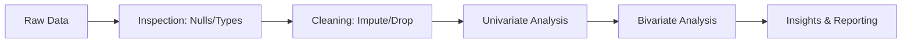
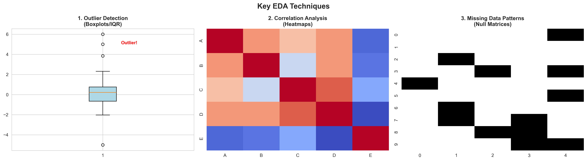
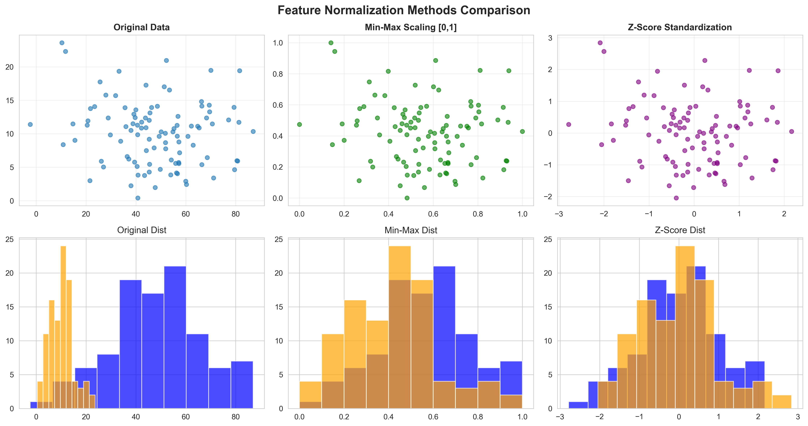
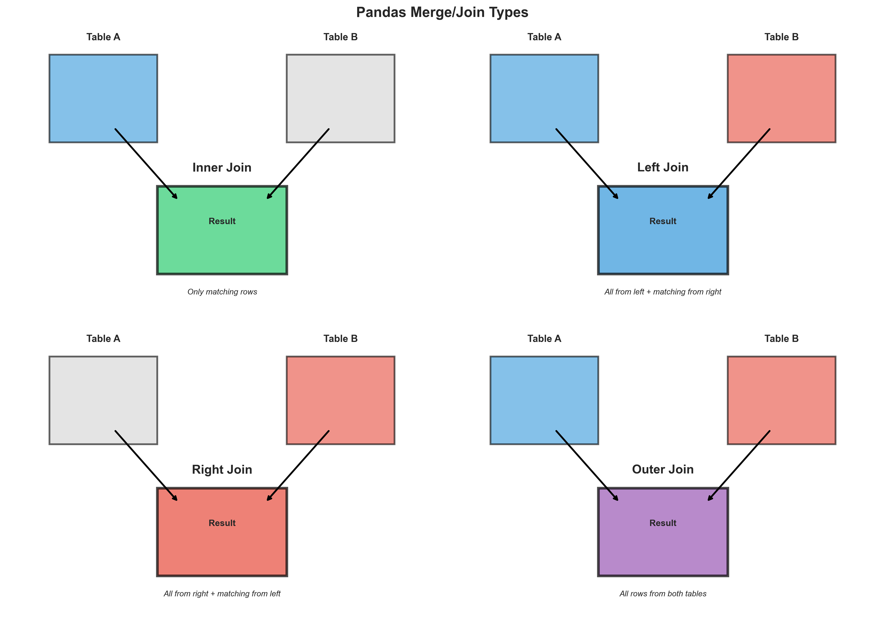
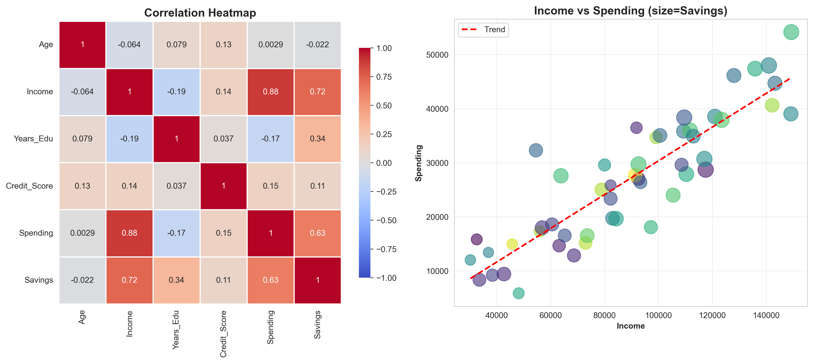

# Module 4: Data Analytics Primer

## Overview
Data Analytics is the foundation of Machine Learning. It involves **Exploratory Data Analysis (EDA)**, **Data Cleaning**, and **Visualization** to understand the dataset before modeling.

## Key Concepts

### EDA Workflow



### 1. The EDA Process
1.  **Inspect:** Check shape, data types, and missing values.
2.  **Clean:** Handle nulls, duplicates, and incorrect types.
3.  **Visualize:** Plot distributions and relationships.



### 2. Data Types
*   **Quantitative (Numerical):**
    *   *Continuous:* Height, Price, Temperature.
    *   *Discrete:* Number of children, Units sold.
*   **Qualitative (Categorical):**
    *   *Nominal:* Names, Colors (No order).
    *   *Ordinal:* Rankings, Ratings (Ordered).

## Key Formulas

### 1. Z-Score (Standardization)
Measures how many standard deviations a data point is from the mean.




$$ z = \frac{x - \mu}{\sigma} $$

*   If $|z| > 3$, the point is typically considered an **outlier**.

### 2. Interquartile Range (IQR)
Used for outlier detection in boxplots.

$$ IQR = Q3 - Q1 $$

*   **Lower Bound:** $Q1 - 1.5 \times IQR$
*   **Upper Bound:** $Q3 + 1.5 \times IQR$

## Code for Learning

### Setup and Import
```python
import pandas as pd
import numpy as np
import seaborn as sns
import matplotlib.pyplot as plt

# Load sample dataset
df = sns.load_dataset('titanic')
```

### 1. Advanced Data Inspection & Cleaning
```python
# 1. Inspect Missing Values
print(df.isnull().sum())

# Visualizing Missing Data (Heatmap)
plt.figure(figsize=(10, 6))
sns.heatmap(df.isnull(), cbar=False, cmap='viridis')
plt.title("Missing Data Heatmap")
plt.show()

# 2. Impute Missing Values (Fillna)
# Fill Age with Median
df['age'] = df['age'].fillna(df['age'].median())

# Fill Embarked with Mode (Most common value)
df['embarked'] = df['embarked'].fillna(df['embarked'].mode()[0])

# 3. Drop Columns with too many missing values
df.drop(columns=['deck'], inplace=True)
```

### 2. Analyzing Relationships (Groupby & Merge)


```python
# Groupby: Average survival rate by Class and Sex
survival_stats = df.groupby(['pclass', 'sex'])['survived'].mean().reset_index()
print(survival_stats)

# Merge (Joins)
# inner: intersection of keys
# outer: union of keys
# left: use keys from left frame only
# right: use keys from right frame only
# merged_df = pd.merge(df1, df2, on='common_column', how='inner')
```

### 3. String Operations
Pandas provides vectorized string functions via the `.str` accessor.

```python
# Create a sample dataframe
data = {'Name': ['Alice Smith', 'Bob Jones', 'Charlie Brown'], 'Email': ['alice@gmail.com', 'bob@yahoo.com', 'charlie@gmail.com']}
df_str = pd.DataFrame(data)

# String methods
df_str['Upper_Name'] = df_str['Name'].str.upper()
df_str['Gmail_User'] = df_str['Email'].str.contains('gmail')
df_str['First_Name'] = df_str['Name'].str.split(' ').str[0]

print(df_str)
```

### 4. Outlier Detection (Boxplot)
Using Boxplots to visualize the spread and identify outliers.

```python
plt.figure(figsize=(8, 5))
sns.boxplot(x='pclass', y='fare', data=df)
plt.title("Fare Distribution by Class (Detecting Outliers)")
plt.show()
```

### 5. Correlation Matrix
Understanding feature relationships.

```python
# Select only numeric columns
numeric_df = df.select_dtypes(include=[np.number])

# Compute correlation
corr_matrix = numeric_df.corr()

# Plot Heatmap
plt.figure(figsize=(10, 8))
sns.heatmap(corr_matrix, annot=True, cmap='coolwarm', fmt=".2f")
plt.title("Correlation Matrix")
plt.show()
```



### 6. Advanced Visualization with Plotly
Interactive plots for deeper analysis.

```python
import plotly.express as px

# 1. Scatterplot with Size and Color dimensions
# log_x=True is useful for skewed data like GDP
fig_scatter = px.scatter(df, x='age', y='fare', color='sex', size='pclass',
                         hover_data=['embarked'], title='Titanic Age vs Fare (Multidimensional)')
fig_scatter.show()

# 2. Violin Plot (Distribution + Boxplot)
# points='all' shows the underlying data points
fig_violin = px.violin(df, y="age", x="pclass", color="sex", box=True, points="all",
                       title='Age Distribution by Class')
fig_violin.show()

# 3. Density Heatmap
# Good for visualizing density of points avoiding overplotting
fig_density = px.density_heatmap(df, x="age", y="fare", marginal_x="histogram", marginal_y="histogram")
fig_density.show()

# 4. Marginals
# Adding distribution plots to the axes of a scatter plot
fig_marginal = px.scatter(df, x="age", y="fare", marginal_x="box", marginal_y="violin")
fig_marginal.show()
```

