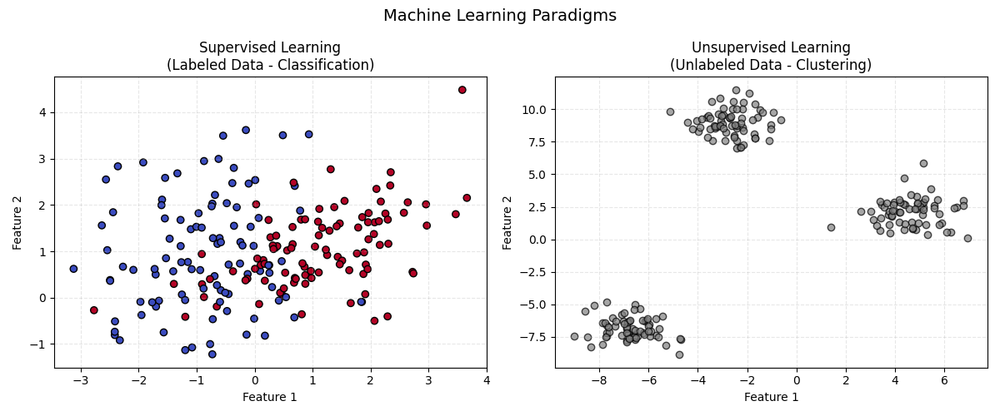
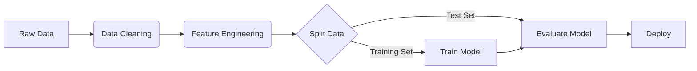

# Module 1: Machine Learning Fundamentals Summary

## Overview
This module lays the groundwork for Machine Learning, covering the Python ecosystem (**Pandas, NumPy**) and the fundamental concepts of ML workflows.

## Key Concepts

### 1. Types of Machine Learning
*   **Supervised Learning:** Training on labeled data (Input $X$ $\rightarrow$ Output $y$).
    *   *Examples:* Regression (Price prediction), Classification (Spam detection).
*   **Unsupervised Learning:** Finding patterns in unlabeled data.
    *   *Examples:* Clustering (Customer segmentation), Dimensionality Reduction (PCA).
*   **Reinforcement Learning:** Agents learning through trial and error (Rewards/Penalties).



### 2. The Python Ecosystem
*   **NumPy:** Numerical computing, Vectors, Matrices.
*   **Pandas:** Tabular data manipulation (DataFrames).
*   **Matplotlib/Seaborn:** Visualization.

## Key Formulas & Pronunciation

### 1. The Mean ($\mu$)
The average value of a dataset.

$$ \mu = \frac{1}{n} \sum_{i=1}^{n} x_i $$

*   **Pronunciation:** "Mu equals one over n times the sum of x-sub-i from i equals 1 to n."

### 2. Euclidean Distance
The straight-line distance between two points ($p$ and $q$) in space.

$$ d(p, q) = \sqrt{\sum_{i=1}^{n} (q_i - p_i)^2} $$

*   **Pronunciation:** "Distance d equals the square root of the sum of squared differences between q-sub-i and p-sub-i."

### 3. Dot Product
Foundational operation in Neural Networks and Linear Algebra.

$$ \vec{a} \cdot \vec{b} = \sum_{i=1}^{n} a_i b_i $$

*   **Pronunciation:** "Vector a dot Vector b equals the sum of the products of their corresponding components."

## ML Workflow Visualization



## Code for Learning

### 1. Installation & Imports
Run this in your terminal or notebook to set up the environment.

```python
# Installation
# !pip install numpy pandas matplotlib seaborn scikit-learn

# Standard Imports
import numpy as np
import pandas as pd
import matplotlib.pyplot as plt
```

### 2. NumPy Basics (Vectors)
```python
# Create Vectors
a = np.array([1, 2, 3])
b = np.array([4, 5, 6])

# Element-wise operations
print(a + b)      # [5 7 9]

# Dot Product (Key for ML)
dot_prod = np.dot(a, b)
print(f"Dot Product: {dot_prod}") # 1*4 + 2*5 + 3*6 = 32
```

### 3. Pandas Basics (DataFrames)
```python
# Create DataFrame
data = {
    'Name': ['Alice', 'Bob', 'Charlie'],
    'Age': [25, 30, 35],
    'City': ['NY', 'LA', 'SF']
}
df = pd.DataFrame(data)

# Basic Inspection
print(df.head())
print(df.describe()) # Summary statistics
```
