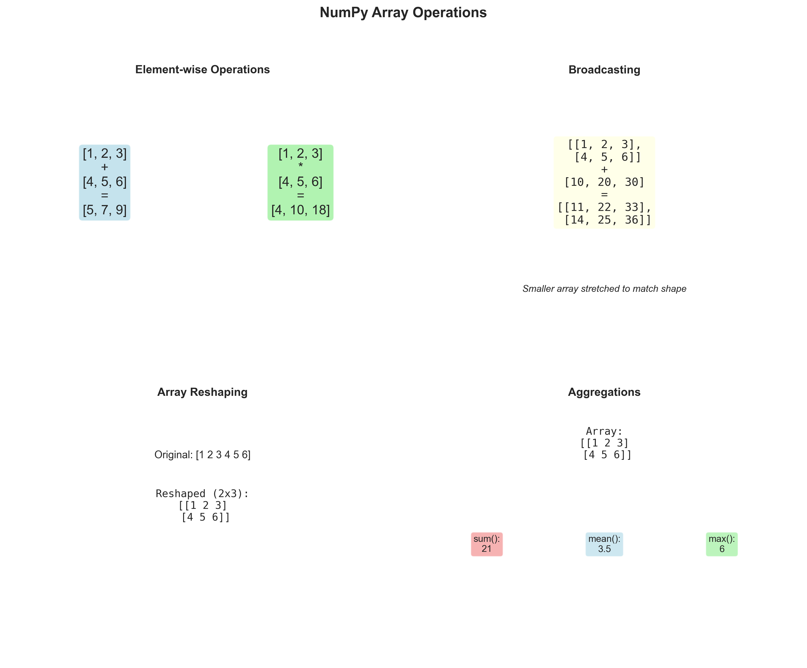
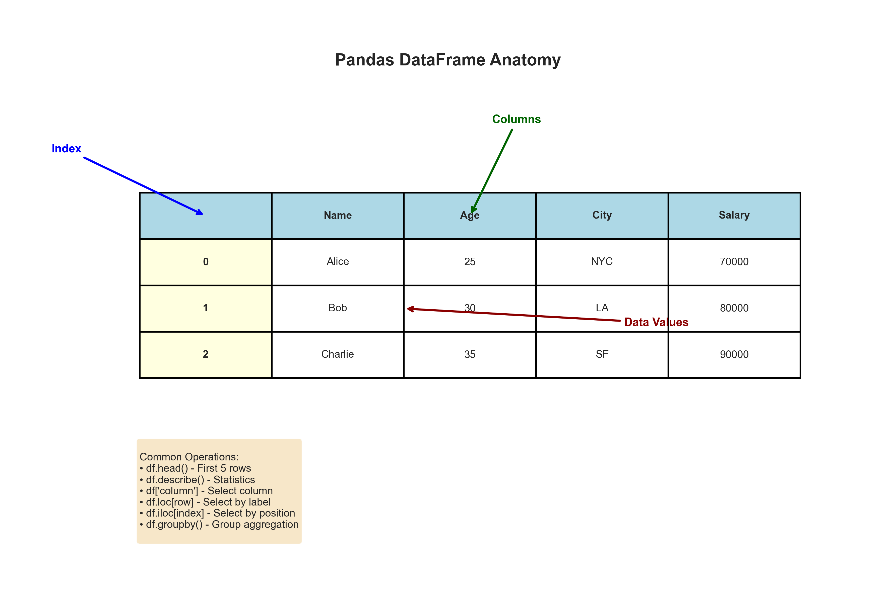
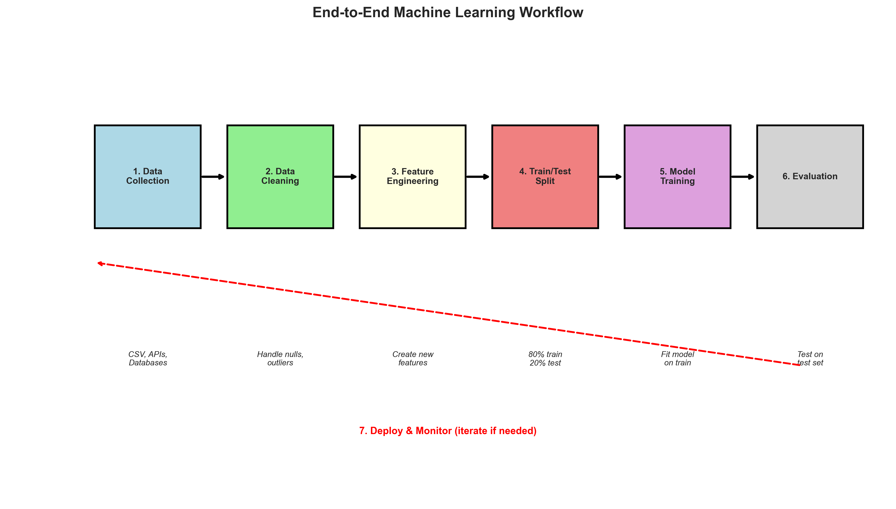
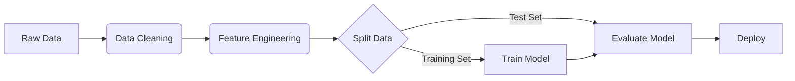

# Module 1: Machine Learning Fundamentals Summary

## Overview
This module lays the groundwork for Machine Learning, covering the Python ecosystem (**Pandas, NumPy**) and the fundamental concepts of ML workflows.

## Key Concepts

### 1. Types of Machine Learning
*   **Supervised Learning:** Training on labeled data (Input $X$ $\rightarrow$ Output $y$).
    *   *Examples:* Regression (Price prediction), Classification (Spam detection).
*   **Unsupervised Learning:** Finding patterns in unlabeled data.
    *   *Examples:* Clustering (Customer segmentation), Dimensionality Reduction (PCA).
*   **Reinforcement Learning:** Agents learning through trial and error (Rewards/Penalties).


### 2. The Python Ecosystem
*   **NumPy:** Numerical computing, Vectors, Matrices.



*   **Pandas:** Tabular data manipulation (DataFrames).



*   **Matplotlib/Seaborn:** Visualization.


## Key Formulas & Pronunciation

### 1. The Mean ($\mu$)
The average value of a dataset.

$$ \mu = \frac{1}{n} \sum_{i=1}^{n} x_i $$

*   **Pronunciation:** "Mu equals one over n times the sum of x-sub-i from i equals 1 to n."

### 2. Euclidean Distance
The straight-line distance between two points ($p$ and $q$) in space.

$$ d(p, q) = \sqrt{\sum_{i=1}^{n} (q_i - p_i)^2} $$

*   **Pronunciation:** "Distance d equals the square root of the sum of squared differences between q-sub-i and p-sub-i."

### 3. Dot Product
Foundational operation in Neural Networks and Linear Algebra.

$$ \vec{a} \cdot \vec{b} = \sum_{i=1}^{n} a_i b_i $$

*   **Pronunciation:** "Vector a dot Vector b equals the sum of the products of their corresponding components."

## ML Workflow Visualization



### Original Diagram




## Code for Learning

### 1. Installation & Imports
Run this in your terminal or notebook to set up the environment.

```python
# Installation
# !pip install numpy pandas matplotlib seaborn scikit-learn

# Standard Imports
import numpy as np
import pandas as pd
import matplotlib.pyplot as plt
```

### 2. NumPy Basics (Vectors)
```python
# Create Vectors
a = np.array([1, 2, 3])
b = np.array([4, 5, 6])

# Element-wise operations
print(a + b)      # [5 7 9]

# Dot Product (Key for ML)
dot_prod = np.dot(a, b)
print(f"Dot Product: {dot_prod}") # 1*4 + 2*5 + 3*6 = 32
```

### 3. Essential NumPy Commands for ML/AI
Here are the most frequently used NumPy operations you will encounter in Machine Learning.

#### Creation & Initialization
*   `np.array([1, 2, 3])`: Create array from list.
*   `np.zeros((3, 3))`: Create 3x3 array of zeros (good for initializing weights).
*   `np.ones((2, 2))`: Create 2x2 array of ones.
*   `np.eye(3)`: Create 3x3 Identity matrix.
*   `np.random.rand(3, 2)`: Random values from uniform distribution [0, 1].
*   `np.random.randn(3, 2)`: Random values from Standard Normal distribution ($\mu=0, \sigma=1$).
*   `np.arange(0, 10, 2)`: Range with step [0, 2, 4, 6, 8].
*   `np.linspace(0, 1, 5)`: 5 equally spaced points between 0 and 1.

#### Inspection & Shape Manipulation
*   `arr.shape`: Dimensions of the array (rows, cols).
*   `arr.ndim`: Number of dimensions.
*   `arr.dtype`: Data type of elements (e.g., float64, int32).
*   `arr.reshape(2, 3)`: Change shape without changing data.
*   `arr.flatten()`: Collapse into 1D array.
*   `arr.T`: Transpose (swap rows and columns).

#### Mathematical Operations
*   `np.sum(arr, axis=0)`: Sum columns (axis=0) or rows (axis=1).
*   `np.mean(arr)`: Average value.
*   `np.std(arr)`: Standard Deviation.
*   `np.min(arr)`, `np.max(arr)`: Min/Max values.
*   `np.argmax(arr)`: Index of the maximum value (crucial for classification outputs).
*   `np.dot(a, b)`: Dot product (Matrix multiplication).
*   `np.exp(arr)`: Exponential (used in Softmax).

#### Indexing & Slicing
*   `arr[0, 1]`: Row 0, Column 1.
*   `arr[:, 0]`: All rows, Column 0.
*   `arr[arr > 5]`: Boolean masking (Filter values > 5).

### 4. Pandas Basics (DataFrames)
```python
# Create DataFrame
data = {
    'Name': ['Alice', 'Bob', 'Charlie'],
    'Age': [25, 30, 35],
    'City': ['NY', 'LA', 'SF']
}
df = pd.DataFrame(data)

# Basic Inspection
print(df.head())
print(df.describe()) # Summary statistics
```
