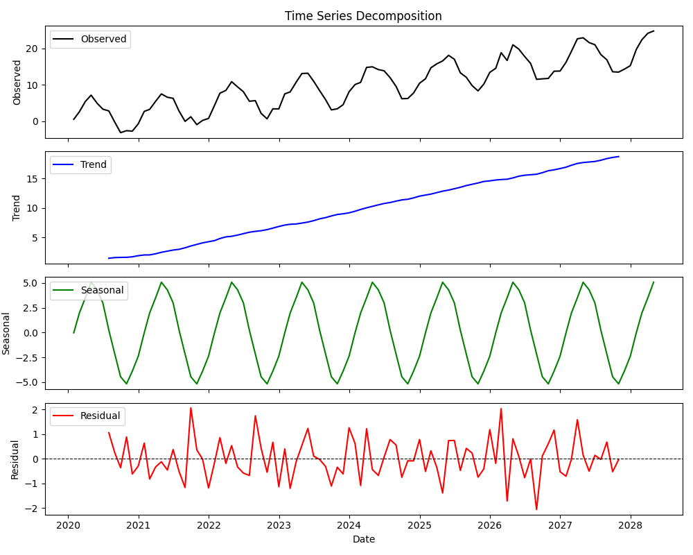
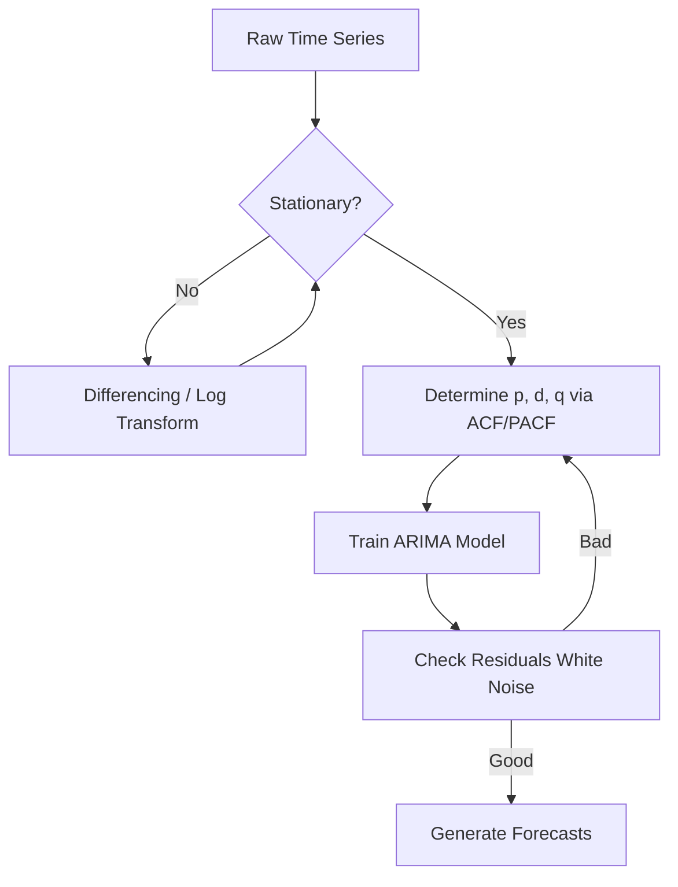

# Module 10: Time Series Analysis

## Overview
This module explores **Time Series Analysis (TSA)**, the process of analyzing data points collected at regular time intervals to uncover underlying structures and predict future values. TSA is fundamental in finance, demand forecasting, and econometrics.

## Key Concepts

### 1. Stationarity
A time series is **stationary** if its statistical properties (mean, variance, autocorrelation) do not change over time.
*   **Why it matters:** Most classical models (like ARIMA) assume stationarity to make reliable predictions.
*   **Non-Stationary behaviors:** Trends (upward/downward movement), Seasonality (repeating cycles), and changing Variance (heteroscedasticity).
*   **Fixes:**
    *   **Log Transformation:** Stabilizes variance (straightens out exponential growth).
    *   **Differencing:** Removes trends by subtracting the previous value ($y_t - y_{t-1}$).

### 2. Time Series Decomposition
Breaking a series into its constituent parts to understand it better:



*   **Additive Model:** $y_t = \text{Trend} + \text{Seasonality} + \text{Residue}$
    *   Use when magnitude of seasonality is constant.
*   **Multiplicative Model:** $y_t = \text{Trend} \times \text{Seasonality} \times \text{Residue}$
    *   Use when magnitude of seasonality changes with the trend (e.g., grows as valus grow).
*   **Smoothing:** A common way to extract trend is using a **convolution filter** (moving average).

### 3. Autocorrelation (ACF & PACF)
*   **ACF (Autocorrelation Function):** Correlation between $y_t$ and its lags ($y_{t-1}, y_{t-2}, ...$). Shows direct and indirect effects.
*   **PACF (Partial Autocorrelation Function):** Direct correlation between $y_t$ and a lag, removing the influence of intermediate lags. Crucial for determining AR terms.

## Key Formulas

### 1. Differencing (for Stationarity)
Used to remove trends.

$$ y'_t = y_t - y_{t-1} $$

### 2. AR (Autoregressive) Model
Predicting the current value based on past values.

$$ y_t = c + \phi_1 y_{t-1} + \phi_2 y_{t-2} + ... + \phi_p y_{t-p} + \epsilon_t $$

*   **$p$** (Pronounced: *p*): The order of the AR term (number of lags).

### 3. MA (Moving Average) Model
Predicting the current value based on past forecast errors (shocks).

$$ y_t = c + \epsilon_t + \theta_1 \epsilon_{t-1} + \theta_2 \epsilon_{t-2} + ... + \theta_q \epsilon_{t-q} $$

*   **$q$** (Pronounced: *q*): The order of the MA term.

### 4. ARIMA Model
Combines AR, Integration (Differencing), and MA. Notation: **ARIMA(p, d, q)**.
*   **$p$**: AutoRegressive order (Lags).
*   **$d$**: Degree of Differencing (to make stationary).
*   **$q$**: Moving Average order (Errors).

### 5. Error Metrics (Evaluation)
*   **MAE (Mean Absolute Error):** Average magnitude of errors.

$$ \text{MAE} = \frac{1}{n} \sum |y_i - \hat{y}_i| $$

*   **RMSE (Root Mean Square Error):** Penalizes large errors heavily.

$$ \text{RMSE} = \sqrt{\frac{1}{n} \sum (y_i - \hat{y}_i)^2} $$

## Code for Learning

### Setup and Import
```bash
pip install pandas numpy matplotlib statsmodels scipy
```

```python
import pandas as pd
import numpy as np
import matplotlib.pyplot as plt
from statsmodels.tsa.seasonal import seasonal_decompose
from statsmodels.tsa.stattools import adfuller
from statsmodels.tsa.arima.model import ARIMA
from statsmodels.graphics.tsaplots import plot_acf, plot_pacf
from sklearn.metrics import mean_squared_error
```

### 1. Visualizing Decomposition
Understanding the underlying structure of the data.

```python
# Create synthetic data
dates = pd.date_range(start='2020-01-01', periods=100, freq='M')
data = np.arange(100) + np.sin(np.arange(100) * 2 * np.pi / 12) * 10 + np.random.normal(0, 2, 100)
df = pd.Series(data, index=dates)

# Decompose
result = seasonal_decompose(df, model='additive')

# Plot
plt.figure(figsize=(12, 8))
plt.subplot(411)
plt.plot(result.observed, label='Observed')
plt.legend(loc='upper left')
plt.subplot(412)
plt.plot(result.trend, label='Trend')
plt.legend(loc='upper left')
plt.subplot(413)
plt.plot(result.seasonal, label='Seasonal')
plt.legend(loc='upper left')
plt.subplot(414)
plt.plot(result.resid, label='Residual')
plt.legend(loc='upper left')
plt.tight_layout()
plt.show()
```

### 2. Testing for Stationarity (ADF Test)
The **Augmented Dickey-Fuller** test is the standard statistical test for stationarity.
*   **Null Hypothesis ($H_0$):** Series is Non-Stationary (has a unit root).
*   **Alternate Hypothesis ($H_1$):** Series is Stationary.
*   **Rule:** If p-value < 0.05, Reject $H_0$ (It is Stationary).

```python
def check_stationarity(series):
    result = adfuller(series.dropna())
    print(f'ADF Statistic: {result[0]}')
    print(f'p-value: {result[1]}')
    print('Critial Values:')
    for key, value in result[4].items():
        print(f'\t{key}: {value}')
        
    if result[1] < 0.05:
        print("✅ Result: Series is Stationary")
    else:
        print("❌ Result: Series is Non-Stationary (Diff needed)")

# Run check on raw data
check_stationarity(df)

# If non-stationary, difference it
df_diff = df.diff().dropna()
check_stationarity(df_diff)
```

### 3. ARIMA Forecasting
Building a model to predict future values.

## Forecasting Workflow



```python
# Split data
train = df.iloc[:-12] # Train on all except last year
test = df.iloc[-12:]  # Test on last year

# Build Model (Order: p=1, d=1, q=1 is simpler example)
# In practice, use ACF/PACF plots to determine p and q
model = ARIMA(train, order=(1, 1, 1)) 
model_fit = model.fit()

# Forecast
forecast_result = model_fit.get_forecast(steps=12)
forecast = forecast_result.predicted_mean
conf_int = forecast_result.conf_int()

# Evaluation
rmse = np.sqrt(mean_squared_error(test, forecast))
print(f'Test RMSE: {rmse:.3f}')

# Plot Results
plt.figure(figsize=(12, 6))
plt.plot(train.index, train, label='Training Data')
plt.plot(test.index, test, label='Actual Values')
plt.plot(test.index, forecast, label='Forecast', color='red')
plt.fill_between(test.index, conf_int.iloc[:, 0], conf_int.iloc[:, 1], color='pink', alpha=0.3)
plt.title('ARIMA Forecast vs Actuals')
plt.legend()
plt.show()
```

### 4. Diagnosing Models with ACF/PACF
Helping to choose the right $p$ and $q$ for ARIMA.

```python
# Plot ACF and PACF
fig, (ax1, ax2) = plt.subplots(2, 1, figsize=(10, 8))
plot_acf(df.diff().dropna(), ax=ax1) # Use differenced (stationary) data
plot_pacf(df.diff().dropna(), ax=ax2)
plt.show()
```
*   **ACF cuts off after lag q:** Suggests MA(q) process.
*   **PACF cuts off after lag p:** Suggests AR(p) process.
