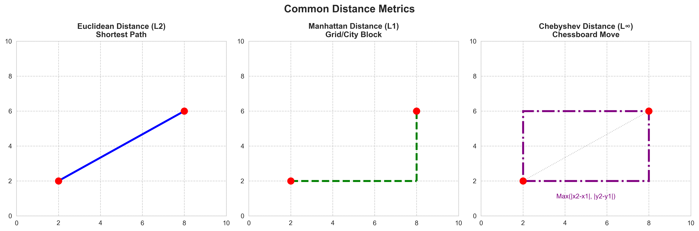
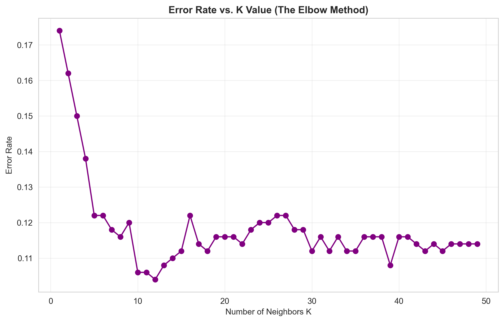
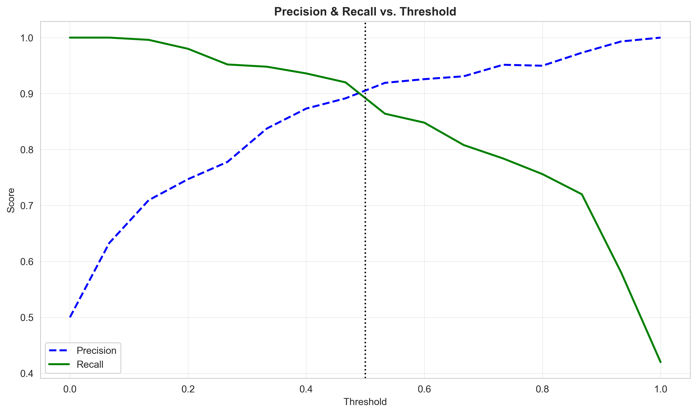
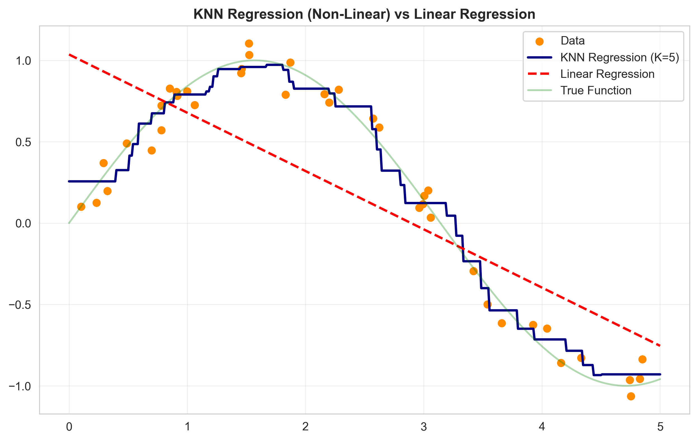
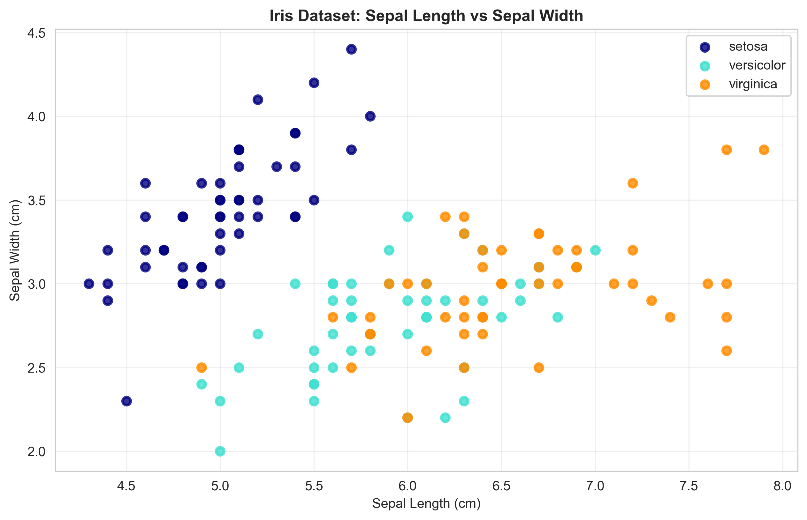
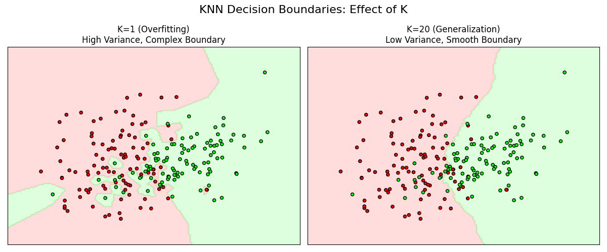

# Module 12: K-Nearest Neighbors (KNN) and Model Selection

## Overview
This module focused on the K-Nearest Neighbors (KNN) algorithm, a versatile distance-based method for classification and regression. The module also emphasized robust model selection techniques, including the use of Pipelines to prevent data leakage and GridSearchCV for hyperparameter tuning.

## Key Concepts
### 1. Classification Concept: Email Spam Detection
*   **Goal:** Classify an incoming email as "Spam" (1) or "Not Spam" (0).
*   **Features:** Word counts (e.g., "Win", "Free"), Sender reputation, Link count.
*   **Process:**
    *   **Training:** The algorithm memorizes the features of known spam and non-spam emails.
    *   **Prediction:** For a new email, it finds the most similar emails (neighbors) from history. If the majority were spam, the new email is classified as spam.

### 2. K-Nearest Neighbors (KNN)
A non-parametric, lazy learning algorithm that classifies a data point based on the majority class of its 'K' nearest neighbors.

### 3. Model Selection & Evaluation
*   **Distance Metrics:** Mathematical formulas used to calculate similarity (e.g., Euclidean, Manhattan).
*   **Feature Scaling:** Normalizing the range of independent variables. Crucial for distance-based algorithms like KNN.
*   **Pipelines:** Chains preprocessing steps (like scaling) with the estimator to prevent data leakage.
*   **Data Leakage:** When information from the test set influences the training process (e.g., scaling before splitting).
*   **Grid Search (GridSearchCV):** Exhaustive search over specified parameter values to find the optimal model configuration.
*   **Cross-Validation:** Evaluating model performance by splitting data into multiple train/test folds to ensure robustness.

## Key Formulas

### 1. Euclidean Distance (L2 Norm)

The straight-line distance between two points $p$ and $q$ in n-dimensional space.

$$ d(p, q) = \sqrt{\sum_{i=1}^{n} (q_i - p_i)^2} $$

*   **$d(p, q)$** (Pronounced: *distance between p and q*): The Euclidean distance.
*   **$q_i, p_i$** (Pronounced: *q sub i, p sub i*): The values of the $i$-th feature.
*   **$\sum$** (Pronounced: *sum* or *sigma*): Summation operator.

### 2. Manhattan Distance (L1 Norm)

The sum of absolute differences. Also known as City Block distance.

$$ d(p, q) = \sum_{i=1}^{n} |q_i - p_i| $$

*   **$|q_i - p_i|$** (Pronounced: *absolute value of q sub i minus p sub i*): The absolute difference.

### 3. Minkowski Distance (Lp Norm)

A generalization of both Euclidean and Manhattan distances.

$$ d(p, q) = \left( \sum_{i=1}^{n} |q_i - p_i|^p \right)^{1/p} $$

*   **$p$** (Pronounced: *p*): The power parameter.
    *   If $p=1$, it becomes Manhattan distance.
    *   If $p=2$, it becomes Euclidean distance.

### 4. Classification Rule (Majority Vote)

For a classification task, the predicted class $\hat{y}$ given a new point $x$:

$$ \hat{y} = \text{mode}(\{y_i : x_i \in N_k(x)\}) $$

*   **$\hat{y}$** (Pronounced: *y hat*): The predicted class label.
*   **$N_k(x)$** (Pronounced: *N sub k of x*): The set of $k$ nearest neighbors to point $x$.
*   **$y_i$** (Pronounced: *y sub i*): The class label of the $i$-th neighbor.
*   **$\text{mode}$** (Pronounced: *mode*): The most frequent value (majority vote).


*Figure 1: Visual comparison of Euclidean, Manhattan, and Chebyshev distance metrics.*

## Hyperparameters

KNN has several key hyperparameters that control its behavior and performance. Tuning these is critical for balancing Bias and Variance.

### 1. `n_neighbors` (K)
The number of neighbors to vote.
*   **Small K (e.g., K=1):**
    *   **Model:** Complex, flexible.
    *   **Bias/Variance:** Low Bias, **High Variance** (Overfitting).
    *   **Behavior:** Captures noise/outliers. Decision boundaries are jagged and follow individual points.
*   **Large K (e.g., K=50):**
    *   **Model:** Simple, rigid.
    *   **Bias/Variance:** **High Bias** (Underfitting), Low Variance.
    *   **Behavior:** Ignores local structure. Decision boundaries are smooth and linear.
*   **Odd vs Even:** For binary classification, choose an **odd** K to avoid ties in voting.

### 2. `weights`
Determines how much influence each neighbor has on the vote.
*   **`'uniform'` (Default):** All neighbors count equally.
    *   *Use case:* When local density is uniform.
*   **`'distance'`:** Closer neighbors have more influence (weight = $1/d$).
    *   *Use case:* When data is unevenly sampled or you want to reduce the effect of far-away neighbors in a sparse region.

### 3. `metric` and `p`
The distance function used to find neighbors.
*   **`'minkowski'`:** The default generalized metric.
    *   **`p=1`:** Manhattan Distance (L1). Good for high dimensions or sparse data.
    *   **`p=2`:** Euclidean Distance (L2). Standard for spatial data.
*   **`'cosine'`:** Measures angle rather than magnitude.
    *   *Use case:* Text analysis, NLP, and high-dimensional sparse data (where magnitude doesn't matter).

### 4. `algorithm`
The data structure used to compute nearest neighbors.
*   **`'auto'`:** Sklearn decides the best method based on training data.
*   **`'brute'`:** Brute-force search. Calculates distance to *every* point.
    *   *Pros:* Exact. *Cons:* Very slow for large datasets ($O(N)$).
*   **`'kd_tree'` / `'ball_tree'`:** Tree-based structures that partition space to prune search.
    *   *Pros:* Much faster prediction ($O(\log N)$). *Cons:* Higher training time (to build tree).

### 5. `leaf_size`
Number of points at which to switch to brute-force within the tree algorithm.
*   *Effect:* Smaller leaf size = larger tree (more memory, potentially faster specific queries). Default is 30.

### 2. Optimization: The Elbow Method
A technique to find the optimal 'K' by plotting the Error Rate against K.
*   **Goal:** Minimize error (or maximize accuracy) without increasing model complexity unnecessarily.
*   **The "Elbow":** The point where the improvement in performance starts to flatten out.



### 3. Classification Metrics & Trade-offs
*   **Accuracy:** $(TP+TN)/(TP+TN+FP+FN)$
*   **Precision:** $TP/(TP+FP)$. "Pessimistic Classifier" (High Precision) is cautious, only predicting positive when certain.
*   **Recall (Sensitivity):** $TP/(TP+FN)$. "Optimistic Classifier" (High Recall) tries to find all positives, risking false alarms.
*   **Specificity:** $TN/(TN+FP)$. Ability to find true negatives.

#### Thresholding and predict_proba
Adjusting the probability cutoff (default 0.5) from `predict_proba` allows trading off Precision vs Recall.
*   **Lower Threshold:** Increases Recall (Catches more positives), but lowers Precision (More false alarms).
*   **Higher Threshold:** Increases Precision (Fewer false alarms), but lowers Recall (Misses some positives).



### 4. KNN Regression
KNN can also be used for regression by averaging the values of the nearest neighbors.

$$ \hat{y} = \frac{1}{k} \sum_{i=1}^{k} y_i $$

*   **Comparison with Linear Regression:**
    *   **Linear Regression:** Fits a straight line (parametric). High Bias, Low Variance. Global model.
    *   **KNN Regression:** Fits a wiggly curve (non-parametric). Low Bias, High Variance. Local model.



### 5. Real-World Application: Matching
**Case Study: Refugee Resettlement**
*   **Goal:** Maximize refugee employment success.
*   **Method:** Use supervised learning (KNN) to predict employment probability based on characteristics and location history.
*   **Result:** Algorithmic assignment could increase employment by 41-73% compared to random assignment.

### 6. Example Dataset: Iris Plants
A classic dataset for testing classification algorithms like KNN.
*   **Goal:** Classify iris flowers into 3 species (setosa, versicolor, virginica).
*   **Features:** Sepal Length, Sepal Width, Petal Length, Petal Width.
*   **Why KNN?** As seen in the plot below, the classes are grouped in clusters. KNN can easily classify new points based on which cluster they fall into.


*Figure: Scatter plot of Iris data showing clear separation between Setosa and overlap between Versicolor/Virginica.*

## Code for Learning

This section demonstrates the correct workflow for KNN, emphasizing Pipelines and Hyperparameter Tuning.

### Setup and Imports

**Installation:**
```bash
pip install numpy pandas matplotlib seaborn scikit-learn
```

**Imports:**
```python
import pandas as pd
import numpy as np
import matplotlib.pyplot as plt
import seaborn as sns

from sklearn.neighbors import KNeighborsClassifier, KNeighborsRegressor
from sklearn.model_selection import train_test_split, GridSearchCV, cross_val_score
from sklearn.preprocessing import StandardScaler, OneHotEncoder
from sklearn.compose import ColumnTransformer, make_column_transformer
from sklearn.pipeline import Pipeline
from sklearn.metrics import accuracy_score, classification_report
```

### 1. The Importance of Scaling and Pipelines

KNN calculates distances, so features with larger ranges (e.g., Salary) will dominate features with smaller ranges (e.g., Age) if not scaled.

**Incorrect Approach (Data Leakage):**
```python
# BAD: Scaling entire dataset before splitting
scaler = StandardScaler()
X_scaled = scaler.fit_transform(X) # Leaks test data info into training!
X_train, X_test, y_train, y_test = train_test_split(X_scaled, y)
```

**Correct Approach (Pipeline):**
```python
# GOOD: Scaling happens inside the pipeline, fitting only on training folds
pipeline = Pipeline([
    ('scaler', StandardScaler()),
    ('knn', KNeighborsClassifier())
])

# Fit pipeline
pipeline.fit(X_train, y_train)
```

### 2. Complete Classification Pipeline

Building a robust pipeline that handles categorical and numerical data.

```python
# Load simple dataset
from sklearn.datasets import load_iris
data = load_iris()
X, y = pd.DataFrame(data.data, columns=data.feature_names), data.target
X_train, X_test, y_train, y_test = train_test_split(X, y, test_size=0.2, random_state=42)

# Define column transformer (if we had mixed types)
# For iris (all numeric), we just need a scaler
# But here is the generic pattern:
numeric_features = X.columns
categorical_features = [] # List your categorical columns here

preprocessor = ColumnTransformer(
    transformers=[
        ('num', StandardScaler(), numeric_features),
        # ('cat', OneHotEncoder(), categorical_features) 
    ])

# Create Pipeline
knn_pipe = Pipeline(steps=[
    ('preprocessor', preprocessor),
    ('classifier', KNeighborsClassifier(n_neighbors=5))
])

# Train and Predict
knn_pipe.fit(X_train, y_train)
print(f"Test Accuracy: {knn_pipe.score(X_test, y_test):.3f}")
```

### 3. Finding Optimal K with GridSearchCV

Systematically searching for the best hyperparameters.

```python
# Define parameter grid
param_grid = {
    'classifier__n_neighbors': range(1, 31, 2), # Odd numbers 1 to 29
    'classifier__weights': ['uniform', 'distance'],
    'classifier__p': [1, 2] # Manhattan vs Euclidean
}

# Grid Search
grid_search = GridSearchCV(
    estimator=knn_pipe,
    param_grid=param_grid,
    scoring='accuracy',
    cv=5,
    n_jobs=-1,
    verbose=1
)

# Fit
grid_search.fit(X_train, y_train)

# Results
print(f"Best Parameters: {grid_search.best_params_}")
print(f"Best CV Accuracy: {grid_search.best_score_:.3f}")

# Evaluate best model
best_model = grid_search.best_estimator_
print(f"Test Accuracy: {best_model.score(X_test, y_test):.3f}")
```

### K-Nearest Neighbors (KNN) for Semantic Search

In this module, we move beyond simple classification to implementing **Semantic Search** using KNN. This involves:

1.  **Text Embedding:** Using pre-trained models like `SentenceTransformer` to convert text descriptions into high-dimensional numerical vectors.
2.  **Dimensionality Reduction (Optional):** Techniques like PCA can be used to visualize these high-dimensional vectors.
3.  **Nearest Neighbor Search:** Using KNN to find the most similar items (nearest neighbors) in the vector space based on a query vector.

#### 1. Generating Embeddings
We use `sentence-transformers` to encode text into embeddings.

```python
from sentence_transformers import SentenceTransformer
import pandas as pd

# Load a pre-trained model
model = SentenceTransformer('all-MiniLM-L6-v2')

# Example Data
sentences = ["This is an example sentence", "Each sentence is converted"]
embeddings = model.encode(sentences)

# Convert to DataFrame for analysis
df_embeddings = pd.DataFrame(embeddings)
print(df_embeddings.head())
```

#### 2. Implementing KNN for Search
Once we have embeddings, we can fit a KNN model to find similar items.

```python
from sklearn.neighbors import NearestNeighbors

# Initialize KNN
# metric='cosine' is often preferred for high-dimensional text vectors
knn = NearestNeighbors(n_neighbors=5, metric='cosine')

# Fit on the embeddings
knn.fit(embeddings)

# Find nearest neighbors for a new query
query = "Example search query"
query_embedding = model.encode([query])
distances, indices = knn.kneighbors(query_embedding)

print(f"Indices of nearest neighbors: {indices}")
print(f"Distances: {distances}")
```

### 4. Visualizing the "Elbow Method"

Plotting accuracy vs K to visually select the best parameter.

```python
k_values = range(1, 31)
train_scores = []
test_scores = []

# Simplified loop for visualization (using scaled data directly)
scaler = StandardScaler()
X_train_scaled = scaler.fit_transform(X_train)
X_test_scaled = scaler.transform(X_test)

for k in k_values:
    knn = KNeighborsClassifier(n_neighbors=k)
    knn.fit(X_train_scaled, y_train)
    train_scores.append(knn.score(X_train_scaled, y_train))
    test_scores.append(knn.score(X_test_scaled, y_test))

# Plot
plt.figure(figsize=(10, 6))
plt.plot(k_values, train_scores, marker='o', label='Train Accuracy')
plt.plot(k_values, test_scores, marker='s', label='Test Accuracy')
plt.xlabel('Number of Neighbors (K)')
plt.ylabel('Accuracy')
plt.title('KNN: Accuracy vs K')
plt.legend()
plt.grid(True)
plt.show()
```

### 5. Visualizing Decision Boundaries



*Figure 2: Decision boundaries for KNN with K=1 (Left) vs K=20 (Right). Note how K=1 overfits with island-like regions, while K=20 creates smoother boundaries.*

```python
def plot_knn_boundary(n_neighbors, X, y):
    # Train model on first 2 features
    clf = KNeighborsClassifier(n_neighbors=n_neighbors)
    clf.fit(X.iloc[:, :2], y)
    
    # Create mesh
    h = .02
    x_min, x_max = X.iloc[:, 0].min() - 1, X.iloc[:, 0].max() + 1
    y_min, y_max = X.iloc[:, 1].min() - 1, X.iloc[:, 1].max() + 1
    xx, yy = np.meshgrid(np.arange(x_min, x_max, h),
                         np.arange(y_min, y_max, h))
    
    # Predict
    Z = clf.predict(np.c_[xx.ravel(), yy.ravel()])
    Z = Z.reshape(xx.shape)
    
    # Plot
    plt.contourf(xx, yy, Z, alpha=0.4, cmap='viridis')
    plt.scatter(X.iloc[:, 0], X.iloc[:, 1], c=y, edgecolor='k', s=20, cmap='viridis')
    plt.title(f'KNN Boundary (K={n_neighbors})')

# Example usage
plt.figure(figsize=(12, 5))
plt.subplot(1, 2, 1)
plot_knn_boundary(1, X_train, y_train)
plt.subplot(1, 2, 2)
plot_knn_boundary(15, X_train, y_train)
plt.show()
```

## Assignment Highlights
*   **Dataset:** Credit card default dataset.
*   **Goal:** Predict whether a customer will default (classification).
*   **Process:**
    *   **Preprocessing:** Used `make_column_transformer` to Apply `StandardScaler` to numeric features and `OneHotEncoder` to categorical features (like 'Student').
    *   **Modeling:** Built a `Pipeline` incorporating the preprocessor and `KNeighborsClassifier`.
    *   **Tuning:** Performed `GridSearchCV` to find the optimal `n_neighbors`.
    *   **Analysis:** Observed that optimal K balances bias and variance (avoiding K=1 which overfits).

## Advantages and Limitations

**Advantages:**
- Simple and intuitive algorithm
- Non-parametric (makes no assumptions about data distribution)
- No training phase (lazy learning), so adding new data is easy
- Works for both classification and regression

**Limitations:**
- Computationally expensive at prediction time (must calculate distance to all training points)
- Sensitive to outliers
- Sensitive to irrelevant features and scale (requires scaling)
- Performance degrades with high dimensionality (Curse of Dimensionality)
- Requires large memory to store training data
