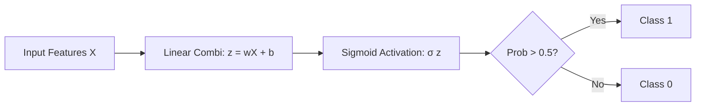
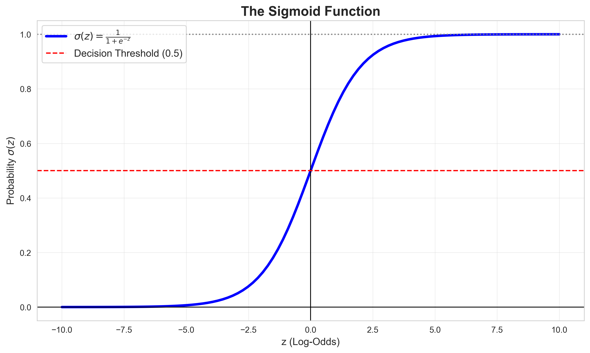
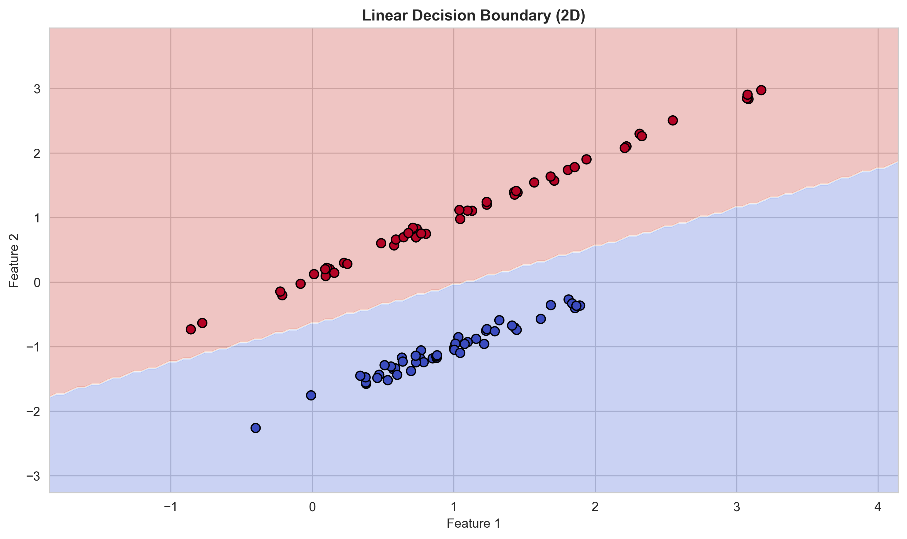
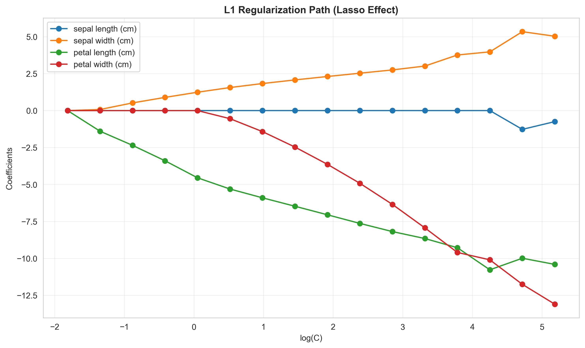
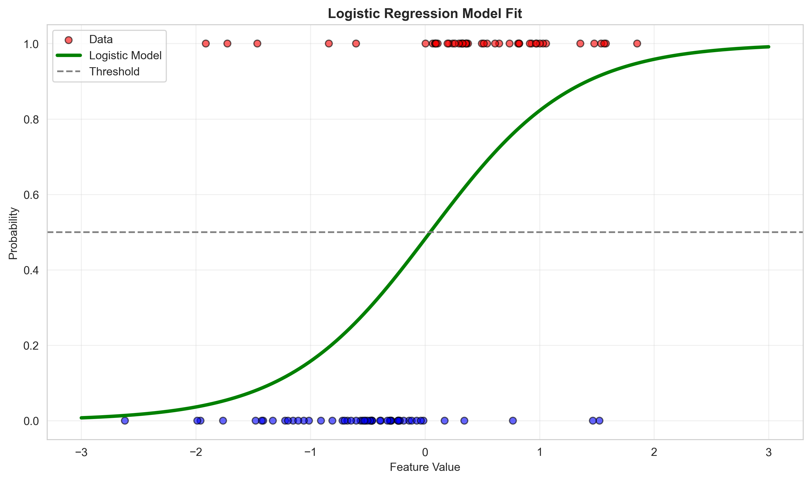
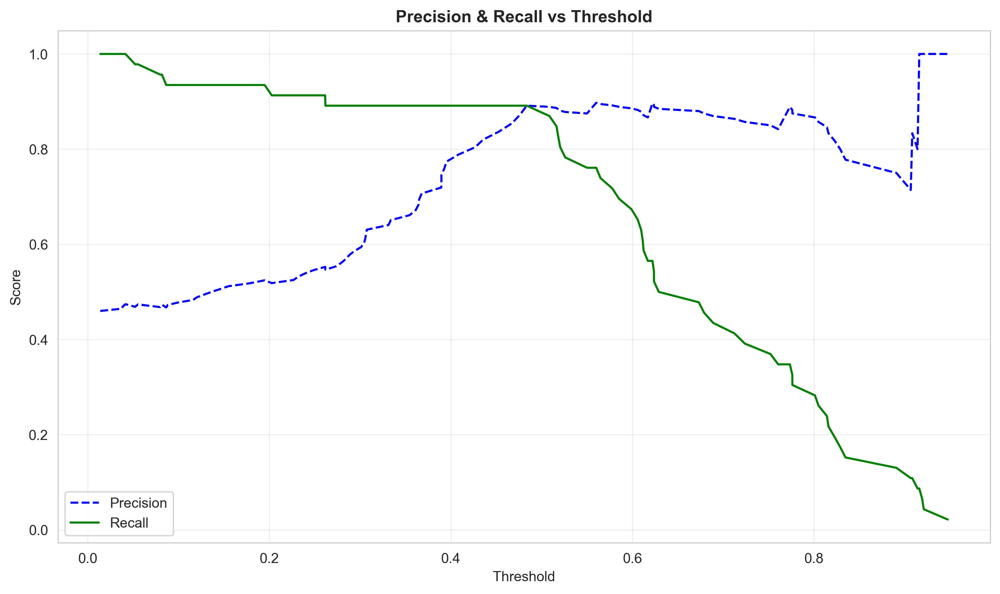
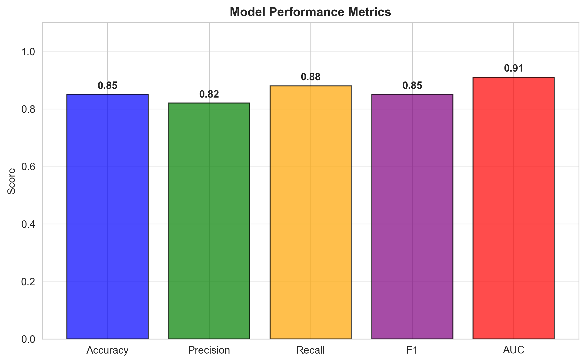
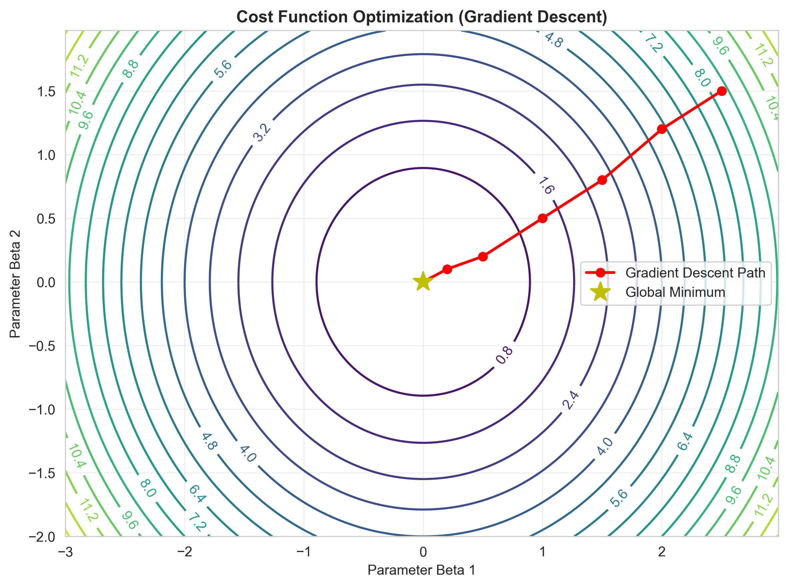
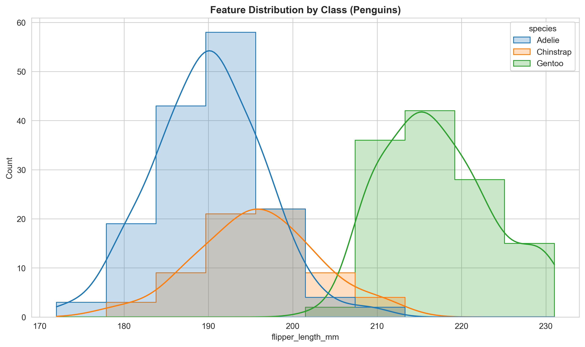

# Module 13: Logistic Regression

## Overview
This module introduced Logistic Regression, a fundamental algorithm for classification tasks. Unlike linear regression which predicts continuous values, logistic regression predicts probabilities and is primarily used for binary and multiclass classification problems.

## Key Concepts
*   **Logistic Regression:** A statistical model that uses the logistic (sigmoid) function to model the probability of a binary outcome (e.g., pass/fail, yes/no, 0/1).
*   **Sigmoid Function:** The activation function that maps any real-valued input to a probability between 0 and 1.
*   **Decision Boundary:** The threshold (typically 0.5) used to convert predicted probabilities into discrete class predictions.
*   **Log Loss (Binary Cross-Entropy):** The cost function minimized during training to find optimal parameters.
*   **Odds and Odds Ratio:** Alternative ways to interpret logistic regression coefficients.
*   **Regularization:** Techniques (L1, L2) to prevent overfitting by penalizing large coefficients.
*   **Multiclass Classification:** Extending binary logistic regression to handle multiple classes using softmax (Multinomial), One-vs-Rest (OVR), or One-vs-One (OVO).
*   **Maximum Likelihood Estimation (MLE):** The statistical framework used to derive the Log Loss cost function.
*   **Cleanly Separable Data:** If classes are perfectly separable, MLE causes coefficients to grow to infinity (overfitting). Regularization (L2) prevents this.

### 8. Multiclass Strategies
*   **One-vs-Rest (OVR):** Fits $K$ classifiers. Good for large $K$.
*   **One-vs-One (OVO):** Fits $\frac{K(K-1)}{2}$ classifiers (every pair). Good for small $K$ or algorithms that don't scale well.
*   **Multinomial (Softmax):** Direct probability estimation for all classes at once. Preferred if solver supports it.

## Key Formulas

### Logistic Regression Workflow



### 1. Sigmoid Function

The sigmoid function maps any real-valued number to the range [0, 1], which can be interpreted as a probability.

$$ \sigma(z) = \frac{1}{1 + e^{-z}} $$

where:

$$ z = \beta_0 + \beta_1 x_1 + \beta_2 x_2 + ... + \beta_n x_n $$

*   **$\sigma(z)$** (Pronounced: *sigma of z*): The sigmoid function output, representing the probability $P(y=1|x)$.
*   **$z$** (Pronounced: *z*): The linear combination of features and coefficients (also called the logit).
*   **$e$** (Pronounced: *e* or *Euler's number*): The mathematical constant approximately equal to 2.71828.
*   **$\beta_0$** (Pronounced: *beta zero*): The intercept (bias term).
*   **$\beta_i$** (Pronounced: *beta i*): The coefficient for feature $x_i$.


*Figure 1: The sigmoid function curve showing how it maps input values to probabilities between 0 and 1.*

**Properties:**
- Output range: $(0, 1)$
- Symmetric around 0.5
- $\sigma(0) = 0.5$
- As $z \to \infty$, $\sigma(z) \to 1$
- As $z \to -\infty$, $\sigma(z) \to 0$

### 2. Logistic Regression Model

The probability that the output $y$ equals 1 given input features $x$:

$$ P(y=1|x; \beta) = \sigma(\beta_0 + \beta_1 x_1 + ... + \beta_n x_n) = \frac{1}{1 + e^{-(\beta_0 + \sum_{i=1}^{n} \beta_i x_i)}} $$

*   **$P(y=1|x; \beta)$** (Pronounced: *Probability of y equals 1 given x, parameterized by beta*): The predicted probability of the positive class.

### 3. Odds and Odds Ratio

The **odds** represent the ratio of the probability of success to the probability of failure:

$$ \text{Odds} = \frac{P(y=1)}{1-P(y=1)} = e^{\beta_0 + \beta_1 x_1 + ... + \beta_n x_n} $$

*   **$\text{Odds}$** (Pronounced: *Odds*): The odds of the positive outcome occurring.
*   **$e^{\beta_i}$** (Pronounced: *e to the beta i*): The **odds ratio** for a one-unit increase in $x_i$, holding other features constant.

**Interpretation:** If $\beta_1 = 0.5$, then $e^{0.5} \approx 1.65$, meaning a one-unit increase in $x_1$ increases the odds by 65%.

### 4. Log Loss (Binary Cross-Entropy)

The cost function minimized in logistic regression training:

$$ J(\beta) = -\frac{1}{m} \sum_{i=1}^{m} \left[ y^{(i)} \log(\hat{y}^{(i)}) + (1-y^{(i)}) \log(1-\hat{y}^{(i)}) \right] $$

*   **$J(\beta)$** (Pronounced: *J of beta*): The log loss (cost function).
*   **$m$** (Pronounced: *m*): The number of training samples.
*   **$y^{(i)}$** (Pronounced: *y super i*): The actual label for sample $i$ (0 or 1).
*   **$\hat{y}^{(i)}$** (Pronounced: *y hat super i*): The predicted probability for sample $i$.
*   **$\log$** (Pronounced: *log* or *natural logarithm*): The natural logarithm.
*   **$\sum$** (Pronounced: *sum*): Summation over all training examples.

**Intuition:** Log loss penalizes confident wrong predictions heavily. Predicting high probability for the wrong class results in large loss.

### 5. Gradient of Log Loss

To minimize the cost function using Gradient Descent, we need its partial derivatives. Surprisingly, it has the **exact same form** as Linear Regression:

$$ \frac{\partial}{\partial \beta_j} J(\beta) = \frac{1}{m} \sum_{i=1}^{m} (\sigma(z^{(i)}) - y^{(i)}) x_j^{(i)} $$

*   **$\frac{\partial}{\partial \beta_j}$** (Pronounced: *partial derivative with respect to beta j*): The rate of change of the cost function as just $\beta_j$ changes.

Vectorized form:

$$ \nabla J(\beta) = \frac{1}{m} X^T (\hat{y} - y) $$

*   **$\nabla J(\beta)$** (Pronounced: *Nabla J of beta*): The gradient vector.
*   **$X^T$** (Pronounced: *X transpose*): The transpose of the feature matrix.
*   **$\hat{y}$**: The vector of predicted probabilities $\sigma(X\beta)$.

### 6. Newton-Raphson Method (Second-Order Optimization)

Advanced solvers like `newton-cg` and `lbfgs` use second-order derivative information (the Hessian matrix) for faster convergence:

$$ \beta^{(t+1)} = \beta^{(t)} - H^{-1} \nabla J(\beta^{(t)}) $$

*   **$H$** (Pronounced: *Hessian matrix*): Matrix of second partial derivatives.
*   **$H^{-1}$** (Pronounced: *H inverse*): The inverse of the Hessian matrix.
*   **Pros:** Much faster convergence near the minimum.
*   **Cons:** Expensive to compute $H^{-1}$ for large numbers of features.

### 7. Regularized Cost Functions

To prevent overfitting, we add a penalty term to the cost function:

**L2 Regularization (Ridge) - Default:**
$$ J_{reg}(\beta) = J(\beta) + \frac{\lambda}{2m} \sum_{j=1}^{n} \beta_j^2 $$

**L1 Regularization (Lasso):**
$$ J_{reg}(\beta) = J(\beta) + \frac{\lambda}{m} \sum_{j=1}^{n} |\beta_j| $$

*   **$\lambda$** (Pronounced: *lambda*): Regularization strength (inverse of parameter `C`).

### 8. Evaluation Metrics

**Confusion Matrix Components:**
- **TP** (True Positive): Correctly predicted positive
- **TN** (True Negative): Correctly predicted negative
- **FP** (False Positive): Incorrectly predicted positive (Type I error)
- **FN** (False Negative): Incorrectly predicted negative (Type II error)

**Accuracy:**

Proportion of correct predictions out of all predictions.

$$ \text{Accuracy} = \frac{TP + TN}{TP + TN + FP + FN} $$

*   **$\text{Accuracy}$** (Pronounced: *Accuracy*): Overall correctness of the model.

**Precision:**

Proportion of true positives among all positive predictions. Answers: "Of all predicted positives, how many were actually positive?"

$$ \text{Precision} = \frac{TP}{TP + FP} $$

*   **$\text{Precision}$** (Pronounced: *Precision*): Measures the quality of positive predictions.

**Recall (Sensitivity, True Positive Rate):**

Proportion of true positives among all actual positives. Answers: "Of all actual positives, how many did we correctly identify?"

$$ \text{Recall} = \frac{TP}{TP + FN} $$

*   **$\text{Recall}$** (Pronounced: *Recall* or *Sensitivity*): Measures the model's ability to find all positive cases.

**F1 Score:**

Harmonic mean of precision and recall, balancing both metrics.

$$ F1 = 2 \times \frac{\text{Precision} \times \text{Recall}}{\text{Precision} + \text{Recall}} = \frac{2 \times TP}{2 \times TP + FP + FN} $$

*   **$F1$** (Pronounced: *F-one score*): Combines precision and recall into a single metric.

**Specificity (True Negative Rate):**

$$ \text{Specificity} = \frac{TN}{TN + FP} $$

### 6. ROC Curve Metrics

**True Positive Rate (TPR):**

$$ TPR = \frac{TP}{TP + FN} = \text{Recall} $$

**False Positive Rate (FPR):**

$$ FPR = \frac{FP}{FP + TN} = 1 - \text{Specificity} $$

*   **$TPR$** (Pronounced: *T-P-R* or *True Positive Rate*): Y-axis of ROC curve.
*   **$FPR$** (Pronounced: *F-P-R* or *False Positive Rate*): X-axis of ROC curve.

**ROC Curve:** A plot of TPR vs FPR at various classification thresholds.

**AUC (Area Under the Curve):** A single metric summarizing ROC curve performance:
- AUC = 1.0: Perfect classifier
- AUC = 0.5: Random guessing
- AUC > 0.8: Generally considered good


*Figure 2: Decision boundary showing how logistic regression separates classes in feature space.*

### 7. Multinomial Logistic Regression (Softmax)

For multiclass classification with $K$ classes, the softmax function generalizes the sigmoid:

$$ P(y=k|x; \beta) = \frac{e^{\beta_k^T x}}{\sum_{j=1}^{K} e^{\beta_j^T x}} $$

*   **$P(y=k|x; \beta)$** (Pronounced: *Probability of y equals k given x*): Probability of class $k$.
*   **$K$** (Pronounced: *K*): Total number of classes.
*   **$\beta_k^T x$** (Pronounced: *beta k transpose times x*): Linear combination for class $k$.
*   **$\sum_{j=1}^{K}$** (Pronounced: *sum from j equals 1 to K*): Normalization term ensuring probabilities sum to 1.

## Hyperparameters

Logistic Regression in scikit-learn has several important hyperparameters:

### Regularization
*   **`penalty`**: Type of regularization to apply.
    *   Options: `'l1'`, `'l2'` (default), `'elasticnet'`, `None`
    *   **L2 (Ridge)**: Penalizes sum of squared coefficients, shrinks coefficients smoothly
    *   **L1 (Lasso)**: Penalizes sum of absolute values, can zero out coefficients (feature selection)
    *   **ElasticNet**: Combination of L1 and L2
    
*   **`C`**: Inverse of regularization strength (must be positive).
    *   Default: `1.0`
    *   *Smaller values* → stronger regularization → simpler model
    *   *Larger values* → weaker regularization → more complex model
    *   *Effect:* Controls the tradeoff between fitting training data and keeping coefficients small


*Figure 3: Effect of L1 regularization on coefficient values, showing how some coefficients become exactly zero.*

### Optimization
*   **`solver`**: Algorithm to use for optimization.
    *   Options: `'lbfgs'` (default), `'liblinear'`, `'newton-cg'`, `'sag'`, `'saga'`
    *   **lbfgs**: Good for small to medium datasets, supports L2 and None
    *   **liblinear**: Good for small datasets, supports L1 and L2
    *   **sag/saga**: Fast for large datasets, `saga` supports all penalties
    *   *Note:* Some solvers don't support all penalty types
    
*   **`max_iter`**: Maximum number of iterations for convergence.
    *   Default: `100`
    *   *Effect:* Increase if model doesn't converge

### Class Imbalance
*   **`class_weight`**: Weights associated with classes.
    *   Options: `None` (default), `'balanced'`, or dictionary
    *   **'balanced'**: Automatically adjusts weights inversely proportional to class frequencies: $\frac{n\_samples}{n\_classes \times n\_samples\_for\_class}$
    *   *Effect:* Helps model perform better on imbalanced datasets

### Multiclass Strategy
*   **`multi_class`**: Strategy for multiclass classification.
    *   Options: `'auto'`, `'ovr'`, `'multinomial'`
    *   **'ovr'** (One-vs-Rest): Trains one binary classifier per class
    *   **'multinomial'**: Uses softmax function for true multinomial loss
    *   *Effect:* Multinomial is generally better but requires solvers like 'lbfgs'

## Code for Learning

This section provides essential code for building, evaluating, and tuning Logistic Regression models.

### Setup and Imports

**Installation:**
```bash
pip install numpy pandas matplotlib seaborn scikit-learn scipy
```

**Imports:**
```python
import pandas as pd
import numpy as np
import matplotlib.pyplot as plt
import seaborn as sns

from sklearn.linear_model import LogisticRegression
from sklearn.model_selection import train_test_split, cross_val_score, GridSearchCV
from sklearn.metrics import (accuracy_score, precision_score, recall_score, f1_score,
                             confusion_matrix, classification_report, 
                             roc_curve, roc_auc_score, ConfusionMatrixDisplay)
from sklearn.preprocessing import StandardScaler, OneHotEncoder
from sklearn.compose import ColumnTransformer
from sklearn.pipeline import Pipeline
from sklearn.impute import SimpleImputer

### Product Category Classification (PriceRunner Dataset)

In this module, we handle a dataset with **high-cardinality categorical features** (e.g., Product Titles, Merchant IDs). Standard One-Hot Encoding would create too many features, so we use advanced techniques.

#### 1. The Challenge: High Cardinality
A feature like "Product Name" might have thousands of unique values.
- **One-Hot Encoding:** Creates thousands of sparse columns (inefficient).
- **Target Encoding (James-Stein):** Replaces the category with a weighted average of the target variable for that category, shrinking it towards the global mean to prevent overfitting.

#### 2. Advanced Encoding Pipeline
We use `category_encoders` combined with `sklearn` pipelines.

```python
from sklearn.pipeline import Pipeline
from sklearn.compose import ColumnTransformer
from sklearn.preprocessing import StandardScaler
from category_encoders import JamesSteinEncoder
from sklearn.linear_model import LogisticRegression
from sklearn.feature_selection import SelectFromModel

# Feature Selection
# 'num' and 'cat' would be lists of column names
preprocessor = ColumnTransformer(
    transformers=[
        ('num', StandardScaler(), numeric_cols),
        ('cat', JamesSteinEncoder(), categorical_cols)
    ]
)

# Pipeline: Preprocess -> Select Features -> Classify
pipeline = Pipeline([
    ('preprocessor', preprocessor),
    ('selector', SelectFromModel(LogisticRegression(penalty='l1', solver='liblinear'))),
    ('classifier', LogisticRegression())
])

# Fit on training data
pipeline.fit(X_train, y_train)

# Evaluate
print(f"Test Accuracy: {pipeline.score(X_test, y_test):.3f}")
```

#### 3. Why James-Stein?
It balances the **category's mean** with the **global mean**.
- If a category is reliable (many data points), use its own mean.
- If a category is rare (few data points), pull it towards the global average.
This is defined as:
$$ \hat{\mu}_i = (1 - B) y_i + B \bar{y} $$
Where $B$ is the shrinking factor.



*Figure 4: Logistic regression model showing the sigmoid curve fitted to binary classification data.*

### 2. Visualizing the Sigmoid Curve

Plot the sigmoid function and predicted probabilities.

```python
# For single feature visualization
X_single = penguins_binary[['flipper_length_mm']]
logreg_single = LogisticRegression(random_state=42)
logreg_single.fit(X_single, y)

# Create range of values
x_range = np.linspace(X_single.min(), X_single.max(), 300)
# Predict probabilities
probs = logreg_single.predict_proba(x_range.reshape(-1, 1))[:, 1]

# Plot
plt.figure(figsize=(10, 6))
plt.scatter(X_single, y, alpha=0.5, label='Actual')
plt.plot(x_range, probs, color='red', linewidth=2, label='Sigmoid Curve')
plt.axhline(y=0.5, color='green', linestyle='--', label='Decision Boundary (0.5)')
plt.xlabel('Flipper Length (mm)')
plt.ylabel('Probability of Gentoo')
plt.title('Logistic Regression Sigmoid Curve')
plt.legend()
plt.grid(True, alpha=0.3)
plt.show()
```

### 3. Confusion Matrix and Classification Report

Comprehensive evaluation using confusion matrix.

```python
from sklearn.metrics import ConfusionMatrixDisplay

# Confusion matrix
cm = confusion_matrix(y_test, y_pred)
disp = ConfusionMatrixDisplay(confusion_matrix=cm, display_labels=['Adelie', 'Gentoo'])
disp.plot(cmap='Blues')
plt.title('Confusion Matrix')
plt.show()

# Detailed classification report
print(classification_report(y_test, y_pred, target_names=['Adelie', 'Gentoo']))
```


*Figure 5: Analysis of different classification thresholds showing precision-recall tradeoff.*

### 4. ROC Curve and AUC

Visualize model performance across different thresholds.

```python
# Calculate ROC curve
fpr, tpr, thresholds = roc_curve(y_test, y_pred_proba)
auc = roc_auc_score(y_test, y_pred_proba)

# Plot ROC curve
plt.figure(figsize=(8, 6))
plt.plot(fpr, tpr, linewidth=2, label=f'Logistic Regression (AUC = {auc:.3f})')
plt.plot([0, 1], [0, 1], 'k--', label='Random Classifier (AUC = 0.5)')
plt.xlabel('False Positive Rate')
plt.ylabel('True Positive Rate')
plt.title('ROC Curve')
plt.legend()
plt.grid(True, alpha=0.3)
plt.show()

print(f"AUC Score: {auc:.3f}")
```


*Figure 6: Model performance metrics comparison across different configurations.*

### 5. Threshold Tuning

Find optimal threshold for specific use case.

```python
# Calculate metrics for different thresholds
thresholds_to_test = np.linspace(0.1, 0.9, 50)
precision_scores = []
recall_scores = []
f1_scores = []

for threshold in thresholds_to_test:
    y_pred_thresh = (y_pred_proba >= threshold).astype(int)
    precision_scores.append(precision_score(y_test, y_pred_thresh))
    recall_scores.append(recall_score(y_test, y_pred_thresh))
    f1_scores.append(f1_score(y_test, y_pred_thresh))

# Plot threshold analysis
plt.figure(figsize=(10, 6))
plt.plot(thresholds_to_test, precision_scores, label='Precision', linewidth=2)
plt.plot(thresholds_to_test, recall_scores, label='Recall', linewidth=2)
plt.plot(thresholds_to_test, f1_scores, label='F1 Score', linewidth=2)
plt.xlabel('Threshold')
plt.ylabel('Score')
plt.title('Metrics vs Classification Threshold')
plt.legend()
plt.grid(True, alpha=0.3)
plt.show()

# Find threshold that maximizes F1
best_threshold = thresholds_to_test[np.argmax(f1_scores)]
print(f"Best Threshold for F1: {best_threshold:.3f}")
```

### 6. Regularization (L1 vs L2)

Compare different regularization techniques.

```python
from sklearn.preprocessing import StandardScaler

# Standardize features (important for regularization)
scaler = StandardScaler()
X_train_scaled = scaler.fit_transform(X_train)
X_test_scaled = scaler.transform(X_test)

# Train models with different regularization
C_values = [0.001, 0.01, 0.1, 1, 10, 100]
l1_scores = []
l2_scores = []

for C in C_values:
    # L1 regularization
    logreg_l1 = LogisticRegression(penalty='l1', C=C, solver='liblinear', random_state=42)
    logreg_l1.fit(X_train_scaled, y_train)
    l1_scores.append(logreg_l1.score(X_test_scaled, y_test))
    
    # L2 regularization
    logreg_l2 = LogisticRegression(penalty='l2', C=C, solver='lbfgs', random_state=42)
    logreg_l2.fit(X_train_scaled, y_train)
    l2_scores.append(logreg_l2.score(X_test_scaled, y_test))

# Plot comparison
plt.figure(figsize=(10, 6))
plt.semilogx(C_values, l1_scores, marker='o', label='L1 (Lasso)', linewidth=2)
plt.semilogx(C_values, l2_scores, marker='s', label='L2 (Ridge)', linewidth=2)
plt.xlabel('C (Inverse Regularization Strength)')
plt.ylabel('Accuracy')
plt.title('Regularization Comparison')
plt.legend()
plt.grid(True, alpha=0.3)
plt.show()
```


*Figure 7: Optimization path showing how coefficients converge during training.*

### 7. Multiclass Classification

Extend to multiple classes using multinomial logistic regression.

```python
# Use all penguin species
X_multi = penguins[['flipper_length_mm', 'bill_length_mm', 'bill_depth_mm']]
y_multi = penguins['species']

# Split data
X_train_m, X_test_m, y_train_m, y_test_m = train_test_split(
    X_multi, y_multi, test_size=0.2, random_state=42
)

# Train multinomial logistic regression
logreg_multi = LogisticRegression(multi_class='multinomial', solver='lbfgs', 
                                   max_iter=1000, random_state=42)
logreg_multi.fit(X_train_m, y_train_m)

# Predict
y_pred_m = logreg_multi.predict(X_test_m)

# Evaluate
print(f"Multiclass Accuracy: {accuracy_score(y_test_m, y_pred_m):.3f}")
print("\nClassification Report:")
print(classification_report(y_test_m, y_pred_m))

# Confusion matrix
cm_multi = confusion_matrix(y_test_m, y_pred_m)
disp_multi = ConfusionMatrixDisplay(confusion_matrix=cm_multi, 
                                     display_labels=logreg_multi.classes_)
disp_multi.plot(cmap='Blues')
plt.title('Multiclass Confusion Matrix')
plt.show()
```


*Figure 8: Distribution of flipper length feature across different penguin species.*

### 8. Handling Class Imbalance

Use class weights to handle imbalanced datasets.

```python
# Create imbalanced dataset (example)
# Simulate by undersampling one class
majority_class = y_train[y_train == 0]
minority_class = y_train[y_train == 1][:len(majority_class)//5]  # 1:5 ratio

y_imbalanced = pd.concat([majority_class, minority_class])
X_imbalanced = X_train.loc[y_imbalanced.index]

print(f"Class distribution: {y_imbalanced.value_counts().to_dict()}")

# Train without balancing
logreg_unbalanced = LogisticRegression(random_state=42)
logreg_unbalanced.fit(X_imbalanced, y_imbalanced)

# Train with balanced class weights
logreg_balanced = LogisticRegression(class_weight='balanced', random_state=42)
logreg_balanced.fit(X_imbalanced, y_imbalanced)

# Compare on test set
print("\nWithout Balancing:")
print(classification_report(y_test, logreg_unbalanced.predict(X_test)))

print("\nWith Balanced Weights:")
print(classification_report(y_test, logreg_balanced.predict(X_test)))
```

### 9. Pipeline with Preprocessing

Create a complete ML pipeline with preprocessing steps.

```python
from sklearn.compose import ColumnTransformer
from sklearn.pipeline import Pipeline
from sklearn.preprocessing import StandardScaler, OneHotEncoder
from sklearn.impute import SimpleImputer

# Example with mixed data types
penguins_full = sns.load_dataset('penguins')
X_full = penguins_full.drop('species', axis=1)
y_full = penguins_full['species']

# Define feature types
numerical_features = ['bill_length_mm', 'bill_depth_mm', 'flipper_length_mm', 'body_mass_g']
categorical_features = ['island', 'sex']

# Create preprocessing pipelines
numerical_pipeline = Pipeline([
    ('imputer', SimpleImputer(strategy='median')),
    ('scaler', StandardScaler())
])

categorical_pipeline = Pipeline([
    ('imputer', SimpleImputer(strategy='most_frequent')),
    ('onehot', OneHotEncoder(handle_unknown='ignore', drop='first'))
])

# Combine preprocessing
preprocessor = ColumnTransformer([
    ('num', numerical_pipeline, numerical_features),
    ('cat', categorical_pipeline, categorical_features)
])

# Create full pipeline
full_pipeline = Pipeline([
    ('preprocessor', preprocessor),
    ('classifier', LogisticRegression(multi_class='multinomial', solver='lbfgs',
                                     max_iter=1000, random_state=42))
])

# Train and evaluate
X_train_full, X_test_full, y_train_full, y_test_full = train_test_split(
    X_full, y_full, test_size=0.2, random_state=42
)

full_pipeline.fit(X_train_full, y_train_full)
y_pred_full = full_pipeline.predict(X_test_full)

print(f"Pipeline Accuracy: {accuracy_score(y_test_full, y_pred_full):.3f}")
print("\nClassification Report:")
print(classification_report(y_test_full, y_pred_full))
```

### 10. Hyperparameter Tuning with GridSearchCV

Find optimal hyperparameters using grid search.

```python
# Define parameter grid
param_grid = {
    'classifier__C': [0.001, 0.01, 0.1, 1, 10, 100],
    'classifier__penalty': ['l2'],
    'classifier__solver': ['lbfgs', 'saga'],
    'classifier__max_iter': [500, 1000]
}

# Grid search
grid_search = GridSearchCV(
    full_pipeline,
    param_grid,
    cv=5,
    scoring='accuracy',
    n_jobs=-1,
    verbose=1
)

grid_search.fit(X_train_full, y_train_full)

# Best parameters
print("Best Parameters:", grid_search.best_params_)
print(f"Best CV Score: {grid_search.best_score_:.3f}")

# Test set performance
y_pred_best = grid_search.best_estimator_.predict(X_test_full)
print(f"Test Accuracy: {accuracy_score(y_test_full, y_pred_best):.3f}")
```

## Assignment Highlights
*   **Dataset:** Penguins dataset for binary and multiclass classification.
*   **Goal:** Classify penguin species based on physical measurements.
*   **Process:**
    *   Fitted Logistic Regression models for binary classification (Adelie vs Gentoo).
    *   Visualized the sigmoid curve to understand probability mapping.
    *   Evaluated models using accuracy, precision, recall, and F1 score.
    *   Created confusion matrices to analyze classification errors.
    *   Plotted ROC curves and calculated AUC scores.
    *   Experimented with different classification thresholds.
    *   Applied regularization (L1, L2) to prevent overfitting.
    *   Extended to multiclass classification using softmax.
    *   Built complete pipelines with preprocessing.
    *   Handled class imbalance using `class_weight='balanced'`.

## Advantages and Limitations

**Advantages:**
- Probabilistic output (not just class labels)
- Well-calibrated probabilities
- Interpretable coefficients (odds ratios)
- Efficient training and prediction
- Works well with linearly separable data
- Built-in regularization options
- Extends naturally to multiclass problems

**Limitations:**
- Assumes linear relationship between features and log-odds
- Sensitive to outliers (can be mitigated with regularization)
- Requires feature scaling for optimal performance
- May underperform with highly non-linear decision boundaries
- Can struggle with highly imbalanced datasets without adjustment
- Prone to overfitting with many features relative to samples
