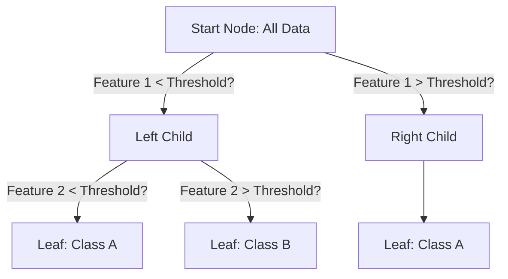

# Module 14: Decision Trees

## Overview
This module covered Decision Trees, a versatile non-parametric supervised learning method used for both classification and regression. Decision Trees recursively partition the feature space to make predictions based on feature values.

## Key Concepts
*   **Decision Tree:** A flowchart-like structure in which each internal node represents a test on an attribute, each branch represents the outcome of the test, and each leaf node represents a class label or regression value.
*   **Splitting Criteria:** Methods to determine the best feature and threshold to split data at each node.
*   **Gini Impurity:** Measures the likelihood of incorrect classification if a sample is randomly labeled according to the class distribution.
*   **Entropy:** Measures the randomness or disorder in the information being processed.
*   **Information Gain:** Measures the reduction in entropy after splitting on an attribute.
*   **Overfitting:** Creating a tree that is too complex and matches training data too closely, leading to poor generalization.
*   **Pruning:** Reducing tree complexity by removing sections that provide little predictive power.
*   **Feature Importance:** Quantifies the contribution of each feature to the model's predictions.

## Decision Tree Decision Process



## Key Formulas

### 1. Gini Impurity

Gini Impurity measures how often a randomly chosen element from the set would be incorrectly labeled if it was randomly labeled according to the distribution of labels in the subset. Lower values indicate purer nodes.

$$ G = 1 - \sum_{i=1}^{C} p_i^2 $$

*   **$G$** (Pronounced: *G* or *Gini*): The Gini Impurity score.
*   **$C$** (Pronounced: *C*): The number of classes.
*   **$p_i$** (Pronounced: *p sub i*): The probability (proportion) of class $i$ in the node.
*   **$\sum$** (Pronounced: *sum*): Summation over all classes.

**Example:** For a binary classification with 40% class A and 60% class B:
$G = 1 - (0.4^2 + 0.6^2) = 1 - (0.16 + 0.36) = 0.48$

### 2. Entropy

Entropy measures the impurity or randomness in the data. Higher values indicate more disorder. It's commonly used in the ID3 and C4.5 algorithms.

$$ H = - \sum_{i=1}^{C} p_i \log_2(p_i) $$

*   **$H$** (Pronounced: *H* or *Entropy*): The entropy score.
*   **$p_i$** (Pronounced: *p sub i*): The probability (proportion) of class $i$ in the node.
*   **$\log_2$** (Pronounced: *log base 2*): Logarithm with base 2.

**Note:** By convention, $0 \log_2(0) = 0$ when a class probability is zero.

### 3. Information Gain

Information Gain (IG) measures the reduction in entropy (or impurity) after splitting on a particular attribute. The attribute with the highest information gain is chosen as the splitting criterion.

$$ IG(D, A) = H(D) - \sum_{v \in \text{values}(A)} \frac{|D_v|}{|D|} H(D_v) $$

*   **$IG(D, A)$** (Pronounced: *I-G of D comma A* or *Information Gain of dataset D given attribute A*)
*   **$H(D)$** (Pronounced: *H of D* or *Entropy of dataset D*): Entropy before the split.
*   **$A$** (Pronounced: *A*): The attribute being considered for splitting.
*   **$\text{values}(A)$** (Pronounced: *values of A*): The set of all possible values for attribute $A$.
*   **$D_v$** (Pronounced: *D sub v*): The subset of dataset $D$ for which attribute $A$ has value $v$.
*   **$|D_v|$** (Pronounced: *cardinality of D sub v*): Number of samples in subset $D_v$.
*   **$|D|$** (Pronounced: *cardinality of D*): Total number of samples in dataset $D$.

### 4. Gain Ratio

Information Gain is biased towards attributes with many values. Gain Ratio corrects this by normalizing Information Gain with Split Information.

$$ \text{GainRatio}(D, A) = \frac{IG(D, A)}{SplitInfo_A(D)} $$

Where:

$$ SplitInfo_A(D) = - \sum_{j=1}^{v} \frac{|D_j|}{|D|} \log_2 \left( \frac{|D_j|}{|D|} \right) $$

*   **$SplitInfo_A(D)$** (Pronounced: *Split Info of A on D*): The entropy of the split itself.
*   **$v$** (Pronounced: *v*): The number of distinct values (branches) for attribute $A$.

### 5. Regression Tree Criteria (MSE & MAE)

For regression tasks, the impurity measure is typically the variance or absolute error of the target variable within the node.

**Mean Squared Error (MSE) Reduction:**

$$ H(Q_m) = \frac{1}{N_m} \sum_{y \in Q_m} (y - \bar{y}_m)^2 $$

*   **$H(Q_m)$** (Pronounced: *H of Q sub m*): Impurity of node $m$.
*   **$N_m$** (Pronounced: *N sub m*): Number of samples in node $m$.
*   **$Q_m$** (Pronounced: *Q sub m*): The set of samples in node $m$.
*   **$y$** (Pronounced: *y*): The target value for a sample.
*   **$\bar{y}_m$** (Pronounced: *y bar sub m*): The mean target value in node $m$.

**Mean Absolute Error (MAE):**

$$ H(Q_m) = \frac{1}{N_m} \sum_{y \in Q_m} |y - \text{median}(y)_m| $$

*   **$\text{median}(y)_m$** (Pronounced: *median of y in m*): The median target value in node $m$.

### 6. Cost Complexity Pruning

Cost Complexity Pruning (also known as weakest link pruning) finds the optimal balance between tree complexity and accuracy by penalizing the number of terminal nodes. The cost complexity of a tree is:

$$ R_\alpha(T) = R(T) + \alpha |T| $$

*   **$R_\alpha(T)$** (Pronounced: *R alpha of T*): The cost complexity of tree $T$ with complexity parameter $\alpha$.
*   **$R(T)$** (Pronounced: *R of T*): The total misclassification error (or impurity) of tree $T$ on the training data.
*   **$\alpha$** (Pronounced: *alpha*): Complexity parameter (also called `ccp_alpha` in scikit-learn). Higher values lead to more aggressive pruning.
*   **$|T|$** (Pronounced: *cardinality of T* or *size of T*): The number of terminal (leaf) nodes in tree $T$.

**How it works:** For each value of $\alpha$, we find the subtree that minimizes $R_\alpha(T)$. As $\alpha$ increases, the optimal tree becomes smaller.

**1-SE Rule:** A common strategy in cross-validation is to select the smallest tree whose error is within one standard error of the minimum error tree. This favors simpler models when performance is comparable.

### 7. Feature Importance

Feature importance quantifies how much each feature contributes to reducing impurity across all splits in the tree. Features used in splits closer to the root and affecting more samples have higher importance.

$$ \text{Importance}(f) = \frac{\sum_{\text{node splits on } f} (\text{samples at node}) \times \Delta \text{impurity}}{\text{total samples}} $$

*   **$\text{Importance}(f)$** (Pronounced: *Importance of feature f*): The normalized importance score for feature $f$.
*   **$\Delta \text{impurity}$** (Pronounced: *Delta impurity*): The decrease in impurity (Gini or Entropy) achieved by the split.

In scikit-learn, feature importances are automatically normalized to sum to 1.

## Hyperparameters

Decision Trees have many hyperparameters that control tree structure and prevent overfitting:

### Splitting Criteria
*   **`criterion`**: The function to measure split quality.
    *   Options: `'gini'` (default), `'entropy'`, `'log_loss'`
    *   **Gini** is computationally faster; **Entropy** may produce slightly different trees

### Tree Structure Control
*   **`max_depth`**: Maximum depth of the tree (number of splits from root to leaf).
    *   Default: `None` (nodes are expanded until all leaves are pure or contain fewer than `min_samples_split` samples)
    *   *Effect:* Lower values prevent overfitting but may underfit
    
*   **`min_samples_split`**: Minimum number of samples required to split an internal node.
    *   Default: `2`
    *   *Effect:* Higher values prevent overfitting by requiring more data to justify a split
    
*   **`min_samples_leaf`**: Minimum number of samples required to be at a leaf node.
    *   Default: `1`
    *   *Effect:* Higher values create smoother decision boundaries
    
*   **`max_features`**: Number of features to consider when looking for the best split.
    *   Options: `None`, `'sqrt'`, `'log2'`, integer, or float
    *   Default: `None` (considers all features)
    *   *Effect:* Limits features per split, useful for Random Forests

### Pruning
*   **`ccp_alpha`**: Complexity parameter used for Minimal Cost-Complexity Pruning.
    *   Default: `0.0` (no pruning)
    *   *Effect:* Higher values lead to more pruning and simpler trees
    *   *Recommended:* Use `cost_complexity_pruning_path()` to find optimal values

### Other Parameters
*   **`splitter`**: Strategy to choose the split at each node.
    *   Options: `'best'` (default), `'random'`
    *   *Effect:* `'random'` can speed up training and add randomness
    
*   **`class_weight`**: Weights associated with classes (for imbalanced datasets).
    *   Options: `None`, `'balanced'`, or dictionary
    *   *Effect:* `'balanced'` automatically adjusts weights inversely proportional to class frequencies

## Code for Learning

This section provides essential code for building, tuning, and visualizing Decision Trees.

### Setup and Imports

**Installation:**
```bash
pip install numpy pandas matplotlib seaborn scikit-learn graphviz
```

**Imports:**
```python
import pandas as pd
import numpy as np
import matplotlib.pyplot as plt
import seaborn as sns

from sklearn.tree import DecisionTreeClassifier, DecisionTreeRegressor
from sklearn.tree import plot_tree, export_text, export_graphviz
from sklearn.model_selection import train_test_split, GridSearchCV, cross_val_score
from sklearn.metrics import accuracy_score, classification_report, confusion_matrix
```

### 1. Basic Decision Tree Classification

Train a simple decision tree and visualize it.

```python
# Load data
penguins = sns.load_dataset('penguins').dropna()
X = penguins[['bill_length_mm', 'flipper_length_mm']]
y = penguins['species']

# Split data
X_train, X_test, y_train, y_test = train_test_split(X, y, test_size=0.2, random_state=42)

# Train a shallow tree
tree = DecisionTreeClassifier(max_depth=3, random_state=42)
tree.fit(X_train, y_train)

# Evaluate
y_pred = tree.predict(X_test)
print(f"Accuracy: {accuracy_score(y_test, y_pred):.3f}")

# Visualize the tree
plt.figure(figsize=(15, 10))
plot_tree(tree, feature_names=X.columns, class_names=tree.classes_, 
          filled=True, rounded=True, fontsize=10)
plt.show()
```

### 2. Hyperparameter Tuning with GridSearchCV

Find the best hyperparameters using grid search with cross-validation.

```python
from sklearn.model_selection import GridSearchCV

# Define parameter grid
param_grid = {
    'criterion': ['gini', 'entropy'],
    'max_depth': [None, 5, 10, 15, 20],
    'min_samples_split': [2, 5, 10],
    'min_samples_leaf': [1, 2, 4],
    'max_features': [None, 'sqrt', 'log2']
}

# Initialize grid search
tree = DecisionTreeClassifier(random_state=42)
grid_search = GridSearchCV(
    estimator=tree,
    param_grid=param_grid,
    cv=5,
    scoring='accuracy',
    n_jobs=-1,
    verbose=1
)

# Fit grid search
grid_search.fit(X_train, y_train)

# Best parameters and score
print("Best Parameters:", grid_search.best_params_)
print("Best Cross-Validation Score:", grid_search.best_score_)

# Evaluate on test set
best_tree = grid_search.best_estimator_
y_pred = best_tree.predict(X_test)
print(f"Test Accuracy: {accuracy_score(y_test, y_pred):.3f}")
```

### 3. Cost Complexity Pruning

Use cost complexity pruning to find the optimal tree size.

```python
# Train a full tree
tree_full = DecisionTreeClassifier(random_state=42)
tree_full.fit(X_train, y_train)

# Get pruning path
path = tree_full.cost_complexity_pruning_path(X_train, y_train)
ccp_alphas = path.ccp_alphas
impurities = path.impurities

# Train trees with different alpha values
trees = []
for ccp_alpha in ccp_alphas[:-1]:  # Exclude the last alpha (prunes to root)
    tree = DecisionTreeClassifier(random_state=42, ccp_alpha=ccp_alpha)
    tree.fit(X_train, y_train)
    trees.append(tree)

# Evaluate each tree
train_scores = [tree.score(X_train, y_train) for tree in trees]
test_scores = [tree.score(X_test, y_test) for tree in trees]

# Plot alpha vs accuracy
plt.figure(figsize=(10, 6))
plt.plot(ccp_alphas[:-1], train_scores, marker='o', label='Train', drawstyle='steps-post')
plt.plot(ccp_alphas[:-1], test_scores, marker='o', label='Test', drawstyle='steps-post')
plt.xlabel('Alpha (Complexity Parameter)')
plt.ylabel('Accuracy')
plt.title('Accuracy vs Alpha for Cost Complexity Pruning')
plt.legend()
plt.grid(True)
plt.show()

# Select best alpha (highest test score)
best_idx = np.argmax(test_scores)
best_alpha = ccp_alphas[best_idx]
print(f"Best Alpha: {best_alpha:.5f}")
print(f"Best Test Accuracy: {test_scores[best_idx]:.3f}")

# Optional: 1-SE Rule Implementation
# Calculate standard error of accuracy (approximate)
n = len(y_test)
se = np.sqrt(test_scores[best_idx] * (1 - test_scores[best_idx]) / n)
target_accuracy = test_scores[best_idx] - se

# Find simplest model (highest alpha) within 1 SE of best accuracy
compatible_alphas = [ccp_alphas[i] for i in range(len(test_scores)) 
                     if test_scores[i] >= target_accuracy]
best_alpha_1se = max(compatible_alphas)
print(f"Best Alpha (1-SE Rule): {best_alpha_1se:.5f}")
```

### 4. Feature Importance Visualization


*Figure 1: Feature importance showing which features contribute most to the decision tree's predictions.*

```python
# Train a tree
tree = DecisionTreeClassifier(max_depth=5, random_state=42)
tree.fit(X_train, y_train)

# Get feature importances
importances = tree.feature_importances_
feature_names = X.columns

# Create a dataframe for visualization
importance_df = pd.DataFrame({
    'Feature': feature_names,
    'Importance': importances
}).sort_values(by='Importance', ascending=False)

# Plot
plt.figure(figsize=(10, 6))
plt.barh(importance_df['Feature'], importance_df['Importance'])
plt.xlabel('Importance')
plt.title('Feature Importance in Decision Tree')
plt.gca().invert_yaxis()
plt.show()

print(importance_df)
```

### 5. Decision Boundary Visualization


*Figure 2: Decision boundaries showing how the tree partitions the feature space.*

```python
from matplotlib.colors import ListedColormap

def plot_decision_boundary(model, X, y, title='Decision Boundary'):
    """Plot decision boundary for a 2D feature space."""
    # Create mesh
    h = 0.02  # Step size
    x_min, x_max = X.iloc[:, 0].min() - 1, X.iloc[:, 0].max() + 1
    y_min, y_max = X.iloc[:, 1].min() - 1, X.iloc[:, 1].max() + 1
    xx, yy = np.meshgrid(np.arange(x_min, x_max, h),
                         np.arange(y_min, y_max, h))
    
    # Predict on mesh
    Z = model.predict(np.c_[xx.ravel(), yy.ravel()])
    Z = pd.Categorical(Z).codes.reshape(xx.shape)
    
    # Plot
    plt.figure(figsize=(10, 8))
    plt.contourf(xx, yy, Z, alpha=0.4, cmap='viridis')
    plt.scatter(X.iloc[:, 0], X.iloc[:, 1], c=pd.Categorical(y).codes, 
                edgecolor='k', s=50, cmap='viridis')
    plt.xlabel(X.columns[0])
    plt.ylabel(X.columns[1])
    plt.title(title)
    plt.colorbar()
    plt.show()

# Plot for different max_depths
for depth in [1, 3, 5]:
    tree = DecisionTreeClassifier(max_depth=depth, random_state=42)
    tree.fit(X, y)
    plot_decision_boundary(tree, X, y, 
                          title=f'Decision Boundary (max_depth={depth})')
```

### 6. Export Tree Structure


*Figure 3: Visual representation of a decision tree structure showing splits and leaf nodes.*

```python
# Export as text
tree = DecisionTreeClassifier(max_depth=3, random_state=42)
tree.fit(X_train, y_train)

# Text representation
tree_rules = export_text(tree, feature_names=list(X.columns))
print(tree_rules)

# Export to DOT format (for Graphviz)
from sklearn.tree import export_graphviz
import graphviz

dot_data = export_graphviz(
    tree,
    feature_names=X.columns,
    class_names=tree.classes_,
    filled=True,
    rounded=True,
    special_characters=True
)
graph = graphviz.Source(dot_data)
graph.render("decision_tree", format='png')  # Saves as decision_tree.png
```

## Assignment Highlights
*   **Dataset:** Penguins dataset from Seaborn.
*   **Goal:** Classify penguin species based on physical measurements.
*   **Process:**
    *   Built Decision Tree models with various `max_depth` values.
    *   Visualized trees using `plot_tree` to understand splitting logic.
    *   Experimented with hyperparameters (`max_depth`, `min_samples_split`, `criterion`) to observe effects on model complexity and performance.
    *   Used GridSearchCV to find optimal hyperparameters.
    *   Visualized decision boundaries to see how trees partition the feature space.
    *   Applied cost complexity pruning to prevent overfitting.
    *   Analyzed feature importance to understand which features drive predictions.

## Advantages and Limitations

**Advantages:**
- Easy to understand and interpret
- Requires little data preprocessing
- Can handle both numerical and categorical data
- Non-parametric (no assumptions about data distribution)
- Can capture non-linear relationships

**Limitations:**
- Prone to overfitting without proper constraints
- Can be unstable (small data changes can result in very different trees)
- Biased toward features with more levels
- Can create overly complex trees that don't generalize well
