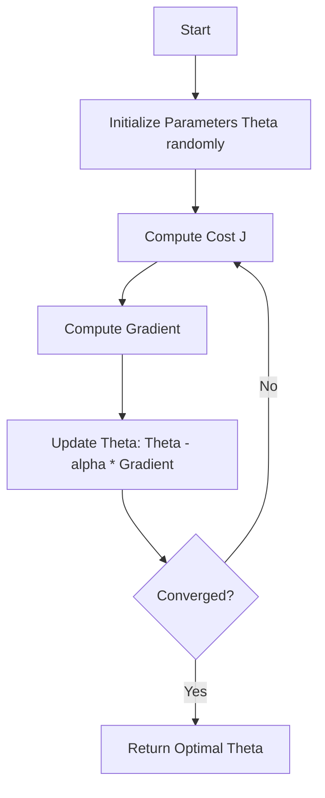

# Module 15: Gradient Descent for Linear Regression

## Overview
This module explored the optimization algorithm **Gradient Descent** and its application to Linear Regression. Gradient Descent is a fundamental optimization technique used throughout machine learning to minimize cost functions and find optimal model parameters.

## Key Concepts
*   **Gradient Descent:** An iterative optimization algorithm that finds the minimum of a function by moving in the direction of steepest descent (negative gradient).
*   **Linear Regression (Optimization perspective):** Finding the coefficients (weights) that minimize the prediction error.
*   **Cost Function (MSE):** Mean Squared Error - the objective function we minimize to fit the model.
*   **Learning Rate (α):** A hyperparameter controlling the step size in each iteration.
*   **Convergence:** The process of gradient descent reaching the optimal parameters where the cost function is minimized.
*   **Epochs:** The number of complete passes through the entire training dataset.

## Key Formulas

### 1. Mean Squared Error (MSE) Cost Function
The function we want to minimize:

$$ J(\theta) = \frac{1}{2m} \sum_{i=1}^{m} (h_\theta(x^{(i)}) - y^{(i)})^2 $$

*   **$J(\theta)$** (Pronounced: *J of theta*): The cost function value.
*   **$\theta$** (Pronounced: *theta*): The parameter vector (weights).
*   **$m$** (Pronounced: *m*): The number of training examples.
*   **$h_\theta(x^{(i)})$** (Pronounced: *h theta of x i*): The hypothesis function (prediction) for the $i$-th example.
*   **$y^{(i)}$** (Pronounced: *y i*): The actual target value for the $i$-th example.

### 2. Linear Hypothesis Function
For linear regression with $n$ features:

$$ h_\theta(x) = \theta_0 + \theta_1 x_1 + \theta_2 x_2 + ... + \theta_n x_n = \theta^T x $$

*   **$\theta_0$** (Pronounced: *theta zero* or *theta naught*): The bias term (intercept).
*   **$\theta_j$** (Pronounced: *theta j*): The weight for feature $j$.
*   **$T$** (Pronounced: *transpose*): Matrix transpose operation.

### 3. Gradient Descent Update Rule
Parameters are updated iteratively to minimize the cost function:

$$ \theta_j := \theta_j - \alpha \frac{\partial}{\partial \theta_j} J(\theta) $$

*   **$:=$** (Pronounced: *is assigned*): Assignment operator (update in place).
*   **$\alpha$** (Pronounced: *alpha*): The learning rate (step size).
*   **$\frac{\partial}{\partial \theta_j} J(\theta)$** (Pronounced: *partial derivative of J with respect to theta j*): The gradient of the cost function.

## Gradient Descent Algorithm Flow



### 4. Gradient for Linear Regression
The gradient (partial derivative) of MSE with respect to each parameter:

$$ \frac{\partial}{\partial \theta_j} J(\theta) = \frac{1}{m} \sum_{i=1}^{m} (h_\theta(x^{(i)}) - y^{(i)}) x_j^{(i)} $$

*   **$x_j^{(i)}$** (Pronounced: *x j of i*): The $j$-th feature value of the $i$-th training example.

### 5. Deep Dive: Coefficients vs. Residuals
How do these elements actually influence the model?

#### Coefficients ($\theta$ or $\beta$) - The "Drivers"
Coefficients determine the **Prediction**. They represent the sensitivity of the output to a specific feature.
*   **Influence on Prediction:**
    *   **Positive Coefficient:** As feature $x$ increases, prediction $\hat{y}$ increases.
    *   **Negative Coefficient:** As feature $x$ increases, prediction $\hat{y}$ decreases.
    *   **Magnitude:** Larger absolute value means the feature has a strictly stronger impact on the outcome.
*   **Influence on Probability (Logistic):** Coefficients shift the "Log-Odds". A positive coefficient pushes the probability toward 1; a negative one pushes it toward 0.

#### Residuals ($y - \hat{y}$) - The "Feedback"
Residuals represent the **Error**. They measure the discrepancy between the Truth ($y$) and the Model's opinion ($\hat{y}$).
*   **Influence on Learning:** Residuals drive the **Gradient Descent** updates.
    *   **Large Residual:** The model is far off $\rightarrow$ Large gradient $\rightarrow$ Big change to Coefficients.
    *   **Small Residual:** The model is close $\rightarrow$ Small gradient $\rightarrow$ Fine-tuning.
*   **Formula Connection:** Notice the term $(h_\theta(x) - y)$ in the gradient equation? That *is* the residual! The learning process is literally "Error $\times$ Input".

### 6. Vectorized Gradient Computation
For efficient computation with matrices:

$$ \nabla_\theta J(\theta) = \frac{1}{m} X^T (X\theta - y) $$

*   **$\nabla_\theta$** (Pronounced: *nabla theta* or *gradient with respect to theta*): The gradient vector.
*   **$X$** (Pronounced: *X*): The feature matrix (m × n).
*   **$y$** (Pronounced: *y*): The target vector (m × 1).

### 7. Mathematical Derivation of Gradient (Chain Rule)

To understand *why* the update rule works, we derive the gradient of the MSE cost function with respect to a single parameter $\theta_j$.

$$ \frac{\partial}{\partial \theta_j} J(\theta) = \frac{\partial}{\partial \theta_j} \frac{1}{2m} \sum_{i=1}^{m} (h_\theta(x^{(i)}) - y^{(i)})^2 $$

Using the **Chain Rule**:
$$ \frac{\partial J}{\partial \theta_j} = \frac{1}{m} \sum_{i=1}^{m} (h_\theta(x^{(i)}) - y^{(i)}) \cdot \frac{\partial}{\partial \theta_j} (h_\theta(x^{(i)}) - y^{(i)}) $$

Since $h_\theta(x^{(i)}) = \sum_{k=0}^{n} \theta_k x_k^{(i)}$, the partial derivative with respect to $\theta_j$ is simply $x_j^{(i)}$:
$$ \frac{\partial J}{\partial \theta_j} = \frac{1}{m} \sum_{i=1}^{m} (h_\theta(x^{(i)}) - y^{(i)}) \cdot x_j^{(i)} $$

### 8. Normal Equation (Analytical Solution)

Instead of iterating with Gradient Descent, we can solve for $\theta$ directly by setting the gradient to zero:

$$ \theta = (X^T X)^{-1} X^T y $$

*   **$(X^T X)^{-1}$** (Pronounced: *inverse of X transpose times X*): The inverse matrix.
*   **Pros:** No need to choose $\alpha$ (learning rate); no iterations.
*   **Cons:** Computationally expensive for large $n$ ($O(n^3)$); matrix must be invertible.

### 9. R-squared ($R^2$) Evaluation Metric

Measures the proportion of variance in the dependent variable explained by the model:

$$ R^2 = 1 - \frac{SS_{res}}{SS_{tot}} = 1 - \frac{\sum_{i=1}^{m} (y_i - \hat{y}_i)^2}{\sum_{i=1}^{m} (y_i - \bar{y})^2} $$

*   **$SS_{res}$** (Pronounced: *Sum of Squared Residuals*): The sum of squared errors of the model.
*   **$SS_{tot}$** (Pronounced: *Total Sum of Squares*): The total variance of the data (from the mean).
*   **Range:** $-\infty$ to $1$. ($1.0$ is perfect prediction).

### 10. Convexity
A function $f$ is **convex** if a line segment between any two points on the graph lies above or on the graph:

$$ t f(a) + (1-t)f(b) \ge f(t a + (1-t)b) $$

**Significance:** Convex functions (like MSE for Linear Regression) have a single global minimum, guaranteeing Gradient Descent will find the optimal solution (given small enough $\alpha$).

## Convergence Criteria

Instead of fixed iterations, stop when:

$$ |J(\theta^{(t+1)}) - J(\theta^{(t)})| < \epsilon $$

## Hyperparameters

### 1. Learning Rate (α)
*   **Definition:** Controls how much to change the model parameters in response to the estimated error.
*   **Typical Range:** 0.001 to 0.3
*   **Too Small:** Convergence is very slow; may require many iterations.
*   **Too Large:** Can overshoot the minimum and fail to converge (divergence).
*   **Optimal:** Should be tuned experimentally; try values like 0.001, 0.01, 0.1.

### 2. Number of Iterations (Epochs)
*   **Definition:** How many times the algorithm iterates through the training data.
*   **Typical Range:** 100 to 10,000+ depending on dataset and learning rate.
*   **Too Few:** Model may not converge to optimal parameters.
*   **Too Many:** Wastes computation time without improvement.
*   **Strategy:** Monitor cost function; stop when change becomes negligible.

### 3. Batch Size (for Mini-Batch/Stochastic GD)
*   **Definition:** Number of training examples used in each iteration.
*   **Batch GD:** Uses entire dataset (batch size = m).
*   **Stochastic GD:** Uses one example at a time (batch size = 1).
*   **Mini-Batch GD:** Uses a small batch (typical: 32, 64, 128, 256).

## Gradient Descent Variants

### Batch Gradient Descent
*   Uses the **entire training set** to compute the gradient at each step.
*   **Pros:** Stable convergence, guaranteed to converge to global minimum for convex functions.
*   **Cons:** Slow for large datasets; requires fitting entire dataset in memory.

### Stochastic Gradient Descent (SGD)
*   Uses **one random training example** at each step.
*   **Pros:** Faster updates; can escape local minima; works with large datasets.
*   **Cons:** Noisy updates; convergence path oscillates; may not reach exact minimum.

### Mini-Batch Gradient Descent
*   Uses **small random batches** (e.g., 32-256 examples).
*   **Pros:** Balances speed and stability; efficient use of vectorization.
*   **Cons:** Introduces hyperparameter (batch size).

## 4. Modern Machine Learning Concepts

### Double Descent Phenomenon
In classical ML, increasing complexity eventually leads to overfitting (high variance). In modern Deep Learning (over-parameterized regime), test error can **decrease again** after the interpolation threshold (zero training error).
*   **Classical Regime:** U-shaped test error curve (Bias-Variance Tradeoff).
*   **Validation:** Error spikes at the interpolation point.
*   **Modern Regime:** Error drops as model becomes massive (Double Descent).

### Implicit Regularization of SGD
Stochastic Gradient Descent (SGD) doesn't just find *any* minimum. It tends to find "flat" minima which generalize better. Among infinite solutions with zero training error, SGD naturally selects simpler solutions, acting as **implicit regularization**.

## Library Installation

```bash
# Install required libraries
pip install numpy pandas matplotlib scikit-learn scipy
```

## Implementation Details

### 1. Required Imports

```python
import numpy as np
import pandas as pd
import matplotlib.pyplot as plt
from sklearn.linear_model import LinearRegression, SGDRegressor
from scipy.optimize import minimize
```

### 2. Basic Gradient Descent Implementation

```python
def gradient_descent(df, initial_guess, alpha, n):
    """
    Performs n steps of gradient descent.
    
    Parameters:
    -----------
    df : function
        The derivative (gradient) function to minimize
    initial_guess : array
        Starting parameter values
    alpha : float
        Learning rate
    n : int
        Number of iterations
        
    Returns:
    --------
    guesses : array
        History of parameter values at each iteration
    """
    guesses = [initial_guess]
    current_guess = initial_guess
    
    for i in range(n - 1):
        # Update rule: theta = theta - alpha * gradient
        current_guess = current_guess - alpha * df(current_guess)
        guesses.append(current_guess)
        
    return np.array(guesses)
```

### 3. MSE Cost Function

```python
def mse_cost(theta, X, y):
    """
    Calculate the Mean Squared Error cost function.
    
    Parameters:
    -----------
    theta : array
        Parameter vector [theta_0, theta_1, ...]
    X : DataFrame or array
        Feature matrix
    y : array
        Target values
        
    Returns:
    --------
    cost : float
        The MSE cost
    """
    m = len(y)
    predictions = X @ theta  # Matrix multiplication
    errors = predictions - y
    cost = (1 / (2 * m)) * np.sum(errors ** 2)
    return cost
```

### 4. Gradient Calculation for Linear Regression

```python
def mse_gradient(theta, X, y_obs):
    """
    Calculate the gradient of MSE with respect to parameters.
    
    Parameters:
    -----------
    theta : array
        Current parameter values [theta_0, theta_1]
    X : DataFrame
        Feature matrix (should include column of 1s for intercept)
    y_obs : array
        Observed target values
        
    Returns:
    --------
    gradient : array
        Gradient vector [dJ/dtheta_0, dJ/dtheta_1]
    """
    x0 = X.iloc[:, 0]  # First feature (or intercept column)
    x1 = X.iloc[:, 1]  # Second feature
    
    # Compute partial derivatives
    # dJ/dtheta_0 = (1/m) * sum((h(x) - y) * x_0)
    dth0 = np.mean(-2 * (y_obs - theta[0]*x0 - theta[1]*x1) * x0)
    dth1 = np.mean(-2 * (y_obs - theta[0]*x0 - theta[1]*x1) * x1)
    
    return np.array([dth0, dth1])

# Example usage
X = credit[['Rating', 'Age']]  # Features
X.insert(0, 'Intercept', 1)    # Add column of 1s for intercept
y = credit['Balance']          # Target

# Create lambda for use with gradient_descent
mse_grad_func = lambda theta: mse_gradient(theta, X, y)

# Run gradient descent
initial_theta = np.array([0, 0, 0])
learning_rate = 0.0001
iterations = 10000

theta_history = gradient_descent(mse_grad_func, initial_theta, learning_rate, iterations)
optimal_theta = theta_history[-1]

print(f"Optimal parameters: {optimal_theta}")
```

### 5. Stochastic Gradient Descent (SGD)

```python
def stochastic_gradient_descent(gradient_func, initial_guess, alpha, n_iterations, 
                                num_datapoints, num_batches):
    """
    Performs Stochastic Gradient Descent with mini-batches.
    
    Parameters:
    -----------
    gradient_func : function
        Function that computes gradient for given batch
    initial_guess : array
        Starting parameter values
    alpha : float
        Learning rate
    n_iterations : int
        Number of iterations
    num_datapoints : int
        Total number of training examples
    num_batches : int
        Number of batches to split data into
        
    Returns:
    --------
    guesses : array
        History of parameter values
    """
    guesses = [initial_guess]
    guess = initial_guess
    
    for iteration in range(n_iterations):
        # Randomly shuffle data indices
        dp_indices = np.random.permutation(np.arange(num_datapoints))
        
        # Split into batches
        for batch_indices in np.split(dp_indices, num_batches):
            # Compute gradient on this batch only
            gradient = gradient_func(guess, batch_indices)
            
            # Update parameters
            guess = guess - alpha * gradient
            guesses.append(guess)
            
    return np.array(guesses)
```

### 6. Visualization of Convergence

```python
def plot_cost_history(theta_history, X, y):
    """
    Plot how the cost function decreases over iterations.
    """
    costs = []
    for theta in theta_history:
        cost = mse_cost(theta, X, y)
        costs.append(cost)
    
    plt.figure(figsize=(10, 6))
    plt.plot(costs, linewidth=2)
    plt.xlabel('Iteration', fontsize=12)
    plt.ylabel('Cost J(θ)', fontsize=12)
    plt.title('Cost Function vs. Iterations', fontsize=14)
    plt.grid(True, alpha=0.3)
    plt.show()
    
    print(f"Initial cost: {costs[0]:.2f}")
    print(f"Final cost: {costs[-1]:.2f}")
    print(f"Cost reduction: {costs[0] - costs[-1]:.2f}")

# Usage
plot_cost_history(theta_history, X, y)
```

### 7. Comparison with Scikit-Learn

```python
from sklearn.linear_model import LinearRegression, SGDRegressor

# Prepare data
X_train = credit[['Rating']].values
y_train = credit['Balance'].values

# Method 1: Gradient Descent (Manual)
# ... (use code from above)

# Method 2: Scikit-Learn Linear Regression (Closed-form solution)
lr = LinearRegression()
lr.fit(X_train, y_train)
print(f"sklearn LinearRegression - Intercept: {lr.intercept_:.2f}, Coefficient: {lr.coef_[0]:.2f}")

# Method 3: Scikit-Learn SGD Regressor (Stochastic Gradient Descent)
sgd = SGDRegressor(max_iter=10000, learning_rate='constant', eta0=0.0001, random_state=42)
sgd.fit(X_train, y_train)
print(f"sklearn SGDRegressor - Intercept: {sgd.intercept_[0]:.2f}, Coefficient: {sgd.coef_[0]:.2f}")

# Compare results
print(f"Manual GD - Intercept: {optimal_theta[0]:.2f}, Coefficient: {optimal_theta[1]:.2f}")

# Method 4: Normal Equation (Analytical Solution)
def normal_equation(X, y):
    X_b = np.c_[np.ones((len(X), 1)), X] # Add intercept term
    return np.linalg.inv(X_b.T @ X_b) @ X_b.T @ y

theta_normal = normal_equation(X_train, y_train) 
print(f"Normal Equation - Intercept: {theta_normal[0]:.2f}, Coefficient: {theta_normal[1]:.2f}")
```

## Assignment Highlights
*   **Dataset:** Credit dataset (predicting 'Balance' from features like 'Rating', 'Limit').
*   **Goal:** Implement Gradient Descent from scratch and compare with sklearn's implementations.
*   **Process:**
    *   Loaded and explored the Credit dataset.
    *   Defined the MSE cost function.
    *   Implemented gradient computation manually.
    *   Ran batch gradient descent with different learning rates.
    *   Visualized cost reduction over iterations.
    *   Implemented Stochastic Gradient Descent with mini-batches.
    *   Compared manual implementation with `LinearRegression` and `SGDRegressor`.

## Common Pitfalls & Debugging Tips

### 1. Divergence (Cost Increasing)
*   **Cause:** Learning rate too large.
*   **Solution:** Reduce α by factors of 10 (e.g., try 0.1, 0.01, 0.001).

### 2. Slow Convergence
*   **Cause:** Learning rate too small.
*   **Solution:** Increase α, but monitor for divergence.

### 3. Feature Scaling
*   **Issue:** Features with different scales can slow convergence.
*   **Solution:** Normalize or standardize features before training.

```python
from sklearn.preprocessing import StandardScaler

scaler = StandardScaler()
X_scaled = scaler.fit_transform(X)
```

### 4. Not Converging
*   **Check:** Plot cost vs. iterations.
*   **Check:** Verify gradient computation is correct.
*   **Try:** Different initialization values for θ.

## Convergence Criteria

Instead of fixed iterations, stop when:

$$ |J(\theta^{(t+1)}) - J(\theta^{(t)})| < \epsilon $$

*   **$\epsilon$** (Pronounced: *epsilon*): A small threshold (e.g., 0.0001).
*   **$t$** (Pronounced: *t*): The iteration number.

```python
def gradient_descent_with_convergence(gradient_func, initial_theta, alpha, max_iter=10000, tolerance=1e-4):
    """Gradient descent that stops when cost change is below tolerance."""
    theta = initial_theta
    cost_history = []
    
    for i in range(max_iter):
        theta = theta - alpha * gradient_func(theta)
        cost = mse_cost(theta, X, y)
        cost_history.append(cost)
        
        # Check convergence
        if i > 0 and abs(cost_history[-1] - cost_history[-2]) < tolerance:
            print(f"Converged after {i+1} iterations")
            break
    
    return theta, cost_history
```

## Key Takeaways
1. Gradient Descent is an iterative optimization algorithm fundamental to machine learning.
2. The learning rate α is critical: too large causes divergence, too small causes slow convergence.
3. Stochastic variants (SGD, Mini-Batch GD) trade some stability for speed and scalability.
4. Feature scaling significantly improves convergence speed.
5. Scikit-learn provides optimized implementations (`LinearRegression` uses closed-form solution, `SGDRegressor` uses SGD).
