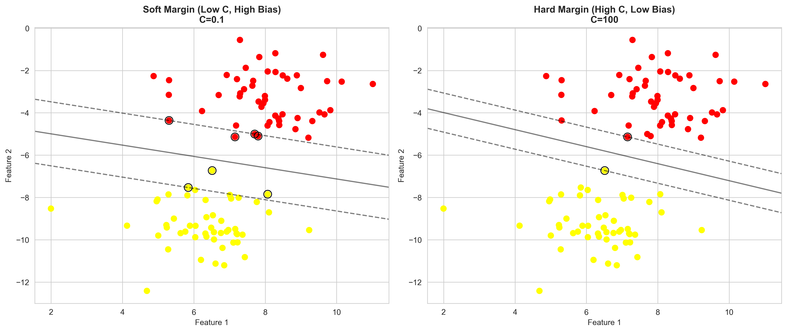
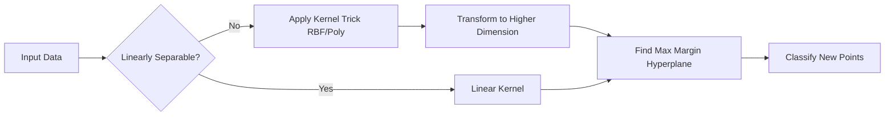
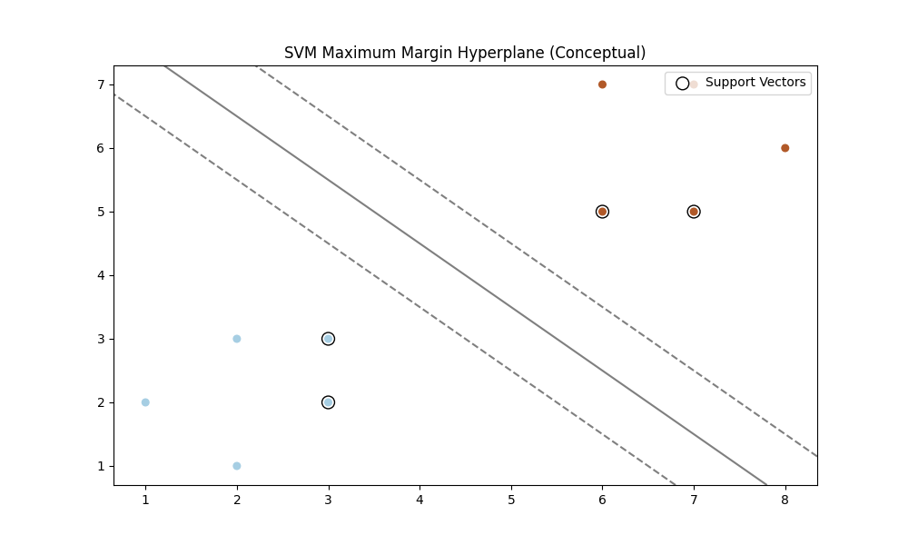
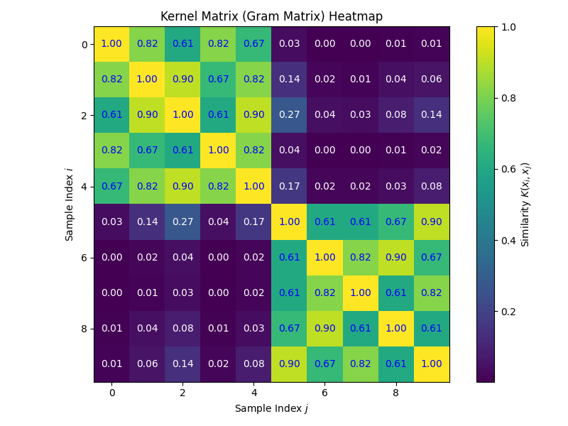

# Module 16: Support Vector Machines (SVM)

## Overview
This module focused on Support Vector Machines (SVM), specifically the Maximum Margin Classifier.

## Key Concepts
*   **Support Vector Classifier (SVC):** A supervised learning algorithm used for classification/regression. It finds a hyperplane in an N-dimensional space that distinctly classifies the data points.
*   **Maximum Margin:** The objective of SVM is to find the hyperplane that maximizes the margin (distance) between the classes. The vectors that define the hyperplane are the support vectors.
*   **Support Vectors:** Data points that are closer to the hyperplane and influence the position and orientation of the hyperplane.
*   **Kernels:** Functions that transform data into a higher-dimensional space to make it separable.
    *   `kernel='linear'`: For linearly separable data.
    *   `kernel='poly'`: Polynomial kernel for non-linear boundaries.
    *   `kernel='rbf'`: Radial Basis Function (infinite dimensions).
*   **Decision Function:** A function that returns the distance of samples to the separating hyperplane.

*   **Soft Margin:** Allows some misclassification to achieve a better overall boundary. Controlled by parameter `C` and slack variables ($\xi$).
*   **Slack Variable ($\xi$):** A variable added to the constraints to allow a data point to violate the margin.

### 7. Real-World Application
**Case Study: Restaurant Health Inspections (Yelp)**
*   **Goal:** Target health inspectors to restaurants most likely to have violations.
*   **Method:** SVM trained on Yelp reviews (text features like "gross", "sticky") and metadata (ZIP, cuisine).
*   **Result:** 82% accuracy in distinguishing severe offenders, allowing efficient allocation of inspector resources.

## Hard Margin vs. Soft Margin

### 1. Hard Margin SVM
*   **Definition:** Strictly enforces that **ALL** data points must be correctly classified and lie outside the margin.
*   **Condition:** Data must be linearly separable (no noise/overlap).
*   **Pros:** Works perfectly on clean, separable data.
*   **Cons:** Highly sensitive to outliers. A single outlier can dramatically shift the boundary or make the problem unsolvable.
*   **Equation:** Minimize $\|w\|^2$ subject to $y_i(w^T x_i + b) \ge 1$ for all $i$.
  *   **$\|w\|^2$** (Pronounced: *norm of w squared*): The term we minimize to maximize the margin.
  *   **$\ge 1$** (Pronounced: *greater than or equal to 1*): The constraint forcing correct classification.

### 2. Soft Margin SVM
*   **Definition:** Allows some data points to be misclassified or violate the margin to achieve a more robust decision boundary.
*   **Condition:** Handles non-linearly separable data and noise.
*   **Mechanism:** Introduces **Slack Variables** ($\xi_i$) for each point.
*   **Role of C:** The hyperparameter `C` controls the penalty for misclassification.
    *   **Large C:** Strict (Hard Margin behavior). Low bias, high variance. Risk of overfitting.
    *   **Small C:** Flexible (Soft Margin behavior). Higher bias, lower variance. Smoother boundary.
*   **Equation:** Minimize $\|w\|^2 + C \sum \xi_i$ subject to $y_i(w^T x_i + b) \ge 1 - \xi_i$.
  *   **$\xi_i$** (Pronounced: *zeta sub i* or *slack variable*): Measure of how much the $i$-th point violates the margin.
  *   **$C$** (Pronounced: *C*): Regularization parameter balancing margin width and error.


*Figure: Hard Margin (Left) forces all points to be correct, potentially overfitting outliers. Soft Margin (Right) ignores some points to find a better general trend.*

## SVM Classification Workflow



## Key Formulas

### 1. Hyperplane
The decision boundary in N-dimensional space:

$$ w^T x + b = 0 $$

*   **$w$** (Pronounced: *w*): The weight vector perpendicular to the hyperplane.
*   **$x$** (Pronounced: *x*): The input feature vector.
*   **$b$** (Pronounced: *b*): The bias term (intercept).
*   **$T$** (Pronounced: *transpose*): Operation flipping the vector to a row vector.


### 2. Margin
The distance between the hyperplane and the nearest data point (support vector). SVM maximizes this margin:

$$ \text{Margin} = \frac{2}{\|w\|} $$

*   **$\|w\|$** (Pronounced: *norm of w*): The Euclidean length (magnitude) of the weight vector.


*Figure 1: Maximum Margin Hyperplane showing support vectors (circled) and the decision boundary.*

### 3. Cost Function (Hinge Loss)

SVM minimizes the Hinge Loss function to find the maximum margin. It penalizes misclassifications:

$$ L(y, f(x)) = \max(0, 1 - y \cdot f(x)) $$

*   **$L$** (Pronounced: *Loss*): The hinge loss value.
*   **$y$** (Pronounced: *y*): The true class label (-1 or 1).
*   **$f(x)$** (Pronounced: *f of x*): The predicted score from the decision function ($w^T x + b$).
*   **$\cdot$** (Pronounced: *dot*): Multiplication.

### 4. Kernel Functions & The Kernel Trick
**The Problem:** Many datasets are not linearly separable in their original dimensions (e.g., concentric circles).

**The Solution (The Kernel Trick):**
Instead of explicitly calculating the coordinates of data points in a high-dimensional space (which is computationally expensive), SVM uses a **Kernel Function** to compute the dot product between two vectors as if they were in that higher-dimensional space.

*   **Concept:** Like lifting the data into a 3D space where a flat sheet (hyperplane) can separate points that were mixed together on a 2D table.
*   **Efficiency:** It avoids the "Curse of Dimensionality" by operating in the original input space while benefiting from high-dimensional separability.


*Figure 2: The Kernel Trick conceptualized. Left: Non-separable 2D data. Right: Mapping to 3D makes it linearly separable.*

**Common Kernels:**

*   **Linear Kernel:** For linearly separable data.

$$ K(x, x') = x^T x' $$

  *   **$K(x, x')$** (Pronounced: *K of x and x prime*): The kernel function value representing similarity.
  *   **$x'$** (Pronounced: *x prime*): Another data point (support vector) we are comparing against.

*   **Polynomial Kernel:** Maps data into a polynomial feature space.

$$ K(x, x') = (\gamma x^T x' + r)^d $$

  *   **$\gamma$** (Pronounced: *gamma*): A coefficient scaling the input data.
  *   **$r$** (Pronounced: *r*): A constant term (coefficient 0).
  *   **$d$** (Pronounced: *d*): The degree of the polynomial.

*   **Radial Basis Function (RBF) Kernel:** (Default) Maps data into an infinite-dimensional space. Effective for complex, non-linear boundaries.

$$ K(x, x') = \exp(-\gamma \|x - x'\|^2) $$

  *   **$\gamma$** (Pronounced: *gamma*): Controls the reach of a single training example's influence.
  *   **$\exp$** (Pronounced: *exponential*): The exponential function ($e$ raised to the power of...).
  *   **$\|x - x'\|^2$** (Pronounced: *squared Euclidean distance*): The squared distance between two data points.

### 5. Kernel Matrix (Gram Matrix)

**Definition:** A square matrix ($n \times n$) containing the pairwise similarity scores between all training data points.

$$ K_{ij} = K(x_i, x_j) $$

*   **$K_{ij}$** (Pronounced: *K sub i j*): The element in the $i$-th row and $j$-th column of the kernel matrix.
*   **$x_i, x_j$** (Pronounced: *x sub i, x sub j*): The $i$-th and $j$-th data points in the training set.

*   **Role:** During training, SVM doesn't look at the data points directly; it looks at this matrix of relationships. It tells the algorithm "how similar is point $i$ to point $j$?" in the high-dimensional space.
*   **Properties:** It must be symmetric and positive semi-definite (Mercer's Theorem).


*Figure 3: Heatmap of a Kernel Matrix. Darker colors on the diagonal indicate high self-similarity.*


### 6. Basis Function Expansion
The formula $y(x) = \beta_0 + \beta_1 \Phi_1(x) + \beta_2 \Phi_2(x) + \dots$ represents a linear model acting on transformed data.

*   **$y(x)$**: The predicted output.
*   **$\beta_i$** (Pronounced: *beta*): The weights (coefficients) learned by the model.
*   **$\Phi_i(x)$** (Pronounced: *Phi of x*): The **Basis Functions** that transform the original input $x$ into a new feature.
    *   *Example:* If $\Phi_1(x) = x$ and $\Phi_2(x) = x^2$, this becomes polynomial regression.
*   **Significance:** SVMs with kernels effectively perform this expansion into an infinite number of $\Phi$ functions without calculating them explicitly.

## Hyperparameters

### 1. Regularization (`C`)
*   **Definition:** Controls the trade-off between achieving a low error on the training data and minimizing the norm of the weights (maximizing margin).
*   **High C:** Strict penalty for misclassification. Results in a smaller margin and complex boundary (Risk: Overfitting).
*   **Low C:** More tolerance for misclassification. Results in a wider margin and simpler boundary (Risk: Underfitting).

### 2. Gamma (`gamma`)
*   **Definition:** Kernel coefficient for 'rbf', 'poly', and 'sigmoid'. Defines how far the influence of a single training example reaches.
*   **High Gamma:** Only close points influence the boundary. Creates islands of decision boundaries around points (Risk: Overfitting).
*   **Low Gamma:** Far points influence the boundary. Result is a smoother, more linear-like boundary.

## Assignment Highlights
*   **Dataset:** Synthetic blobs.
*   **Goal:** Implement specific SVC estimators and visualize decision boundaries.
*   **Process:**
    *   Instantiated `SVC` with a linear kernel.
    *   Identified support vectors using `support_vectors_`.
    *   Calculated decision boundary characteristics.
    *   Visualized margins and support vectors.
    *   Implemented Polynomial SVM for non-linear data.

## Implementation Details

### Linear Support Vector Classifier
The `SVC` class with `kernel='linear'` fits a linear decision boundary.

```python
svc_linear = SVC(kernel='linear', C=1.0)
svc_linear.fit(X_train, y_train)

# Get support vectors
support_vectors = svc_linear.support_vectors_
print(f"Number of support vectors: {len(support_vectors)}")
```

### Decision Function and Visualization
Using `decision_function` to plot decision boundaries and margins.

```python
# Create grid
h = .02
x_min, x_max = X[:, 0].min() - 1, X[:, 0].max() + 1
y_min, y_max = X[:, 1].min() - 1, X[:, 1].max() + 1
xx, yy = np.meshgrid(np.arange(x_min, x_max, h), np.arange(y_min, y_max, h))

# Predict scores
Z = svc_linear.decision_function(np.c_[xx.ravel(), yy.ravel()])
Z = Z.reshape(xx.shape)

# Plot
plt.contour(xx, yy, Z, colors='k', levels=[-1, 0, 1], alpha=0.5, linestyles=['--', '-', '--'])
plt.scatter(X[:, 0], X[:, 1], c=y, cmap=plt.cm.Paired)
plt.scatter(support_vectors[:, 0], support_vectors[:, 1], s=100, linewidth=1, facecolors='none', edgecolors='k')
plt.title("Linear SVM Decision Boundary")
plt.show()
```

### Polynomial Kernel
For non-linear data, use `kernel='poly'`.

```python
svc_poly = SVC(kernel='poly', degree=3, C=10)
svc_poly.fit(X_train, y_train)
```

### Telecom Churn Classification: Model Comparison

In this module, we tackle a real-world business problem: predicting customer churn. We compare multiple classifiers (KNN, Logistic Regression, SVM, Decision Tree) using a systematic pipeline.

#### 1. Data Preparation
- **Dataset:** Telecom Churn dataset.
- **Preprocessing:** Handling categorical variables (e.g., 'International plan', 'Voice mail plan') by converting them to binary/dummy variables.
- **Imbalance Check:** Identifying class imbalance (e.g., fewer churners than retainers) is crucial, as it impacts metric selection (Accuracy vs. Recall/F1-Score).

#### 2. The Modeling Pipeline
We use `Pipeline` to ensure preprocessing (Scaling) is correctly applied within cross-validation folds, preventing data leakage.

```python
from sklearn.pipeline import Pipeline
from sklearn.preprocessing import StandardScaler
from sklearn.svm import SVC
from sklearn.linear_model import LogisticRegression
from sklearn.neighbors import KNeighborsClassifier
from sklearn.tree import DecisionTreeClassifier
from sklearn.model_selection import GridSearchCV
import pandas as pd
import time

# Define models and hyperparameters for Grid Search
models = {
    'knn': (KNeighborsClassifier(), {'knn__n_neighbors': [3, 5, 7]}),
    'logisticregression': (LogisticRegression(max_iter=1000), {'logisticregression__C': [0.1, 1, 10]}),
    'svc': (SVC(), {'svc__C': [0.1, 1, 10], 'svc__kernel': ['linear', 'rbf']}),
    'decisiontree': (DecisionTreeClassifier(), {'decisiontree__max_depth': [5, 10, 15]})
}

results = []

for name, (model, params) in models.items():
    # Construct Pipeline
    # Scaling is essential for SVM and KNN
    pipeline = Pipeline([
        ('scaler', StandardScaler()),
        (name, model)
    ])
    
    # Grid Search with Cross Validation
    grid = GridSearchCV(pipeline, param_grid=params, cv=5, n_jobs=-1)
    
    start = time.time()
    grid.fit(X_train, y_train)
    fit_time = time.time() - start
    
    # Evaluation
    best_model = grid.best_estimator_
    train_score = best_model.score(X_train, y_train)
    test_score = best_model.score(X_test, y_test)
    
    results.append([name, train_score, test_score, fit_time])

# Summary of Results
results_df = pd.DataFrame(results, columns=['Model', 'Train Acc', 'Test Acc', 'Fit Time'])
print(results_df)
```
