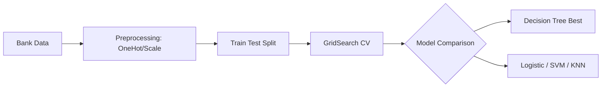
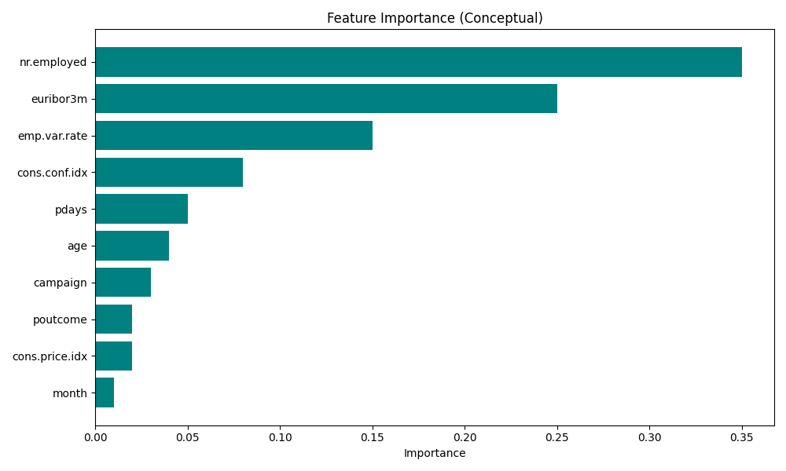
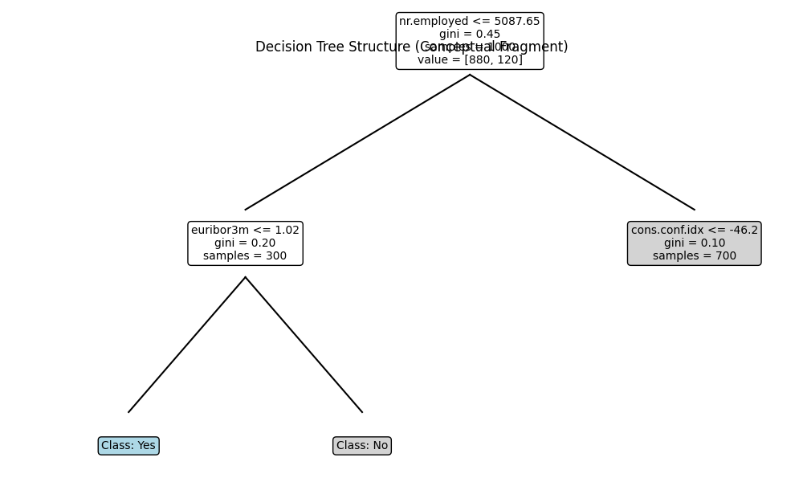
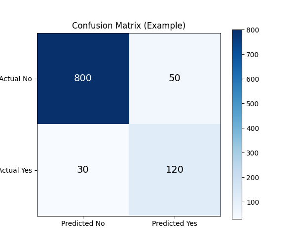
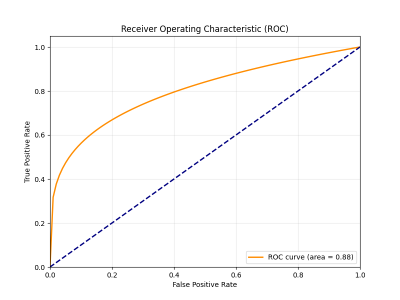

# Module 17: Term Deposit Subscription Prediction (CRISP-DM)

## Overview
This module involved a comprehensive project applying the CRISP-DM methodology to predict whether a bank client will subscribe to a term deposit.

## Key Concepts
*   **CRISP-DM Application:** End-to-end process from Business Understanding to Evaluation.
*   **Imbalanced Data:** Handling datasets where one class (non-subscribers) significantly outnumbers the other.
*   **Model Comparison:** Evaluating multiple classifiers (Logistic Regression, KNN, SVM, Decision Tree) to find the best performer.

## Project Pipeline



## Key Findings
*   **Demographics:** Students and Retired individuals have the highest subscription rates.
*   **Age:** U-shaped relationship; young adults and seniors are more likely to subscribe.
*   **Seasonality:** March, September, October, and December are high-conversion months.
*   **Economic Indicators:** Employment variation rate and Euribor rates are strong predictors.
*   **Call Duration:** Long calls are strongly correlated with success (though a lagging indicator).

## Key Concepts (Advanced)
*   **Sensitivity Analysis:** A method used to determine how different values of an independent variable impact a particular dependent variable under a given set of assumptions.
    *   *Application:* Used to measure feature importance for the SVM model (identifying that `nr.employed` and `euribor3m` were critical).

## Model Performance
*   **Decision Tree:** Achieved the highest accuracy (~91.62%) after hyperparameter tuning (max_depth=5).
*   **Logistic Regression & SVM:** Strong baselines with similar accuracy (~91.20%).
*   **KNN:** Slightly lower accuracy (~90.13%) and computationally expensive for inference.

## Key Formulas

### Classification Metrics

**Accuracy:**

$$ \text{Accuracy} = \frac{TP + TN}{TP + TN + FP + FN} $$

*   **$TP$** (Pronounced: *True Positive*): Correctly predicted positive instances (e.g., successful subscription).
*   **$TN$** (Pronounced: *True Negative*): Correctly predicted negative instances.
*   **$FP$** (Pronounced: *False Positive*): Incorrectly predicted as positive (Type I error).
*   **$FN$** (Pronounced: *False Negative*): Incorrectly predicted as negative (Type II error).

**Precision:**

$$ \text{Precision} = \frac{TP}{TP + FP} $$

**Recall (Sensitivity):**

$$ \text{Recall} = \frac{TP}{TP + FN} $$

**F1-Score:**

$$ F_1 = 2 \cdot \frac{\text{Precision} \cdot \text{Recall}}{\text{Precision} + \text{Recall}} $$

**Cumulative Lift:**
A measure of how much better the model is at identifying positive cases compared to a random selection.

$$ \text{Lift} = \frac{\text{Response Rate in Decile}}{\text{Overall Response Rate}} $$

*   **Decile:** Population divided into 10 equal groups based on predicted probability.

**ALIFT (Area Under the Lift Curve):**
Similar to AUC, but for the Lift curve.
*   **Baseline:** 0.5 (Random model).
*   **Perfect:** 1.0.

### Logistic Regression (Sigmoid Function)
Logistic regression uses the sigmoid function to map predictions to probabilities between 0 and 1.

$$ \sigma(z) = \frac{1}{1 + e^{-z}} $$

*   **$\sigma(z)$** (Pronounced: *sigma of z*): The predicted probability.
*   **$z$** (Pronounced: *z*): The linear combination of input features and weights ($z = w^T x + b$).
*   **$e$** (Pronounced: *e*): Euler's number (approx. 2.718).

### Decision Tree (Gini Impurity)
Decision trees split data to minimize impurity. Gini impurity measures the frequency of incorrect labeling if a label was chosen randomly according to the distribution.

$$ G = 1 - \sum_{k=1}^{n} p_k^2 $$

*   **$G$** (Pronounced: *Gini*): The Gini impurity score.
*   **$\sum$** (Pronounced: *sum*): Summation symbol.
*   **$p_k$** (Pronounced: *p sub k*): The probability of an item belonging to class $k$.
*   **$n$** (Pronounced: *n*): Total number of classes.

## Recommendations
*   Target specific demographics (Students, Retired) and time campaigns during high-conversion months.
*   Focus on quality of conversation (duration) rather than just quantity.

## Implementation Details

### Model Comparison Pipeline
The project evaluated multiple classifiers (Logistic Regression, KNN, SVC, Decision Tree) using `GridSearchCV` related to key hyperparameters.

```python
models = {
    'logisticregression': (LogisticRegression(max_iter=1000), {'logisticregression__C': [0.1, 1, 10]}),
    'knn': (KNeighborsClassifier(), {'knn__n_neighbors': [3, 5, 7]}),
    'svc': (SVC(), {'svc__C': [0.1, 1, 10], 'svc__kernel': ['linear', 'rbf']}),
    'decisiontreeclassifier': (DecisionTreeClassifier(), {'decisiontreeclassifier__max_depth': [3, 5, 10]}),
}

best_models = {}  # Dictionary to store the best estimator for each model

results = []
for name, (model, param_grid) in models.items():
    pipeline = Pipeline([
        ('preprocessor', preprocessor),
        (name, model)
    ])
    grid_search = GridSearchCV(pipeline, param_grid, cv=5, n_jobs=-1)
    grid_search.fit(X_train, y_train)
    
    # Store the best model found by GridSearchCV
    best_models[name] = grid_search.best_estimator_
```

### Hyperparameter Tuning Details
The following hyperparameters were tuned to optimize model performance:

*   **Logistic Regression (`C`):** Inverse of regularization strength. Smaller values specify stronger regularization, helping to prevent overfitting.
    *   *Grid:* `[0.1, 1, 10]`
*   **K-Nearest Neighbors (`n_neighbors`):** Number of neighbors to use for classification. Affects the smoothness of the decision boundary.
    *   *Grid:* `[3, 5, 7]`
*   **Support Vector Machine (`C`, `kernel`):** `C` controls the trade-off between smooth decision boundary and classifying training points correctly. `kernel` determines the non-linear mapping (linear vs. radial basis function).
    *   *Grid:* `C=[0.1, 1, 10]`, `kernel=['linear', 'rbf']`
*   **Decision Tree (`max_depth`):** The maximum depth of the tree. Controls model complexity; deeper trees capture more details but risk overfitting.
    *   *Grid:* `[3, 5, 10]`

### Best Model Selection
The **Decision Tree (max_depth=5)** was selected as the best model based on:
1.  **Metric:** Highest Test Accuracy (**91.62%**).
2.  **Efficiency:** Fast training and inference time compared to SVM and KNN.
3.  **Interpretability:** The decision logic (e.g., checking `nr.employed` or `euribor3m`) is easily visualized and explained to stakeholders.

### Feature Importance
Feature importance was analyzed using Logistic Regression coefficients and Decision Tree feature importances. Key drivers include employment rates and consumer confidence.


*Figure 1: Feature Importance ranking showing `nr.employed` and `euribor3m` as top predictors.*

```python
coeffs = lr_model.named_steps['classifier'].coef_[0]
coeff_df = pd.DataFrame({'Feature': feature_names, 'Coefficient': coeffs})
sns.barplot(x='Coefficient', y='Feature', data=coeff_df.head(10))
```

### Decision Tree Visualization
The Decision Tree structure was visualized to understand the decision rules.


*Figure 2: Simplified visualization of the Decision Tree structure showing key split logic.*

```python
decision_tree = DecisionTreeClassifier(max_depth=3, random_state=42, min_samples_split=5)
plot_tree(decision_tree, feature_names=X.columns, class_names=['no', 'yes'], filled=True)
```

### Performance Evaluation
Models were evaluated using Accuracy, Precision, Recall, F1-Score, and ROC-AUC.


*Figure 3: Confusion Matrix showing True Positives vs False Positives.*


*Figure 4: ROC Curve illustrating the trade-off between True Positive Rate and False Positive Rate.*

```python
for name, model in best_models.items():
    y_pred = model.predict(X_test)
    acc = accuracy_score(y_test, y_pred)
    cm = confusion_matrix(y_test, y_pred)
    disp = ConfusionMatrixDisplay(confusion_matrix=cm, display_labels=['No', 'Yes'])
    disp.plot()
```
