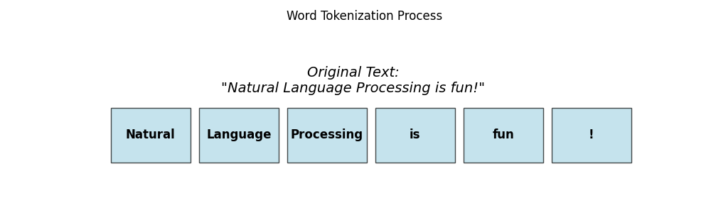
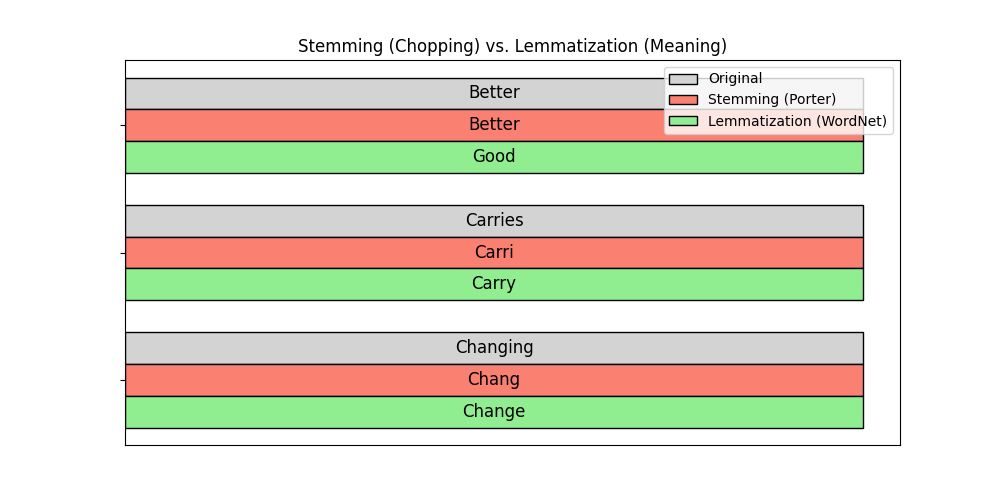
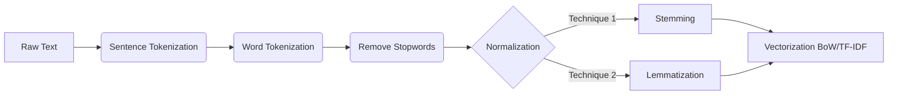
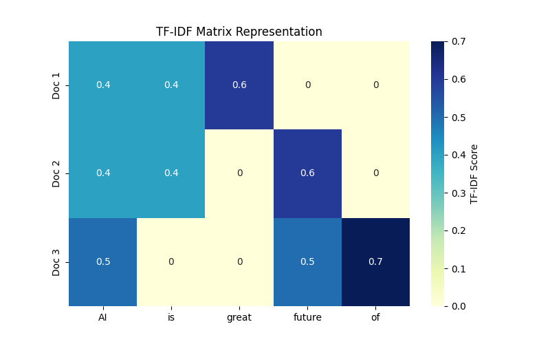

# Module 18: Natural Language Processing - Tokenization

## Overview
This module introduced Natural Language Processing (NLP) techniques, specifically focusing on tokenization using the `nltk` library.

## Key Concepts
*   **Tokenization:** The process of breaking down text into smaller units (tokens).
    *   **Word Tokenization:** Splitting text into individual words.
    *   **Sentence Tokenization:** Splitting text into sentences.


*Figure 1: Visual representation of splitting a sentence into tokens.*

*   **NLTK (Natural Language Toolkit):** A leading Python library for working with human language data.
*   **Lexical Diversity:** The ratio of unique words to the total number of words in a text. A measure of vocabulary richness.
*   **Bag of Words (implied context):** Representing text as a collection of its words, disregarding grammar and word order but keeping multiplicity.
*   **Stop Words:** Common words (e.g., "is", "the", "at") that are often removed because they carry little meaningful information.
*   **Stemming vs. Lemmatization:** Techniques to reduce words to their base form.
    *   **Stemming:** Crude heuristic process that chops off the ends of words (e.g., "better" -> "bet").
    *   **Lemmatization:** Uses vocabulary and morphological analysis to return the dictionary form (lemma) (e.g., "better" -> "good").


*Figure 2: Comparison between Stemming (chopping) and Lemmatization (meaning-based).*

## NLP Preprocessing Pipeline



## Key Formulas

### Lexical Diversity
A measure of the richness of the vocabulary used in a text, defined as the ratio of unique tokens to the total number of tokens.

$$ L_d = \frac{|V|}{N} $$

*   **$L_d$** (Pronounced: *L sub d*): Lexical diversity score.
*   **$|V|$** (Pronounced: *cardinality of V*): Size of the vocabulary (count of unique tokens).
*   **$N$** (Pronounced: *N*): Total number of tokens in the text.

### Naive Bayes & Laplace Smoothing
Naive Bayes is a probabilistic classifier based on Bayes' theorem, often used for text classification (e.g., spam detection). Laplace smoothing is used to handle the problem of zero probabilities for unseen words.

**Naive Bayes (Multinomial):**

$$ P(c|d) \propto P(c) \prod_{w \in d} P(w|c) $$

*   **$P(c|d)$** (Pronounced: *probability of c given d*): The posterior probability of class $c$ given document $d$.
*   **$\propto$** (Pronounced: *proportional to*): Indicates relationship.
*   **$P(c)$** (Pronounced: *probability of c*): The prior probability of class $c$.
*   **$\prod$** (Pronounced: *product*): Product over all words $w$ in document $d$.
*   **$P(w|c)$** (Pronounced: *probability of w given c*): The likelihood of word $w$ occurring in class $c$.

**Laplace Smoothing:**

$$ P(w|c) = \frac{\text{count}(w, c) + 1}{\text{count}(c) + |V|} $$

*   **$\text{count}(w, c)$** (Pronounced: *count of w in c*): The number of times word $w$ appears in class $c$.
*   **$\text{count}(c)$** (Pronounced: *count of c*): The total count of all words in class $c$.
*   **$|V|$** (Pronounced: *cardinality of V*): The vocabulary size (total number of unique words).

### Bag-of-Words (BoW)
A representation of text that describes the occurrence of words within a document. It involves two things:
1.  A vocabulary of known words.
2.  A measure of the presence of known words (often a count).

It disregards grammar and word order but keeps multiplicity. Using `CountVectorizer` in sklearn creates this representation.

### TF-IDF (Term Frequency - Inverse Document Frequency)
A statistical measure used to evaluate how important a word is to a document in a collection or corpus.

$$ \text{TF-IDF}(t, d) = \text{TF}(t, d) \cdot \text{IDF}(t) $$

*   **TF** (Term Frequency): How typically a word appears in a document.
*   **IDF** (Inverse Document Frequency): How rare the word is across all documents.
    $$ \text{IDF}(t) = \log \frac{N}{df(t)} $$
*   **$N$** (Pronounced: *N*): Total number of documents.
*   **$df(t)$** (Pronounced: *document frequency of t*): Number of documents containing term $t$.


*Figure 3: Heatmap showing TF-IDF scores. Rare words unique to a document get higher scores.*

## Assignment Highlights
*   **Data:** Excerpt from Isaac Newton's *Principia* and WhatsApp status dataset.
*   **Goal:** Tokenize text and analyze basic statistics.
*   **Process:**
    *   Used `word_tokenize` and `sent_tokenize`.
    *   Calculated the number of unique words using `set()`.
    *   Computed lexical diversity.
    *   Applied tokenization to a Pandas DataFrame column to analyze a corpus of text.

## Implementation Details

### Tokenization
Tokenization is performed using `nltk.word_tokenize` and `nltk.sent_tokenize`.

**Setup:**
```bash
pip install nltk
```

**Imports and Downloads:**
```python
import nltk
from nltk import word_tokenize, sent_tokenize
from nltk.stem import PorterStemmer
import pandas as pd

# Download necessary NLTK data
nltk.download('punkt')
```

### Word and Sentence Tokenization
```python
# Word Tokenization
ans1 = word_tokenize(principia)

# Sentence Tokenization
ans2 = sent_tokenize(principia)
```

### Vocabulary Analysis
We can calculate the vocabulary size (unique tokens) and lexical diversity.

```python
# Unique words
ans3 = set(word_tokenize(principia))

# Lexical Diversity
ans5 = len(set(word_tokenize(principia)))/len(word_tokenize(principia))
```

### Tokenization on DataFrame
Applying tokenization to a DataFrame column.

```python
ans6 = len(set(happy_df['content'].apply(word_tokenize).sum()))
```

### Stemming
Using `PorterStemmer` to reduce words to their root form.

```python
def stemmer(text):
    stem = PorterStemmer()
    return ' '.join([stem.stem(w) for w in word_tokenize(text)])
```

### Text Classification with Naive Bayes
Using `CountVectorizer` to create a Bag-of-Words representation and `MultinomialNB` for classification.

**Bag-of-Words (CountVectorizer):**
```python
from sklearn.feature_extraction.text import CountVectorizer

# Create instance
cvect = CountVectorizer()
# Fit and transform text data
X_counts = cvect.fit_transform(text_data)
```

**Naive Bayes Classifier:**
```python
from sklearn.naive_bayes import MultinomialNB

# Create instance
nb = MultinomialNB()
# Fit model
nb.fit(X_train, y_train)
# Score
acc = nb.score(X_test, y_test)
```

**Pipeline:**
Combining vectorization and classification.
```python
from sklearn.pipeline import Pipeline

# Build pipeline
pipe = Pipeline([
    ('cvect', CountVectorizer()),
    ('bayes', MultinomialNB())
])

# Fit and evaluate
pipe.fit(X_train, y_train)
acc = pipe.score(X_test, y_test)
```
