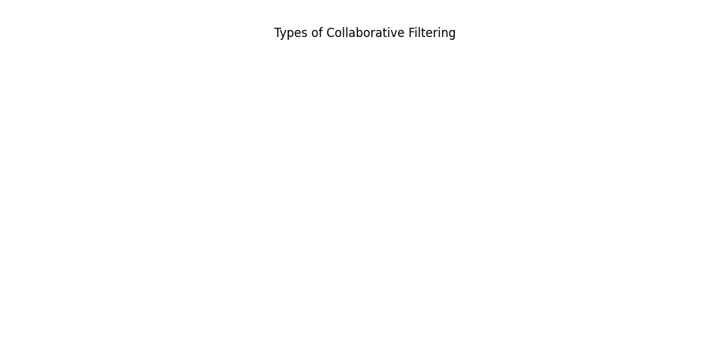
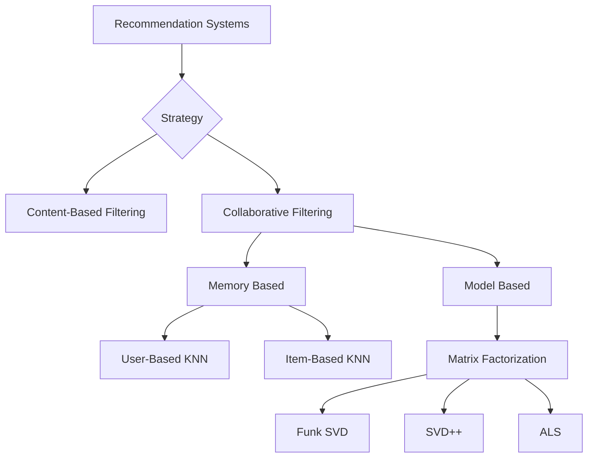
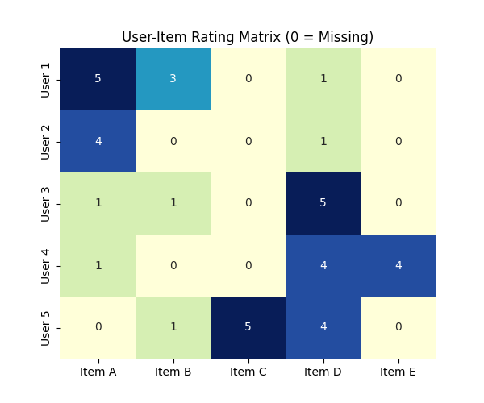
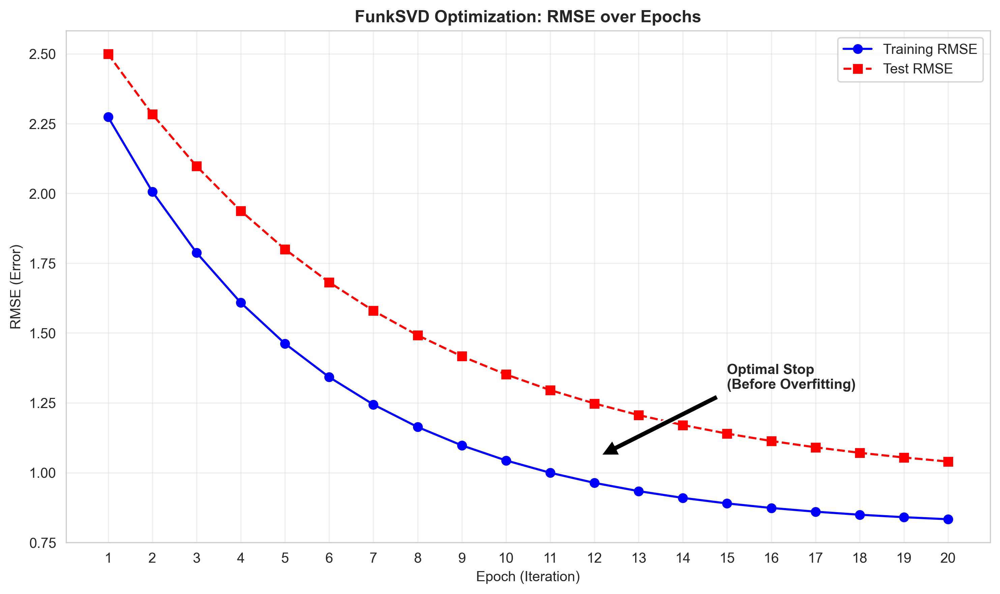
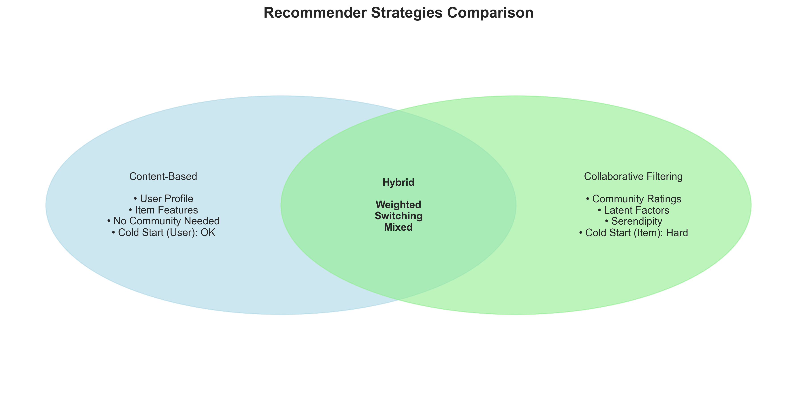
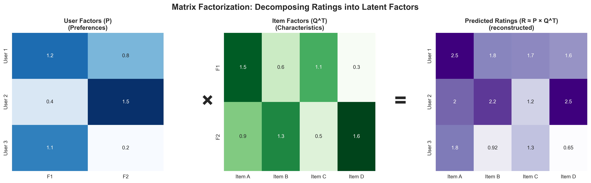

# Module 19: Collaborative Filtering and Recommendation Systems

## Overview
This module explored Recommendation Systems, focusing on Collaborative Filtering and the use of the `Surprise` library to predict user ratings.

## Key Concepts
*   **Collaborative Filtering:** Making predictions about the interests of a user by collecting preferences from many users.
*   **Latent Features:** Hidden features that explain the relationship between users and items.


*Figure 1: Comparison of User-Based, Item-Based, and Model-Based Collaborative Filtering.*

## Recommendation Approaches



*   **Content-Based Filtering:** Recommends items similar to those a user liked in the past, based on item attributes (e.g., genre, director).
*   **Collaborative Filtering:** Relies on past interactions (ratings) of many users.
*   **Funk SVD:** A specific matrix factorization technique using Gradient Descent to handle sparse matrices (missing ratings). Distinct from mathematical SVD which requires a full matrix.

*   **Alternating Least Squares (ALS):** Iterative optimization to find user and item factors.
*   **Matrix Factorization (SVD):** Decomposing the user-item interaction matrix into lower-dimensional matrices.


*Figure 2: A sparse User-Item Matrix where 0 represents missing ratings.*

*   **Surprise Library:** A Python scikit for building and analyzing recommender systems.
*   **Hybrid Recommendations:** Combining multiple algorithms (e.g., SVD + SlopeOne) to improve prediction accuracy.

## Additional Algorithms Used
Beyond SVD and SlopeOne, the module utilized several other algorithms from the Surprise library:

1.  **NMF (Non-Negative Matrix Factorization):** similar to SVD but enforces non-negative factors, often leading to more interpretable results.
2.  **CoClustering:** A collaborative filtering algorithm based on co-clustering users and items (simultaneous clustering).
3.  **KNNBasic:** A basic collaborative filtering algorithm.
4.  **NormalPredictor:** A baseline algorithm that predicts a random rating based on the distribution of the training set (assumed to be normal), used for comparison.

## Hyperparameter Tuning

### Search Strategy: RandomizedSearchCV vs GridSearchCV
In the discussion assignment, **RandomizedSearchCV** was used instead of GridSearchCV.
*   **Why?** Recommender systems often have a large hyperparameter space (factors, learning rates, regularization). GridSearch tries every combination, which is computationally expensive and slow.
*   **RandomizedSearchCV** samples a fixed number of parameter settings (`n_iter`) from specified distributions, effectively finding good hyperparameters in a fraction of the time.

### Key Hyperparameters for SVD
The following parameters were tuned for the `SVD` algorithm:

*   **`n_factors`:** The number of latent factors (dimensions) to represent users and items. Higher values capture more complexity but risk overfitting.
    *   *Range searched:* 50 to 200.
*   **`n_epochs`:** The number of iterations of the SGD procedure.
    *   *Range searched:* 20 to 50.
*   **`lr_all`:** The learning rate for all parameters. Controls step size during optimization.
    *   *Distribution:* Uniform closer to 0 (e.g., 0.002 to 0.015).
*   **`reg_all`:** The regularization term for all parameters. Prevents overfitting by penalizing large coefficients.
    *   *Distribution:* Uniform (e.g., 0.02 to 0.1).

### Key Hyperparameters for KNNBasic
*   **`k`:** The maximum number of neighbors to take into account for aggregation.
    *   *Range searched:* 10 to 50.
*   **`min_k`:** The minimum number of neighbors to take into account for aggregation. If not enough neighbors are found, the neighbor aggregation is not performed.
    *   *Range searched:* 1 to 5.
*   **`sim_options`:** A dictionary of options for the similarity measure.
    *   **`name`:** The name of the similarity metric to use (MSD, Cosine, Pearson).
    *   **`user_based`:** Whether the similarity is computed between users (True) or items (False).

### Key Hyperparameters for NMF (Non-Negative Matrix Factorization)
*   **`n_factors`:** The number of latent factors.
    *   *Range searched:* 15 to 40.
*   **`n_epochs`:** The number of iterations of the SGD procedure.
    *   *Range searched:* 20 to 50.

## Learning Outcomes addressed

### 1. Computing Missing Ratings
Recommender systems deal with **Sparse Matrices**. Even if a user has rated only 10 items, we want to start computing the missing values (fills) based on patterns from similar users (Collaborative) or similar items (Content-based).

### 2. Trade-off: Factors vs. Performance
In Matrix Factorization (`n_factors`):
*   **Too Few Factors (Underfitting):** The model cannot capture complex tastes (e.g., user likes "Dark Sci-Fi" but model only knows "Action").
*   **Too Many Factors (Overfitting):** The model learns noise or specific random correlations for the training set, performing poorly on new data.

### 3. Simon Funk SVD (Gradient Descent)
Unlike the linear algebra SVD which defines $R = U \Sigma V^T$ (only works on full matrices), **Funk SVD** learns two matrices $P$ and $Q$ by iterating over *only* the known ratings.

*   **P Matrix ($|U| \times k$):** User Factors. Each row represents a user's affinity for the $k$ latent features.
*   **Q Matrix ($|I| \times k$):** Item Factors. Each row represents how much an item possesses those $k$ latent features.
*   **$k$:** The number of latent factors (e.g., "Comedy", "Dark", "High Budget"). These are learned from data, not manually defined.

**Algorithm:**
1.  Initialize $P$ and $Q$ with small random values.
2.  For each known rating $r_{ui}$ in the training set:
    *   **Predict:** $\hat{r}_{ui} = P_u \cdot Q_i^T$ (Dot product of User $u$ and Item $i$ vectors).
    *   **Calculate Error:** $e_{ui} = r_{ui} - \hat{r}_{ui}$.
    *   **Update User Factor ($P_u$):** Move $P_u$ in the direction that reduces error.
        $$ P_{u} \leftarrow P_{u} + \eta \cdot (e_{ui} \cdot Q_{i} - \lambda \cdot P_{u}) $$
    *   **Update Item Factor ($Q_i$):** Move $Q_i$ in the direction that reduces error.
        $$ Q_{i} \leftarrow Q_{i} + \eta \cdot (e_{ui} \cdot P_{u} - \lambda \cdot Q_{i}) $$
3.  Repeat until RMSE converges.

*   **$\eta$** (Eta): Learning Rate.
*   **$\lambda$** (Lambda): Regularization term to prevent overfitting.


*Figure: Minimizing RMSE over epochs using Gradient Descent.*

### 4. Surprise Library Workflow
The `Surprise` library simplifies building and analyzing recommenders.

```python
from surprise import SVD, Dataset, Reader
from surprise.model_selection import cross_validate

# 1. Load Data
data = Dataset.load_builtin('ml-100k')

# 2. Define Algorithm
algo = SVD(n_factors=100, n_epochs=20, lr_all=0.005, reg_all=0.02)

# 3. Analyze
cross_validate(algo, data, measures=['RMSE', 'MAE'], cv=5, verbose=True)
```

### 5. Why Hybrid Systems?
*   **Cold Start Problem:** Collaborative filtering fails for new users/items (no history). Content-based can handle new items (via features).
*   **Accuracy:** Combining methods often yields lower error (like Ensemble learning).
*   **Robustness:** If one signal is noisy, the other might correct it.


*Figure: Comparing Content-Based, Collaborative, and Hybrid approaches.*

### 6. Serendipity and Surprise
A good recommendation isn't just accurate; it can be **surprising**.
*   **Over-specialization:** Content-based systems only show what you already like (e.g., if you liked Star Wars, here is Star Wars 2).
*   **Serendipity:** Collaborative filtering can find latent connections (e.g., Sci-Fi fans also happened to like this specific Jazz album), identifying items a user wouldn't have found themselves.

## Key Formulas

### 1. Matrix Factorization (ALS Update Rule)
Matrix factorization decomposes the rating matrix $R$ into two lower-rank matrices $P$ and $Q^T$, such that $R \approx P \times Q^T$.

$$ R \approx P \times Q^T $$

*   **$R$** (Pronounced: *R*): The User-Item rating matrix.
*   **$P$** (Pronounced: *P*): The User-Factor matrix.
*   **$Q^T$** (Pronounced: *Q transpose*): The Factor-Item matrix.


*Figure 3: Visualizing the decomposition of the rating matrix into latent factors.*

**ALS Update Rule:**
For Alternating Least Squares (ALS), the user factors $P$ are updated iteratively to minimize the error between predicted and actual ratings.

$$ P_{a,b} := P_{a,b} - \alpha \sum_{j \in R_a}^N e_{a,j}Q_{b,j} $$

*   **$P_{a,b}$** (Pronounced: *P sub a, b*): The value in the user factor matrix for user $a$ and latent factor $b$.
*   **$\alpha$** (Pronounced: *alpha*): The learning rate, controlling the step size of the update.
*   **$e_{a,j}$** (Pronounced: *e sub a, j*): The error term, representing the difference between the actual rating and the predicted rating for user $a$ on item $j$.
*   **$Q_{b,j}$** (Pronounced: *Q sub b, j*): The value in the item factor matrix for latent factor $b$ and item $j$.
*   **$R_a$** (Pronounced: *R sub a*): The set of items rated by user $a$.
*   **$\sum$** (Pronounced: *sum*): Summation over all items $j$ rated by user $a$.

### 2. Weighted Hybrid Prediction
A weighted hybrid model combines predictions from multiple algorithms (e.g., SVD and SlopeOne) using a linear combination.

$$ \hat{r}_{ui} = \alpha \cdot \hat{r}_{\text{SVD}} + (1-\alpha) \cdot \hat{r}_{\text{SlopeOne}} $$

*   **$\hat{r}_{ui}$** (Pronounced: *r hat sub u, i*): The predicted rating for user $u$ on item $i$ by the hybrid model.
*   **$\alpha$** (Pronounced: *alpha*): The weight assigned to the first model (SVD).
*   **$\hat{r}_{\text{SVD}}$** (Pronounced: *r hat SVD*): The predicted rating from the SVD algorithm.
*   **$\hat{r}_{\text{SlopeOne}}$** (Pronounced: *r hat Slope One*): The predicted rating from the SlopeOne algorithm.

In the assignment, an equal weight ($\alpha = 0.5$) was used:

$$ \hat{r}_{\text{hybrid}} = 0.5 \cdot \hat{r}_{\text{SVD}} + 0.5 \cdot \hat{r}_{\text{SlopeOne}} $$

### 3. Similarity Measures (KNN)
Memory-based collaborative filtering relies on similarity measures like Cosine Similarity or Pearson Correlation.

**Cosine Similarity:**

$$ \text{sim}(u, v) = \frac{\sum_{i} r_{ui} r_{vi}}{\sqrt{\sum_{i} r_{ui}^2} \sqrt{\sum_{i} r_{vi}^2}} $$

*   **$\text{sim}(u, v)$** (Pronounced: *similarity of u and v*): The cosine similarity score between user $u$ and user $v$.
*   **$\sum$** (Pronounced: *sum*): Summation over all co-rated items $i$.
*   **$r_{ui}$** (Pronounced: *r sub u, i*): The rating given by user $u$ to item $i$.
*   **$r_{vi}$** (Pronounced: *r sub v, i*): The rating given by user $v$ to item $i$.

**Pearson Correlation:**

$$ \text{sim}(u, v) = \frac{\sum_{i \in I_{uv}} (r_{ui} - \bar{r}_u)(r_{vi} - \bar{r}_v)}{\sqrt{\sum_{i \in I_{uv}} (r_{ui} - \bar{r}_u)^2} \sqrt{\sum_{i \in I_{uv}} (r_{vi} - \bar{r}_v)^2}} $$

*   **$\bar{r}_u$** (Pronounced: *r bar sub u*): The average rating given by user $u$.
*   **$I_{uv}$** (Pronounced: *I sub u, v*): The set of items rated by both user $u$ and user $v$ (co-rated items).

**Mean Squared Difference (MSD) Similarity:**

$$ \text{msd}(u, v) = \frac{1}{|I_{uv}|} \sum_{i \in I_{uv}} (r_{ui} - r_{vi})^2 $$

$$ \text{sim}(u, v) = \frac{1}{\text{msd}(u, v) + 1} $$

*   **$|I_{uv}|$** (Pronounced: *cardinality of I sub u, v*): The number of items rated by both user $u$ and user $v$.

### 4. Evaluation Metrics

Recommender systems are typically evaluated using error metrics that measure the difference between predicted and actual ratings.

**Root Mean Squared Error (RMSE):**

RMSE is the standard metric for evaluating rating predictions. It penalizes larger errors more heavily due to squaring.

$$ \text{RMSE} = \sqrt{\frac{1}{|\hat{R}|} \sum_{\hat{r}_{ui} \in \hat{R}} (r_{ui} - \hat{r}_{ui})^2} $$

*   **$\text{RMSE}$** (Pronounced: *R-M-S-E* or *Root Mean Squared Error*)
*   **$\hat{R}$** (Pronounced: *R hat*): The set of all predicted ratings.
*   **$|\hat{R}|$** (Pronounced: *cardinality of R hat*): The total number of predictions made.
*   **$r_{ui}$** (Pronounced: *r sub u, i*): The actual rating.
*   **$\hat{r}_{ui}$** (Pronounced: *r hat sub u, i*): The predicted rating.

**Mean Absolute Error (MAE):**

MAE is another common metric that treats all errors equally, making it more robust to outliers compared to RMSE.

$$ \text{MAE} = \frac{1}{|\hat{R}|} \sum_{\hat{r}_{ui} \in \hat{R}} |r_{ui} - \hat{r}_{ui}| $$

*   **$\text{MAE}$** (Pronounced: *M-A-E* or *Mean Absolute Error*)
*   **$|r_{ui} - \hat{r}_{ui}|$** (Pronounced: *absolute value of r sub u, i minus r hat sub u, i*): The absolute error between actual and predicted ratings.

**When to use which:**
- Use **RMSE** when you want to penalize large errors more heavily
- Use **MAE** when all errors should be treated equally and you want more robustness to outliers

## Types of Hybrid Recommendation

While the module focused on **Weighted Hybrid**, there are several types of hybrid recommendation systems:

1.  **Weighted:** The scores of several recommendation techniques are combined together numerically (e.g., Linear Combination).
2.  **Switching:** The system switches between recommendation techniques depending on the heuristic or criteria (e.g., use Content-based if user profile is new, otherwise CF).
3.  **Mixed:** Recommendations from different referrers are presented together (e.g., "People who bought X also bought Y" next to "Recommended for you").
4.  **Feature Combination:** Features from different data sources are thrown together into a single recommendation algorithm.
5.  **Cascade:** One recommender refines the recommendations given by another.
6.  **Feature Augmentation:** Output from one technique is used as an input feature to another.
7.  **Meta-level:** The model generated by one recommender is used as the input for another.

## Code for Learning
This section provides essential code snippets for implementing Recommender Systems, from manual calculations to using the powerful `Surprise` library.

### 0. Toy Dataset (Copy-Paste Executable)
Start here to understand the input format without downloading external files.

```python
import pandas as pd
from surprise import Dataset, Reader, KNNBasic

# 1. Create a simple dataset (User, Item, Rating)
ratings_dict = {
    "item": [1, 2, 1, 2, 1, 2, 1, 2, 1],
    "user": ['A', 'A', 'B', 'B', 'C', 'C', 'D', 'D', 'E'],
    "rating": [1, 2, 2, 4, 2.5, 4, 4.5, 5, 3],
}
df = pd.DataFrame(ratings_dict)
reader = Reader(rating_scale=(1, 5))

# 2. Load into Surprise
data = Dataset.load_from_df(df[['user', 'item', 'rating']], reader)

# 3. Build Trainset & Train
trainset = data.build_full_trainset()
algo = KNNBasic()
algo.fit(trainset)

# 4. Predict
# Predict User E's rating for Item 2
prediction = algo.predict('E', 2)
print(f"Prediction for User E, Item 2: {prediction.est:.2f}")
```

### 1. Setup and Imports
Key libraries include `scikit-surprise` for recommendation algorithms and `sklearn` for manual regression basics.

**Installation:**
```bash
!pip install scikit-surprise
```

**Imports:**
```python
import pandas as pd
import numpy as np
from sklearn.linear_model import LinearRegression
from surprise import Dataset, Reader, SVD, KNNBasic, NMF, SlopeOne, CoClustering
from surprise.model_selection import cross_validate, RandomizedSearchCV
```

### 2. Manual Implementation Concepts
Before using libraries, we explored the math behind recommendations.

**A. User Factor Estimation (Regression):**
Using `LinearRegression` to estimate user preferences (vectors) based on known item features (e.g., 'slick', 'lofi').
```python
# X = Item Features (known), y = User Ratings (known)
X = reviews.dropna(subset=['User'])[['Feature1', 'Feature2']]
y = reviews['User'].dropna()

# Fit regression to learn how much the user likes each feature
lr = LinearRegression(fit_intercept=False).fit(X, y)
user_vector = lr.coef_  # The learned user preferences
```

**B. Manual SVD Update (Gradient Descent):**
Updating a specific user factor $P_{ab}$ using the gradient of the error (Funk SVD logic).
```python
# P_mn = P_mn - alpha * (error * Q_mn)
# alpha = learning rate (e.g., 0.1)
# ans3 = squared error vector
# Q = item factors dataframe
P_new = -9.019710 - 0.1 * (error_term * Q.loc[rated_items]['F1'])
```

### 3. Using the Surprise Library
The standard workflow for building recommenders.

**Loading Data:**
```python
# Define the format: user, item, rating
reader = Reader(rating_scale=(1, 5))
# Load from a pandas dataframe
data = Dataset.load_from_df(df[['userid', 'movie_id', 'rating']], reader)
```

**Hyperparameter Tuning (RandomizedSearchCV):**
Efficiently searching for the best parameters (learning rate, regularization, factors).
```python
from surprise.model_selection import RandomizedSearchCV
from scipy.stats import uniform, randint

param_dist = {
    'n_factors': randint(50, 150),    # Number of latent factors
    'n_epochs': randint(20, 50),      # Number of iterations
    'lr_all': uniform(0.002, 0.01),   # Learning rate
    'reg_all': uniform(0.02, 0.1)     # Regularization term
}

# n_iter=20 tries 20 random combinations
rs = RandomizedSearchCV(SVD, param_dist, measures=['mse'], cv=5, n_iter=20, n_jobs=-1)
rs.fit(data)

print("Best RMSE:", rs.best_score['mse'])
print("Best Params:", rs.best_params['mse'])
```

**Cross-Validation:**
Comparing algorithms effectively.
```python
# Compare SVD and NMF
for algo in [SVD(), NMF()]:
    print(f"Evaluating {algo.__class__.__name__}...")
    cross_validate(algo, data, measures=['RMSE', 'MAE'], cv=5, verbose=True)
```

## Assignment Highlights
*   **Data:** User ratings for artists/albums and MovieLens dataset.
*   **Goal:** Predict missing ratings for users.
*   **Process:**
    *   Implemented manual prediction using `LinearRegression` to understand feature importance.
    *   Utilized `Surprise` for robust Matrix Factorization (SVD) and filtering (KNN).
    *   Optimized models using `RandomizedSearchCV` instead of `GridSearchCV` for efficiency.
