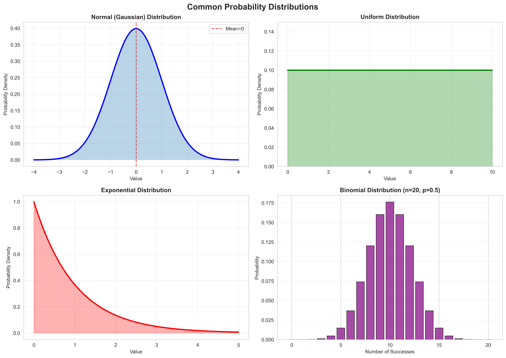
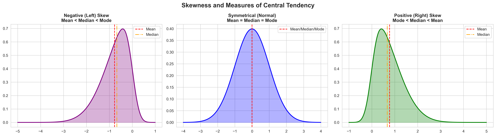
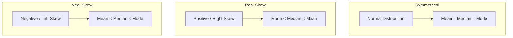
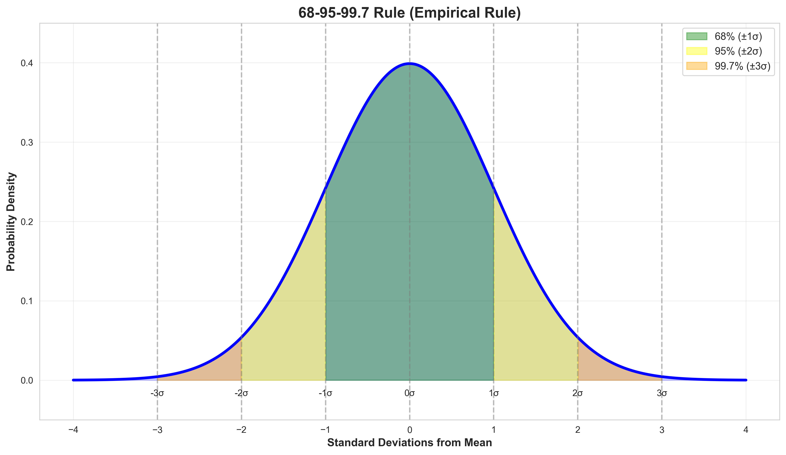

# Module 2: Probability & Distributions

## Overview
Understanding probability distributions is key to statistical inference. This module covers **Continuous Distributions** (Normal, Uniform) and **Descriptive Statistics** (Skewness, Kurtosis).

## Key Concepts

### 1. Probability Distributions
*   **Uniform Distribution:** All outcomes are between $a$ and $b$ are equally likely.
    *   **Discrete (Uniform):** $n$ outcomes ($n=b-a+1$). Mean $\mu = \frac{a+b}{2}$, Variance $\sigma^2 = \frac{n^2-1}{12}$.
    *   **Continuous (Uniform):** Interval $[a, b]$. Mean $\mu = \frac{a+b}{2}$, Variance $\sigma^2 = \frac{(b-a)^2}{12}$.
*   **Normal (Gaussian) Distribution:** The "Bell Curve". Most natural phenomena follow this. Defined by Mean ($\mu$) and Standard Deviation ($\sigma$).
    $$ f(x) = \frac{1}{\sigma\sqrt{2\pi}} e^{-\frac{1}{2}(\frac{x-\mu}{\sigma})^2} $$




### 2. Properties of Distributions
*   **PDF (Probability Density Function):** The height of the curve at point $x$. Likelihood of a value.
*   **CDF (Cumulative Distribution Function):** The area under the curve up to point $x$. Probability of being $\le x$.

### 3. Shape Statistics
*   **Skewness:** Measure of asymmetry.
    *   *Positive (Right) Skew:* Tail on the right. Mean > Median.
    *   *Negative (Left) Skew:* Tail on the left. Mean < Median.
*   **Kurtosis:** Measure of "tailedness" (outliers).
    *   *Leptokurtic:* Heavy tails (more outliers).
    *   *Platykurtic:* Light tails (fewer outliers).

## Visualizing Skewness





## Key Formulas

### 1. Measures of Central Tendency
*   **Mean ($\mu$):** The arithmetic average. Sensitive to outliers.

$$ \mu = \frac{1}{N} \sum_{i=1}^{N} x_i $$

*   **Median:** The middle value when data is sorted. Robust to outliers.
*   **Mode:** The most frequent value. Can be multimodal.

### 2. Measures of Dispersion
*   **Standard Deviation ($\sigma$):** The average distance from the mean.

$$ \sigma = \sqrt{\frac{1}{N} \sum_{i=1}^{N} (x_i - \mu)^2} $$

*   **$\sigma$** (Pronounced: *Sigma*): Population standard deviation.
*   **$\sigma^2$** (Pronounced: *Sigma squared*): Variance.

### 3. Normal Distribution Rule (68-95-99.7)
Percentage of data within standard deviations from the mean:

*   $\mu \pm 1\sigma$: **68%**
*   $\mu \pm 2\sigma$: **95%**
*   $\mu \pm 3\sigma$: **99.7%**




### 4. Standard Score (Z-Score)
Normalizing a value to standard deviation units.

$$ z = \frac{x - \mu}{\sigma} $$

*   **$z$** (Pronounced: *z-score*): The number of standard deviations a data point is from the mean.

### 5. Central Limit Theorem (CLT)
The distribution of the sample mean approaches a **Normal Distribution** as the sample size increases, regardless of the population's distribution.
*   *Implication:* Allows us to make statistical inferences about the population mean.

### 6. Multivariate Distributions
Distributions involving multiple random variables ($X, Y$).
*   **Covariance:** Measure of joint variability. Positive value $\rightarrow$ variables move together.
*   **Correlation:** Normalized covariance (between -1 and 1).
    *   **Independence:** Knowing $X$ gives no info about $Y$. $P(Y|X) = P(Y)$.


## Code for Learning

### Setup and Import
```bash
pip install numpy matplotlib scipy seaborn
```

```python
import numpy as np
import matplotlib.pyplot as plt
from scipy.stats import norm, skew, kurtosis
import seaborn as sns
```

### 1. Analyzing Distributions (Skew & Kurtosis)
```python
from scipy.stats import uniform

# Uniform Distribution (Continuous)
# loc = start, scale = width
u = uniform(loc=10, scale=5) # Range [10, 15]
print(f"Mean: {u.mean()}, Variance: {u.var()}")

# Generate skewed data
data = np.random.exponential(scale=2, size=1000)

# Calculate Stats
data_mean = np.mean(data)
data_skew = skew(data)
data_kurt = kurtosis(data)

print(f"Mean: {data_mean:.2f}")
print(f"Skewness: {data_skew:.2f} (Expected > 0 for exponential)")
print(f"Kurtosis: {data_kurt:.2f}")

# Plot
sns.histplot(data, kde=True, color='purple')
plt.title(f"Skewed Distribution (Skew={data_skew:.2f})")
plt.show()
```

### 2. The Normal Distribution (CDF & PDF)
Calculating probabilities.

```python
# Define a Normal Dist: Mean=0, Std=1
mu, sigma = 0, 1
dist = norm(mu, sigma)

# Question: What is probability of x < 1.96?
prob = dist.cdf(1.96)
print(f"P(x < 1.96) = {prob:.4f} (Approx 97.5%)")

# Question: Limit for top 5%? (Inverse CDF)
top_5 = dist.ppf(0.95)
print(f"Top 5% threshold: {top_5:.4f}")
```
