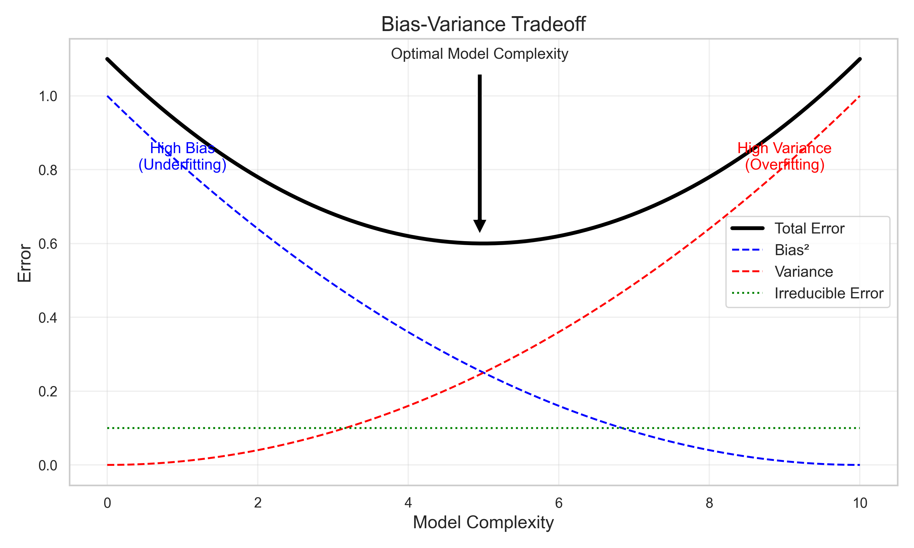
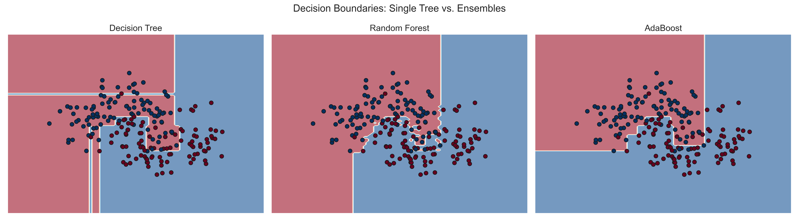
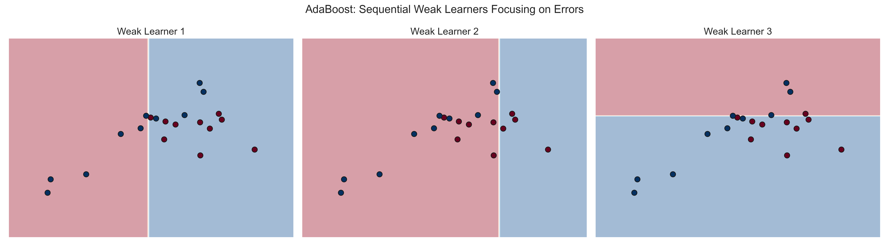
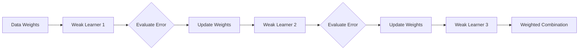

# Module 20: Ensemble Methods

## Overview
This module explores **Ensemble Methods**, a powerful paradigm in machine learning where multiple models (often called "weak learners") are combined to create a "metamodel" with better performance than any single constituent model. The module covers two primary techniques: **Bagging** (Bootstrap Aggregating) to reduce variance, and **Boosting** to reduce bias.

## Key Concepts

### 1. Bias and Variance
Understanding the source of error in models is crucial for ensemble design.
*   **Bias:** Error introduced by approximating a real-world problem with a simplified model. High bias causes **underfitting**.
*   **Variance:** Error introduced by the model's sensitivity to small fluctuations in the training set. High variance causes **overfitting**.
*   **Irreducible Error:** Noise in the data that cannot be reduced by any model.



### 2. Bootstrapping
A statistical technique that involves random sampling with replacement. Use theoretical "bootstrap samples" to estimate the distribution of an estimator.
*   **Sampling with Replacement:** A data point can be selected multiple times in the same sample.

### 3. Bagging (Bootstrap Aggregating)
An ensemble meta-algorithm designed to improve stability and accuracy.
*   **Process:**
    1.  Generate $B$ different bootstrap samples from the training data.
    2.  Train a separate model (base learner) on each sample.
    3.  **Aggregate** the predictions (Average for regression, Majority Voting for classification).
*   **Goal:** Primarily reduces **Variance**. Efficient for high-variance models like Decision Trees.
*   **Out-of-Bag (OOB) Evaluation:** Since each bootstrap sample leaves out about 37% of the data, these "leftover" instances can be used as a validation set to estimate performance without a separate test set.

### 4. Random Forest
An extension of Bagging specifically for Decision Trees.
*   **Key Difference:** In addition to bagging the data, Random Forest uses **Feature Bagging**. At each split in the tree, the algorithm considers only a random subset of features.
*   **Decorrelation:** This randomness decorrelates the trees, making the ensemble more robust than standard Bagging.
*   **Parameters:** `n_estimators` (number of trees), `max_features` (size of random subset), `max_depth`.



### 5. Boosting (AdaBoost)
**AdaBoost** (Adaptive Boosting) trains models sequentially.
*   **Process:**
    1.  Train a weak learner.
    2.  Identify misclassified instances.
    3.  Increase the weights of misclassified instances so the next learner focuses on them.
    4.  Combine learners using a weighted sum based on their accuracy.
*   **Goal:** Primarily reduces **Bias**. Can turn weak learners (slightly better than random guessing) into a strong learner.
*   **Gradient Boosted Trees:** Unlike AdaBoost which updates instance weights, Gradient Boosting fits new models to the *residual errors* of the previous models.



## Key Formulas

### 1. Bias-Variance Decomposition
Total error can be decomposed into bias, variance, and irreducible error.

$$ E[(y - \hat{f}(x))^2] = \text{Bias}[\hat{f}(x)]^2 + \text{Var}[\hat{f}(x)] + \sigma^2 $$

*   **$E$** (Pronounced: *Expected Value*): The average expectation over different training sets.
*   **$\hat{f}(x)$** (Pronounced: *f hat of x*): The estimated prediction function.
*   **$\sigma^2$** (Pronounced: *sigma squared*): The irreducible error (noise).

### 2. Bagging Aggregation & Variance Reduction
For regression, the ensemble prediction is the average:

$$ \hat{y}_{bag} = \frac{1}{B} \sum_{b=1}^B \hat{f}_b(x) $$

Under the assumption that the errors of the individual models are uncorrelated, the variance of the ensemble is reduced by a factor of $B$:

$$ Var_{ensemble} = \frac{Var_{individual}}{B} $$

*   **$\hat{y}_{bag}$** (Pronounced: *y hat bag*): The final ensemble prediction.
*   **$B$** (Pronounced: *Capital B*): The total number of bootstrap samples/models.
*   **$\sum$** (Pronounced: *Sum*): Summation of predictions from model 1 to B.
*   **$\hat{f}_b(x)$** (Pronounced: *f hat sub b of x*): Prediction of the $b$-th model.

### 3. AdaBoost Weight Update (Alpha) & Sample Weights
The weight (influence) of a learner $t$ in the final ensemble depends on its error rate $\epsilon_t$.

**Influence of Learner $t$:**
$$ \alpha_t = \frac{1}{2} \ln\left(\frac{1 - \epsilon_t}{\epsilon_t}\right) $$

*   **$\alpha_t$** (Pronounced: *alpha sub t*): The weight of classifier $t$.
*   **$\ln$** (Pronounced: *natural log*): The natural logarithm.
*   **$\epsilon_t$** (Pronounced: *epsilon sub t*): The weighted error rate of classifier $t$.

**Sample Weight Update:**
For the next iteration, weights $w$ are updated to emphasize misclassified samples.

$$ w_{i}^{(t+1)} = w_{i}^{(t)} \cdot e^{\alpha_t \cdot I(y_i \neq \hat{f}_t(x_i))} $$

*   **$w_{i}^{(t)}$** (Pronounced: *w sub i super t*): Weight of sample $i$ at step $t$.
*   **$e$** (Pronounced: *e*): Base of natural logarithm.
*   **$I(\dots)$** (Pronounced: *Indicator function*): 1 if sample is misclassified, 0 otherwise.

### 4. Gradient Boosting Update
Gradient Boosting builds an additive model by fitting a weak learner $h(x)$ to the **negative gradient** (residuals) of the loss function.

$$ H(x) \leftarrow H(x) + \alpha \cdot h(x) $$

*   **$H(x)$** (Pronounced: *Big H of x*): The current ensemble model.
*   **$\alpha$** (Pronounced: *alpha*): Learning rate.
*   **$h(x)$** (Pronounced: *little h of x*): Weak learner fitted to residuals.

### 5. OOB Estimate Probability
The probability that a specific observation is *not* included in a bootstrap sample of size $n$ (as $n \to \infty$):

$$ p = \lim_{n \to \infty} (1 - \frac{1}{n})^n = \frac{1}{e} \approx 0.368 $$

*   **$e$** (Pronounced: *e*): Euler's number ($\approx 2.718$).
*   **$0.368$**: Approximate proportion of data left out (Out-of-Bag).

## Visualizing Ensemble Flows

### Bagging (Parallel)
```mermaid
graph TD
    Data[Training Data]
    Data --> S1[Sample 1]
    Data --> S2[Sample 2]
    Data --> S3[Sample 3]
    S1 --> M1[Model 1]
    S2 --> M2[Model 2]
    S3 --> M3[Model 3]
    M1 --> Agg[Aggregation]
    M2 --> Agg
    M3 --> Agg
    Agg --> Final[Final Prediction (Majority Vote/Average)]
```

### Voting Classifier (Hard vs Soft)
*   **Hard Voting:** Majority rule. Returns class label.
*   **Soft Voting:** Averages predicted probabilities. Returns class with highest average probability. Often performs better if classifiers are well-calibrated.

### Boosting (Sequential)


## Prerequisites

The **ensemble** module is part of the **scikit-learn** library, not a standalone package. To access it, you must install `scikit-learn` (and others for data handling/plotting).

```bash
pip install scikit-learn pandas matplotlib
```

## Code for Learning

### 1. Implement Bagging and OOB Evaluation
Using `BaggingClassifier` with OOB score enabled.

```python
from sklearn.ensemble import BaggingClassifier
from sklearn.tree import DecisionTreeClassifier
from sklearn.datasets import load_wine
from sklearn.model_selection import train_test_split

# Load Data
data = load_wine()
X, y = data.data, data.target

# Create Bagging Meta-Estimator
# oob_score=True allows evaluation on "left out" data
bagging = BaggingClassifier(base_estimator=DecisionTreeClassifier(),
                            n_estimators=100,
                            max_samples=0.8,
                            oob_score=True,
                            random_state=42)

bagging.fit(X, y)

print(f"OOB Score: {bagging.oob_score_:.4f}")
```

### 2. Random Forest for Classification
Random Forest implies Bagging with Decision Trees + Feature Randomness.

```python
from sklearn.ensemble import RandomForestClassifier

# Initialize Random Forest
# n_estimators: Number of trees
# max_features: 'sqrt' is default for classification (feature bagging)
rf = RandomForestClassifier(n_estimators=100,
                            max_features='sqrt',
                            random_state=42)

rf.fit(X, y)

# Feature Importance
import pandas as pd
importances = pd.Series(rf.feature_importances_, index=data.feature_names)
print(importances.sort_values(ascending=False).head())
```

### 3. AdaBoost Implementation
Boosting using stump trees (depth=1).

```python
from sklearn.ensemble import AdaBoostClassifier

# AdaBoost with Decision Tree Stumps
ada = AdaBoostClassifier(base_estimator=DecisionTreeClassifier(max_depth=1),
                         n_estimators=50,
                         learning_rate=1.0,
                         random_state=42)

ada.fit(X, y)
print(f"AdaBoost Accuracy: {ada.score(X, y):.4f}")
```

### 4. Voting Classifier (Ensemble)
Combining different types of models.

```python
from sklearn.ensemble import VotingClassifier
from sklearn.linear_model import LogisticRegression
from sklearn.neighbors import KNeighborsClassifier
from sklearn.svm import SVC

# Define Base Learners
# Note: SVC needs probability=True for soft voting
lr = LogisticRegression()
knn = KNeighborsClassifier()
svc = SVC(probability=True)

# Hard Voting
voting_hard = VotingClassifier(estimators=[('lr', lr), ('knn', knn), ('svc', svc)], voting='hard')
voting_hard.fit(X, y)

# Soft Voting (Probabilities)
voting_soft = VotingClassifier(estimators=[('lr', lr), ('knn', knn), ('svc', svc)], voting='soft')
voting_soft.fit(X, y)

print(f"Hard Voting Score: {voting_hard.score(X, y):.4f}")
print(f"Soft Voting Score: {voting_soft.score(X, y):.4f}")
```

### 5. Gradient Boosting Regressor
Fitting to residuals.

```python
from sklearn.ensemble import GradientBoostingRegressor
from sklearn.datasets import make_regression

X_reg, y_reg = make_regression(n_samples=100, n_features=1, noise=10, random_state=42)

# Gradient Boosting
# n_estimators: Number of boosting stages
# learning_rate: Shrinks the contribution of each tree
gb = GradientBoostingRegressor(n_estimators=100, learning_rate=0.1, max_depth=3, random_state=42)
gb.fit(X_reg, y_reg)

print(f"Gradient Boosting Score: {gb.score(X_reg, y_reg):.4f}")
```
