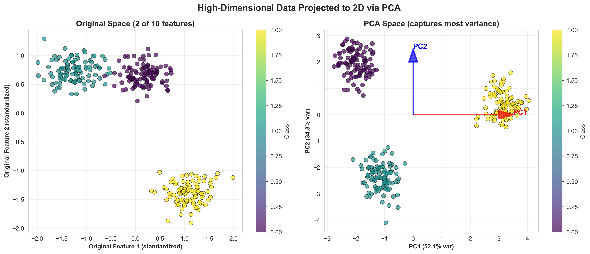
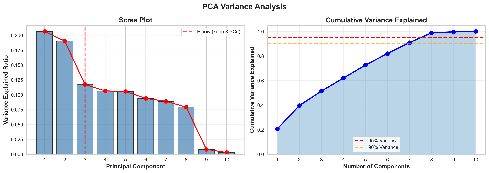
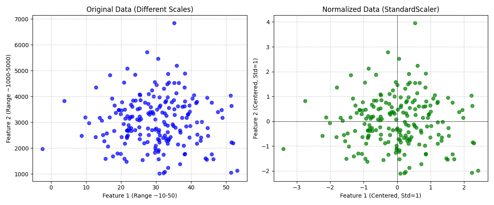
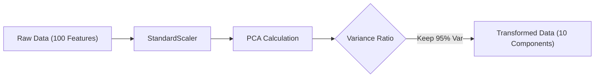
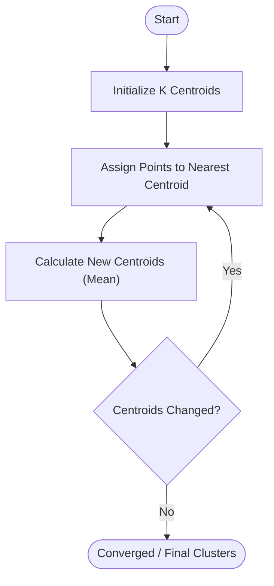
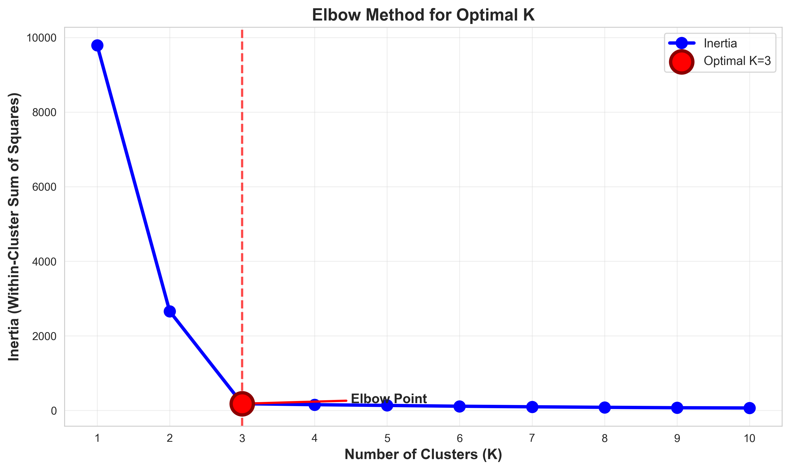
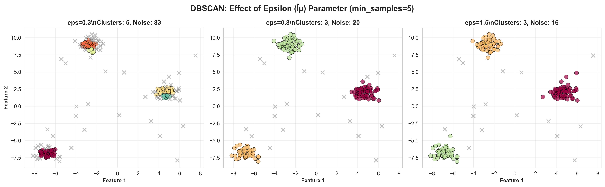

# Module 6: Unsupervised Learning Summary

## Overview
Unsupervised Learning finds hidden patterns in unlabeled data. The two main techniques are **Dimensionality Reduction (PCA)** and **Clustering**.

## Key Concepts

### 1. Principal Component Analysis (PCA)
A technique to reduce the number of features (dimensions) while retaining the most important information (variance).
*   **Eigenvalues:** Represent the amount of variance explained by each Principal Component.
*   **Eigenvectors:** The direction of the Principal Component in the original feature space.
*   **Use Cases:** Visualization (high dimensional -> 2D/3D), Noise Reduction, Feature Extraction.




### 2. Clustering
Grouping similar data points together.
*   **K-Means:** Partitioning data into $K$ distinct clusters based on distance to centroids.
    *   **K-Means++:** Smart initialization strategy to spread centroids apart, improving convergence speed and result quality.
*   **DBSCAN:** Density-based clustering.
    *   **Core Points:** Having at least `min_samples` neighbors within `eps` radius.
    *   **Boundary Points:** Reachable from a core point but not core themselves.
    *   **Noise (Outliers):** Not reachable from any core point.

## Key Formulas

### 1. PCA Transformation
Projecting data $X$ onto the Principal Components (Eigenvectors $W$).

$$ Z = X \cdot W $$

*   $Z$: Transformed data (Principal Components).
*   $W$: Matrix of Top-$k$ Eigenvectors.




### 2. SVD (Singular Value Decomposition)
PCA is often implemented using SVD. $X$ (Tall Matrix, $N \times D$) is decomposed into:

$$ X = U \Sigma V^T $$

*   $X$: Data Matrix.
*   $U$: Left Singular Vectors ($N \times N$, orthogonal).
*   $\Sigma$: Diagonal matrix of Singular Values ($\sigma_i$) sorted descending ($N \times D$).
*   $V^T$: Right Singular Vectors ($D \times D$, Principal Components).

**PCA Approximation (Reconstruction):**
We can approximate the original data using only the top $r$ components:
$$ \tilde{X}_r = U_r \Sigma_r V_r^T $$

### 3. Feature Normalization ($X_{norm}$)
Essential before PCA to ensure all features have the same scale.



$$ x_{norm} = \frac{x - \mu}{\sigma} $$

*   $\mu$: Mean of the feature.
*   $\sigma$: Standard deviation of the feature.

### 4. K-Means Inertia
The goal of K-Means is to minimize this value.

$$ \text{Inertia} = \sum_{j=1}^k \sum_{i \in C_j} ||x_i - \mu_j||^2 $$

*   **$\mu_j$** (Pronounced: *Mu sub j*): Centroid of cluster $j$.
*   **$\sum$** (Pronounced: *Sum*): Summation of distances.

## Visualizing PCA Flow


## Visualizing K-Means Clustering


## Code for Learning

### Setup and Import
```python
import pandas as pd
import numpy as np
import matplotlib.pyplot as plt
import seaborn as sns
from sklearn.decomposition import PCA
from sklearn.cluster import KMeans, DBSCAN
from sklearn.preprocessing import StandardScaler
from sklearn.datasets import load_wine
```

### 1. PCA for Visualization
Reducing 13 features to 2 for plotting.

```python
# Load Data
data = load_wine()
df = pd.DataFrame(data.data, columns=data.feature_names)

# 1. Standardize (Crucial for PCA)
scaler = StandardScaler()
X_scaled = scaler.fit_transform(df)

# 2. PCA
pca = PCA(n_components=2)
principal_components = pca.fit_transform(X_scaled)

# 3. Variance Explained
print(f"Variance Explained: {pca.explained_variance_ratio_}")
# Example: [0.36, 0.19] -> First 2 PCs explain 55% of the data

# 4. Plot
plt.figure(figsize=(8, 6))
plt.scatter(principal_components[:, 0], principal_components[:, 1], c=data.target, cmap='viridis')
plt.xlabel('Principal Component 1')
plt.ylabel('Principal Component 2')
plt.title('PCA of Wine Dataset')
plt.colorbar(label='Target Class')
plt.show()
```

### 2. K-Means and the Elbow Method
Finding the optimal $K$.

```python
inertia = []
K_range = range(1, 11)

for k in K_range:
    kmeans = KMeans(n_clusters=k, random_state=42)
    kmeans.fit(X_scaled)
    inertia.append(kmeans.inertia_)

# Plot Elbow Curve
plt.plot(K_range, inertia, 'bx-')
plt.xlabel('k (Number of clusters)')
plt.ylabel('Inertia')
plt.title('Elbow Method For Optimal k')
plt.show()
```
*   **Interpretation:** Look for the "elbow" where the inertia drop creates an angle. That is the optimal $K$.




### 3. DBSCAN (for specific shapes)
Ignores outliers naturally (-1 label).



```python

# Epsilon (radius) and Min_Samples are key hyperparameters
dbscan = DBSCAN(eps=2.5, min_samples=5)
clusters = dbscan.fit_predict(X_scaled)

# Count clusters (Label -1 is noise)
print(pd.Series(clusters).value_counts())
```
