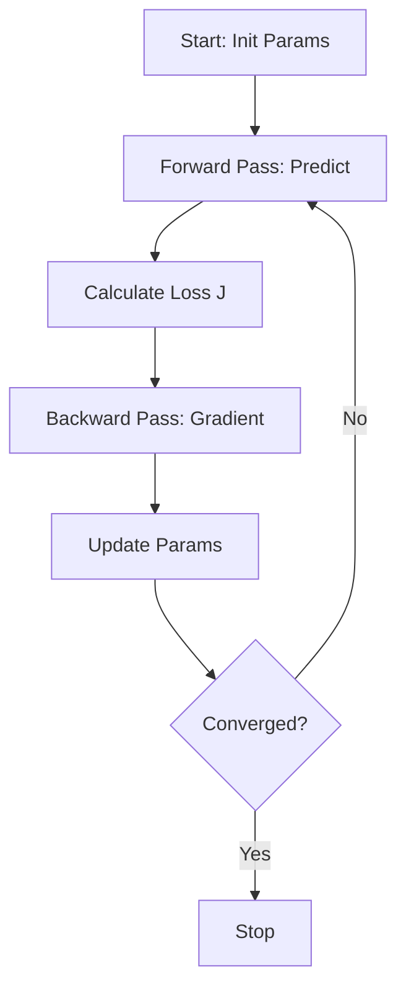
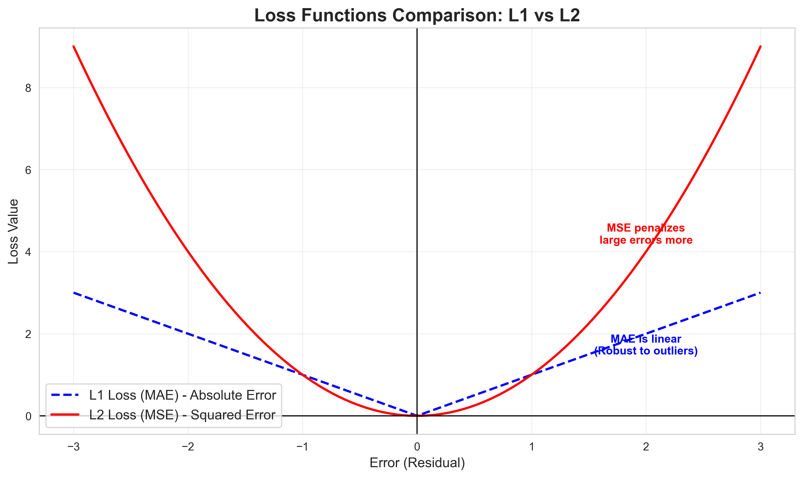
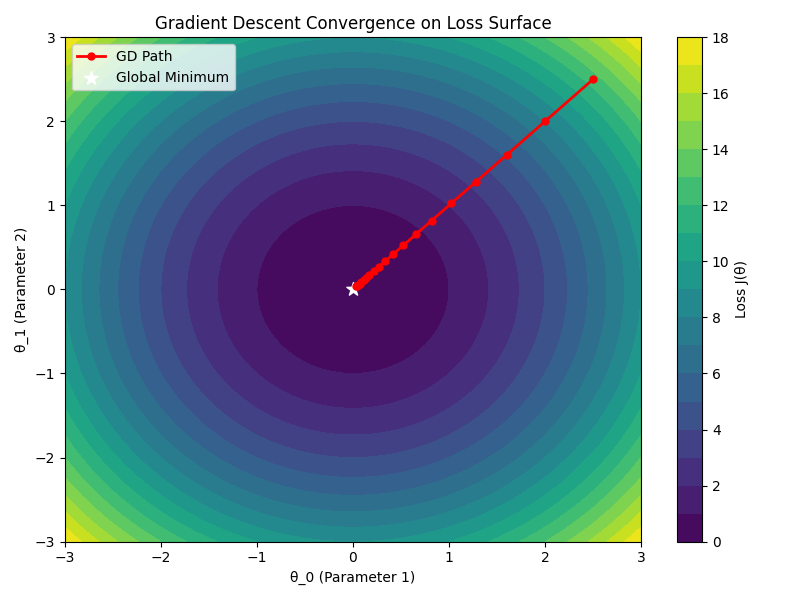

# Module 7: Optimization

## Overview
Optimization is the engine of Machine Learning. It involves finding the best parameters ($\theta$) that minimize a **Loss Function**. The most common algorithm for this is **Gradient Descent**.

## Key Concepts

### 1. Calculus in Machine Learning
Calculus provides the mathematical framework for understanding how models learn and how we measure their performance.

#### Differential Calculus (The Engine of Learning)
*   **Focus:** Rates of change and slopes.
*   **Role in ML:** Optimization.
*   **Key Application:** **Gradient Descent**. We use derivatives (gradients) to find the direction in which the error (loss) increases, and then move in the opposite direction to minimize it.
    *   *Analogy:* Finding the way down a mountain by feeling the steepness of the slope under your feet.

#### Integral Calculus (The Measure of Performance)
*   **Focus:** Accumulation and area under curves.
*   **Role in ML:** Probability and Aggregation.
*   **Key Application:** **ROC-AUC (Area Under the Curve)** & **Probability Distributions**.
    *   *CDF (Cumulative Distribution Function):* Integrating the Probability Density Function (PDF) gives us the total probability up to a certain point.
    *   *Expectation:* Calculating the expected value (mean) involves integration (for continuous variables).

### Optimization Loop



### 1. Model Types
*   **Linear Models:** The target ($y$) is a linear combination of features ($x$). The change in $y$ for a unit change in $x$ is constant.
    *   *Equation:* $y = \theta_0 + \theta_1 x$
*   **Nonlinear Models:** The relationship involves curves, thresholds, or complex interactions. The change in $y$ depends on the current value of $x$.
    *   *Examples:* Polynomial Regression ($y = \theta_0 + \theta_1 x + \theta_2 x^2$), Decision Trees, Neural Networks.

### 2. Linear Regression Models
*   **Simple Linear Regression:** One feature.
    *   $\hat{y} = \theta_0 + \theta_1 x$
*   **Multiple Linear Regression:** Multiple features.
    *   $\hat{y} = \theta_0 + \theta_1 x_1 + ... + \theta_n x_n$
    *   *Interpreting Coefficients:* $\theta_i$ represents the change in $y$ for a one-unit change in $x_i$, holding other variables constant.

### 2. Feature Engineering
*   **Categorical Data Types:**
    *   **Nominal:** No inherent order (e.g., Color: Red, Blue). Use **One-Hot Encoding**.
    *   **Ordinal:** Inherent order (e.g., Size: Small, Medium, Large). Use **Integer Encoding** (1, 2, 3).
*   **Interaction Terms:** Combining features to capture non-linear effects ($x_1 \cdot x_2$).

### 3. The Loss Function ($J(\theta)$)
The Loss Function quantifies how far the model's predictions are from the actual values. Our goal is to minimize this error.



*   **L2 Loss (Mean Squared Error - MSE):** Calculates the squared difference.
    *   *Pros:* Penalizes large errors heavily (due to squaring). Differentiable everywhere, making it ideal for Gradient Descent.
    *   *Cons:* Can be overly sensitive to outliers.
*   **L1 Loss (Mean Absolute Error - MAE):** Calculates the absolute difference.
    *   *Pros:* Robust to outliers (linear penalty).
    *   *Cons:* Harder to optimize because the derivative is undefined at 0 (the "V" shape bottom).

### 4. Gradient Descent
An iterative algorithm that moves parameters in the opposite direction of the gradient (slope) to find the minimum.



*   **Learning Rate ($\alpha$):** Controlled step size.
    *   **Too Small:** Converges very slowly.
    *   **Too Large:** Can overshoot the minimum and diverge.

## Key Formulas

### 1. Mean Squared Error (MSE) - The Loss Function

$$ J(\theta) = \frac{1}{n} \sum_{i=1}^n (y_i - \hat{y}_i)^2 $$

*   **$J(\theta)$** (Pronounced: *J of theta*): The cost function value.
*   **$\hat{y}_i$** (Pronounced: *y hat sub i*): The predicted value for the $i$-th example.
*   **$\sum$** (Pronounced: *sum*): Summation over all $n$ examples.

### 5. The Gradient ($\nabla J$)
The derivative of the loss function with respect to the weights. It points "uphill".

$$ \nabla J(\theta) = -\frac{2}{n} \sum_{i=1}^n (y_i - \hat{y}_i) \cdot x_i $$

*   **$\nabla$** (Pronounced: *Nabla* or *Del*): Symbol for the Gradient (vector of partial derivatives).

### 6. Update Rule (The "Learning" Step)
We move "downhill" by subtracting the gradient.

$$ \theta_{new} = \theta_{old} - \alpha \cdot \nabla J(\theta) $$

*   **$\alpha$** (Pronounced: *Alpha*): The Learning Rate (step size).

## Code for Learning

### Setup
```python
import numpy as np
import matplotlib.pyplot as plt

# Generate Synthetic Data
np.random.seed(42)
X = 2 * np.random.rand(100, 1)
y = 4 + 3 * X + np.random.randn(100, 1) # y = 4 + 3x + noise
```

### 1. Manual Gradient Descent
Implementation from scratch to understand the math.

```python
# Hyperparameters
learning_rate = 0.1
n_iterations = 1000
m = len(X) # Number of samples

# Initialization
theta = np.random.randn(2, 1) # Random weights
X_b = np.c_[np.ones((m, 1)), X] # Add bias term (x0 = 1)

# Optimization Loop
for iteration in range(n_iterations):
    gradients = 2/m * X_b.T.dot(X_b.dot(theta) - y)
    theta = theta - learning_rate * gradients

print("Intercept:", theta[0][0])
print("Slope:", theta[1][0])
```

### 2. Visualizing Convergence
How does the path to the minimum look?

```python
theta_path = []
theta = np.random.randn(2, 1)

for iteration in range(n_iterations):
    gradients = 2/m * X_b.T.dot(X_b.dot(theta) - y)
    theta = theta - learning_rate * gradients
    theta_path.append(theta)

path = np.array(theta_path)
plt.plot(path[:, 0], path[:, 1], "b-o")
plt.xlabel("Theta 0 (Intercept)")
plt.ylabel("Theta 1 (Slope)")
plt.title("Gradient Descent Path")
plt.show()
```

### 3. Visualizing with Plotly (Interactive)
Using `scikit-learn` to fit and `plotly` to visualize.

```python
import plotly.express as px
from sklearn.linear_model import LinearRegression

# 1. Fit Model
model = LinearRegression()
model.fit(X, y)
y_pred = model.predict(X)

# 2. Create DataFrame for Plotly
import pandas as pd
df_plot = pd.DataFrame({'X': X.flatten(), 'y': y.flatten(), 'y_pred': y_pred.flatten()})

# 3. Plot
fig = px.scatter(df_plot, x='X', y='y', opacity=0.65, title='Linear Regression with Plotly')
fig.add_traces(px.line(df_plot, x='X', y='y_pred').data[0])
fig.data[1].line.color = 'red' # Set regression line color
fig.show()
```

### 3. Using Scipy Minimize (Black Box)
For complex functions where gradients are hard to derive manually.

```python
from scipy.optimize import minimize

def loss_func(theta):
    theta = theta.reshape(-1, 1)
    return np.mean((y - X_b.dot(theta))**2)

# Initial guess
x0 = np.random.randn(2, 1)

# Minimize
result = minimize(loss_func, x0)
print("Scipy Result:", result.x)
```

### 4. Evaluating Performance (MAE vs MSE)
```python
from sklearn.metrics import mean_absolute_error, mean_squared_error

# Calculate Errors
mae = mean_absolute_error(y, y_pred)
mse = mean_squared_error(y, y_pred)
rmse = np.sqrt(mse)

print(f"MAE: {mae:.2f}")
print(f"MSE: {mse:.2f}")
print(f"RMSE: {rmse:.2f}")
```

### 5. Multiple Linear Regression
fitting a model with multiple features ($X_1, X_2, ...$).

```python
# Generate data with 2 features
X_multi = 2 * np.random.rand(100, 2)
y_multi = 4 + 3 * X_multi[:, 0] + 5 * X_multi[:, 1] + np.random.randn(100)

# Fit Model
model_multi = LinearRegression()
model_multi.fit(X_multi, y_multi)

print("Coefficients:", model_multi.coef_) # Should be close to [3, 5]
print("Intercept:", model_multi.intercept_) # Should be close to 4
```
