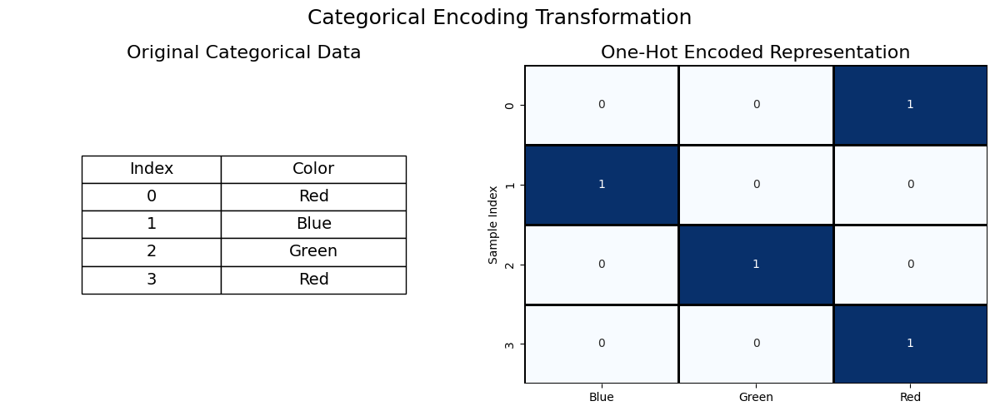
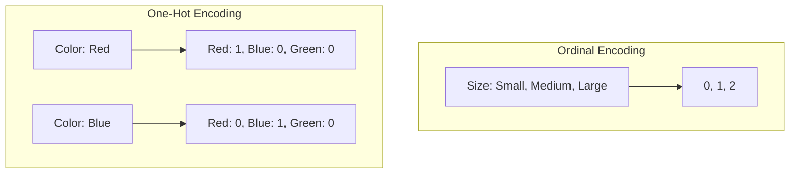
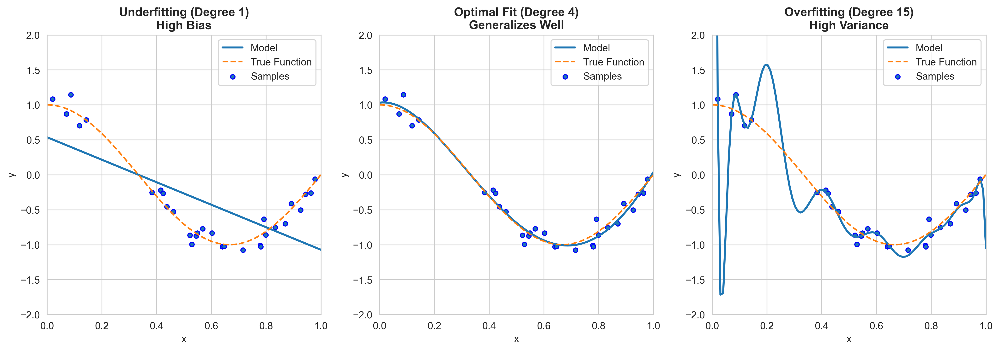
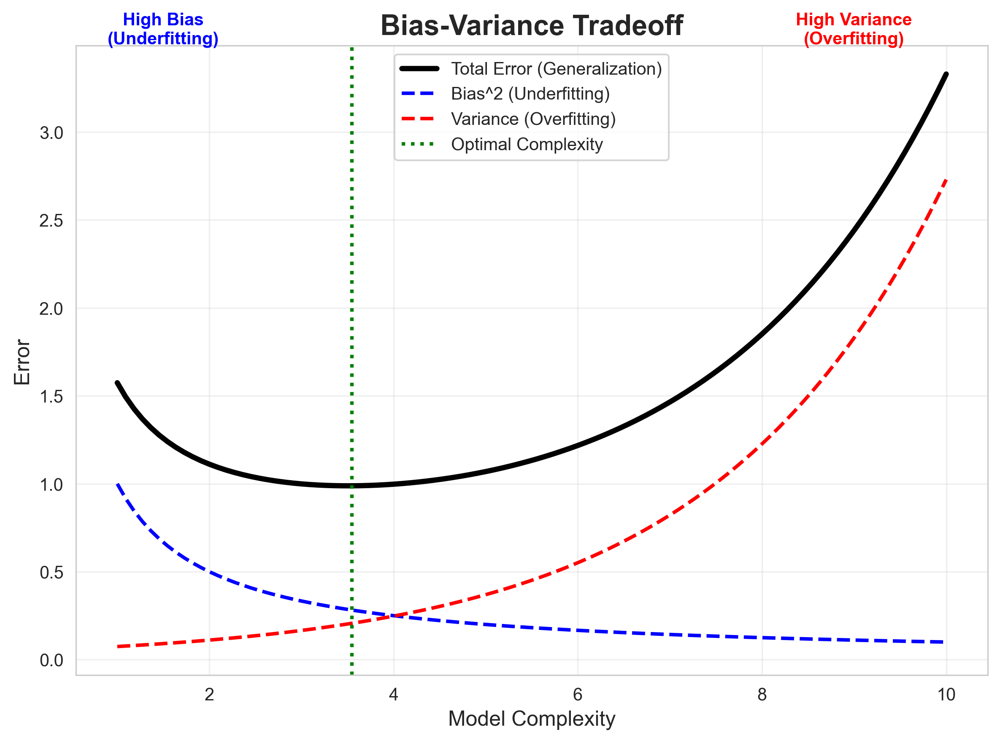

# Module 8: Feature Engineering

## Overview
Feature Engineering is the art and science of transforming raw data into features that better represent the underlying problem to the predictive models, resulting in improved model accuracy on unseen data.

## Key Concepts

### 1. Categorical Encoding
Machine Learning models require numerical input.
*   **Ordinal Encoding:** For data with specific order (e.g., Low < Medium < High). Preserves rank.
*   **One-Hot Encoding:** For nominal data with no order (e.g., Apple, Banana, Cherry). Creates binary columns ($0$ or $1$). Avoids false ranking.

#### Visualizing Encoding






### 2. Inference vs Prediction
*   **Inference:** Understanding the relationship between features and target. Focus on interpretability (e.g., "How much does rainfall affect crop yield?").
*   **Prediction:** Forecasting the target value for new data. Focus on accuracy (e.g., "What will the crop yield be next year?").

### 3. Nonlinear Features (Polynomial Regression)
**The Challenge: Fitting Parabolic Data**
A simple linear model ($y = \theta_0 + \theta_1 x$) produces a straight line. It cannot capture a curve (like a parabola $y = x^2$).
*   **Problem:** High Bias (Underfitting). The model is too simple for the data.
*   **Solution:** Create a **new feature** $x^2$ and feed it to the linear model.
    *   New Equation: $y = \theta_0 + \theta_1 x + \theta_2 x^2$
    *   This is still **Linear Regression** because it is linear in the parameters ($\theta$), even though the feature ($x^2$) is nonlinear.

Linear models can fit nonlinear data by transforming features. A "linear model" refers to linearity in parameters ($\theta$), not necessarily features ($x$).
*   **Polynomial Features:** Generating powers ($x^2, x^3$) and interactions ($x_1 \cdot x_2$) to capture curves.



### 4. Numerical Transformations
*   **Scaling:** Adjusting range (MinMax) or distribution (StandardScaler).
*   **Interaction Terms:** Creating new features by multiplying existing ones.

### 5. Overfitting & Generalization (Bias-Variance Tradeoff)
*   **Overfitting (High Variance):** Model learns noise/specifics of training data. Performs well on train, poor on test.
    *   *Cause:* Model too complex (e.g., high-degree polynomial).
*   **Underfitting (High Bias):** Model makes strong assumptions and misses patterns. Poor on train and test.
    *   *Cause:* Model too simple (e.g., straight line for curved data).
*   **Generalization:** Ability to perform well on unseen data. Our goal is to find the "sweet spot" (Low Bias, Low Variance).



#### Model Selection
*   **Training Set:** Fit parameters.
*   **Validation Set:** Tune hyperparameters (e.g., polynomial degree) and select best model. Evaluates **generalization**.
*   **Test Set:** Final evaluation.

### 6. Pandas for Feature Engineering
Key functions for data manipulation:
*   `df.apply()`: Apply a function along an axis (e.g., row-wise custom logic).
*   `df.map()`: Map values in a Series (e.g., manual encoding).
*   `pd.get_dummies()`: One-hot encode categorical variables.
*   `df.groupby()`: Aggregating data (e.g., mean price by city).
*   `df.fillna()`: Handle missing values.

### 7. Scikit-Learn Pipelines
Chaining transformers and estimators ensures no **data leakage** and simplifies code.
`Pipeline([('scaler', StandardScaler()), ('model', LinearRegression())])`

## Key Formulas

### 1. Polynomial Features (Degree 2)
For features $a, b$:

$$ \text{Features} \rightarrow 1, a, b, a^2, ab, b^2 $$
(Includes Bias $1$, original terms, squares, and interaction $ab$)

*   **$a, b$** (Pronounced: *a, b*): Represents individual input features.
*   **$a^2$** (Pronounced: *a squared*): Polynomial term of degree 2.
*   **$ab$** (Pronounced: *a times b*): Interaction term.

## Code for Learning

### Setup and Import
```python
import pandas as pd
import numpy as np
import matplotlib.pyplot as plt
from sklearn.preprocessing import OneHotEncoder, OrdinalEncoder, StandardScaler, PolynomialFeatures
from sklearn.compose import ColumnTransformer
from sklearn.pipeline import Pipeline
```

### 1. Advanced Encoding Pipeline
Handling mixed data types is a standard industry requirement.

```python
# Sample Data
data = pd.DataFrame({
    'price': [100, 200, 150, 300],
    'city': ['London', 'Paris', 'London', 'Berlin'], # Nominal
    'quality': ['Low', 'High', 'Medium', 'High']    # Ordinal
})

# Define Transformers
# 1. Scaling for numerical
num_trans = StandardScaler()

# 2. One-Hot for nominal (City)
cat_nominal_trans = OneHotEncoder(sparse_output=False, handle_unknown='ignore')

# 3. Ordinal for ordered (Quality) - Define categories explicitly
quality_order = [['Low', 'Medium', 'High']]
cat_ordinal_trans = OrdinalEncoder(categories=quality_order)

# Combine in ColumnTransformer
preprocessor = ColumnTransformer(
    transformers=[
        ('num', num_trans, ['price']),
        ('nom', cat_nominal_trans, ['city']),
        ('ord', cat_ordinal_trans, ['quality'])
    ],
    verbose_feature_names_out=False
)

# Fit and Transform
processed_data = preprocessor.fit_transform(data)
columns = preprocessor.get_feature_names_out()

df_processed = pd.DataFrame(processed_data, columns=columns)
print(df_processed)
```


### 2. Creating Polynomial Interactions
Capturing complex relationships.

```python
X = np.array([[2, 3], [4, 5]]) # Two features: a, b

poly = PolynomialFeatures(degree=2, include_bias=False)
X_poly = poly.fit_transform(X)

print("Original:\n", X)
print("Polynomial (a, b, a^2, ab, b^2):\n", X_poly)
```

### 3. Pipeline with Cross-Validation
Best practice for preventing data leakage.

```python
from sklearn.model_selection import train_test_split
from sklearn.linear_model import LinearRegression
from sklearn.pipeline import Pipeline

# Split Data
X_train, X_test, y_train, y_test = train_test_split(X, y, test_size=0.2, random_state=42)

# Create Pipeline
pipeline = Pipeline([
    ('poly', PolynomialFeatures(degree=2)),
    ('scaler', StandardScaler()),
    ('model', LinearRegression())
])

# Fit and Predict
pipeline.fit(X_train, y_train)
score = pipeline.score(X_test, y_test)
print(f"R^2 Score on Test Set: {score:.4f}")

# Calculate Error (MSE/RMSE)
y_pred = pipeline.predict(X_test)
mse = np.mean((y_test - y_pred)**2)
print(f"Test MSE: {mse:.4f}")
```
