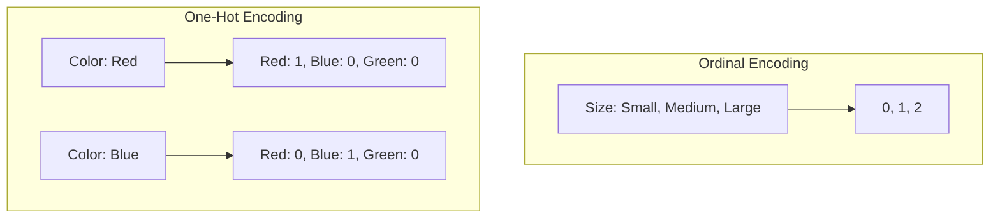
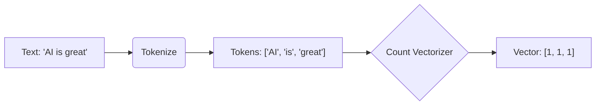

# Module 8: Feature Engineering Summary

## Overview
Feature Engineering is the art and science of transforming raw data into features that better represent the underlying problem to the predictive models, resulting in improved model accuracy on unseen data.

## Key Concepts

### 1. Categorical Encoding
Machine Learning models require numerical input.
*   **Ordinal Encoding:** For data with specific order (e.g., Low < Medium < High). Preserves rank.
*   **One-Hot Encoding:** For nominal data with no order (e.g., Apple, Banana, Cherry). Creates binary columns ($0$ or $1$). Avoids false ranking.

#### Visualizing Encoding


### 2. Text Feature Engineering (NLP Basics)
*   **Bag of Words (BoW):** Counts word frequency. Discards grammar and order.
*   **Count Vectorizer:** Converts a collection of text documents to a matrix of token counts.



### 3. Numerical Transformations
*   **Scaling:** Adjusting range (MinMax) or distribution (StandardScaler).
*   **Interaction Terms:** Creating new features by multiplying existing ones ($x_1 \times x_2$) to capture non-linear effects.

## Key Formulas

### 1. Polynomial Features (Degree 2)
For features $a, b$:
$$ \text{Features} \rightarrow 1, a, b, a^2, ab, b^2 $$
(Includes Bias $1$, original terms, squares, and interaction $ab$)

## Code for Learning

### Setup and Import
```python
import pandas as pd
import numpy as np
import matplotlib.pyplot as plt
from sklearn.preprocessing import OneHotEncoder, OrdinalEncoder, StandardScaler, PolynomialFeatures
from sklearn.compose import ColumnTransformer
from sklearn.feature_extraction.text import CountVectorizer
from sklearn.pipeline import Pipeline
```

### 1. Advanced Encoding Pipeline
Handling mixed data types is a standard industry requirement.

```python
# Sample Data
data = pd.DataFrame({
    'price': [100, 200, 150, 300],
    'city': ['London', 'Paris', 'London', 'Berlin'], # Nominal
    'quality': ['Low', 'High', 'Medium', 'High']    # Ordinal
})

# Define Transformers
# 1. Scaling for numerical
num_trans = StandardScaler()

# 2. One-Hot for nominal (City)
cat_nominal_trans = OneHotEncoder(sparse_output=False, handle_unknown='ignore')

# 3. Ordinal for ordered (Quality) - Define categories explicitly
quality_order = [['Low', 'Medium', 'High']]
cat_ordinal_trans = OrdinalEncoder(categories=quality_order)

# Combine in ColumnTransformer
preprocessor = ColumnTransformer(
    transformers=[
        ('num', num_trans, ['price']),
        ('nom', cat_nominal_trans, ['city']),
        ('ord', cat_ordinal_trans, ['quality'])
    ],
    verbose_feature_names_out=False
)

# Fit and Transform
processed_data = preprocessor.fit_transform(data)
columns = preprocessor.get_feature_names_out()

df_processed = pd.DataFrame(processed_data, columns=columns)
print(df_processed)
```

### 2. Text Vectorization (Bag of Words)
Converting text to a frequency matrix.

```python
corpus = [
    'This is the first document.',
    'This document is the second document.',
    'And this is the third one.',
    'Is this the first document?',
]

# Create Vectorizer (Count Frequency)
vectorizer = CountVectorizer(stop_words='english')

# Fit and Transform
X = vectorizer.fit_transform(corpus)

# View as DataFrame
df_bow = pd.DataFrame(X.toarray(), columns=vectorizer.get_feature_names_out())
print("Bag of Words Matrix:\n", df_bow)
```

### 3. Creating Polynomial Interactions
Capturing complex relationships.

```python
X = np.array([[2, 3], [4, 5]]) # Two features: a, b

poly = PolynomialFeatures(degree=2, include_bias=False)
X_poly = poly.fit_transform(X)

print("Original:\n", X)
print("Polynomial (a, b, a^2, ab, b^2):\n", X_poly)
```
