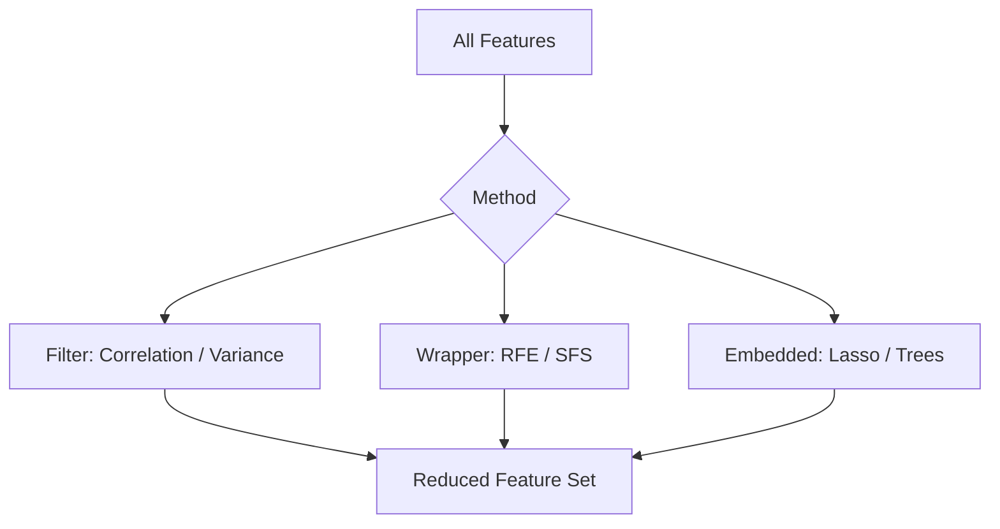

# Module 9: Feature Selection, Regularization & Model Optimization

## Overview
Feature Selection is the process of reducing the number of input variables when developing a predictive model. It is desirable to reduce the number of input variables to both reduce the computational cost of modeling and, in some cases, to improve the performance of the model. This module also covers regularization techniques, hyperparameter tuning, and model optimization strategies.

## Key Concepts

### Feature Selection Strategies



### 1. The Curse of Dimensionality
As the number of features (dimensions) increases, the amount of data needed to generalize accurately grows exponentially.
*   **Consequence:** Models become complex, slower to train, and more prone to **overfitting**.
*   **Solution:** Feature Selection / Dimensionality Reduction.

### 2. Feature Selection Methods
*   **Filter Methods:** Select features based on statistical scores (e.g., Correlation, Chi-Square) independent of the model. Fast but ignores feature interactions.
*   **Wrapper Methods:** Evaluate subsets of features by training a model (e.g., SFS, RFE). Computationally expensive but usually accurate.
*   **Embedded Methods:** Perform feature selection during the model training process (e.g., Lasso, Tree-based importance).


---

## 1. Polynomial Regression

### Concept
### Formula
For a single feature $x$, polynomial regression of degree $d$:

$$ y = \beta_0 + \beta_1 x + \beta_2 x^2 + \beta_3 x^3 + \cdots + \beta_d x^d + \epsilon $$

*   **$\beta_i$** (Pronounced: *beta sub i*): The coefficients (weights) for each polynomial term.
*   **$d$** (Pronounced: *d*): The degree of the polynomial.
*   **$\epsilon$** (Pronounced: *epsilon*): The error term.

### Polynomial Features Transform
For multiple features, polynomial features include:
- **Original features**: $x_1, x_2, \ldots, x_n$
- **Interaction terms**: $x_1 x_2, x_1 x_3, \ldots$
- **Higher powers**: $x_1^2, x_2^2, \ldots$

**Example:** For features $[x_1, x_2]$ with degree 2:
$$ [1, x_1, x_2, x_1^2, x_1 x_2, x_2^2] $$

### K-Fold Cross Validation Formula
For $k$ folds, the cross-validation score is:

$$ \text{CV Score} = \frac{1}{k} \sum_{i=1}^{k} \text{Score}_i $$

### Formula for Model Selection
For hyperparameter set $\theta$:

$$ \theta^* = \arg\max_{\theta} \text{CV-Score}(\theta) $$

*   **$\theta^*$** (Pronounced: *theta star*): The optimal set of hyperparameters.
*   **$\arg\max$** (Pronounced: *argument of the maximum*): The input value that produces the maximum output.

### Standardization (Z-score Normalization)
$$ x_{\text{scaled}} = \frac{x - \mu}{\sigma} $$

*   **$\mu$** (Pronounced: *mu*): Mean of the feature.
*   **$\sigma$** (Pronounced: *sigma*): Standard deviation.

### Min-Max Normalization
$$ x_{\text{scaled}} = \frac{x - x_{\min}}{x_{\max} - x_{\min}} $$

### Robust Scaling
$$ x_{\text{scaled}} = \frac{x - \text{median}}{\text{IQR}} $$

### Mean Squared Error (Regression)
$$ J(\beta) = \frac{1}{n} \sum_{i=1}^{n} (y_i - \hat{y}_i)^2 $$

### Mean Absolute Error (Regression)
$$ J(\beta) = \frac{1}{n} \sum_{i=1}^{n} |y_i - \hat{y}_i| $$

### Cross-Entropy Loss (Classification)
$$ J(\beta) = -\frac{1}{n} \sum_{i=1}^{n} \left[ y_i \log(\hat{y}_i) + (1-y_i) \log(1-\hat{y}_i) \right] $$

### Gradient Descent
Iterative optimization algorithm:

$$ \beta_{t+1} = \beta_t - \eta \nabla J(\beta_t) $$

*   **$\beta_{t+1}$** (Pronounced: *beta sub t plus 1*): The updated parameter vector.
*   **$\eta$** (Pronounced: *eta*): The learning rate (step size).
*   **$\nabla J$** (Pronounced: *nabla J* or *gradient of J*): The direction of steepest ascent (we subtract it to go down).

### Ridge Regression Formula
$$ J(\beta) = \text{MSE} + \lambda \sum_{j=1}^p \beta_j^2 $$

### Lasso Regression Formula
$$ J(\beta) = \text{MSE} + \lambda \sum_{j=1}^p |\beta_j| $$

### The optimization problem Lasso solves:
$$ \min_{\beta} \left\{ \frac{1}{2n} \sum_{i=1}^{n} (y_i - \hat{y}_i)^2 + \alpha \sum_{j=1}^p |\beta_j| \right\} $$

### Rule of thumb: Assymptotic Alpha
$$ \alpha_{\text{optimal}} \propto \frac{1}{\sqrt{n}} $$

### Elastic Net (Combination)
Combines both L1 and L2 penalties:

$$ J(\beta) = \text{MSE} + \lambda_1 \sum_{j=1}^p |\beta_j| + \lambda_2 \sum_{j=1}^p \beta_j^2 $$

Or equivalently:

$$ J(\beta) = \text{MSE} + \lambda \left[ \alpha \sum_{j=1}^p |\beta_j| + (1-\alpha) \sum_{j=1}^p \beta_j^2 \right] $$

Where $\alpha \in [0, 1]$ controls the L1/L2 ratio.

*   **$\lambda$** (Pronounced: *lambda*): Verification of the regularization strength.
*   **$\sum$** (Pronounced: *sum* or *sigma*): Summation operator.
*   **$|\beta_j|$** (Pronounced: *absolute value of beta j*): L1 norm component.
*   **$\beta_j^2$** (Pronounced: *beta j squared*): L2 norm component.

### Visualization


**Key Insights:**
- **Ridge**: All coefficients shrink smoothly but remain non-zero
- **Lasso**: Coefficients rapidly go to zero as $\lambda$ increases
- **Feature Selection**: Only Lasso can eliminate features completely

### 9. Advanced Applications
#### Case Study: Hiring Algorithms (Contextual Bandits)
To balance **Exploitation** (hiring known good profiles) vs **Exploration** (hiring diverse/unknown profiles to learn):
*   **Static LASSO**: Picks based on historical data. Good performance, low diversity (Bias).
*   **Contextual Bandit (Upper Confidence Bound)**: Adds an exploration bonus for underrepresented groups (high variance/uncertainty).
    *   *Result*: Increases demographic diversity while maintaining or improving hiring quality.

## Code for Learning

### Setup and Import
```python
import pandas as pd
import numpy as np
import matplotlib.pyplot as plt
import seaborn as sns
from sklearn.feature_selection import SequentialFeatureSelector, RFE, SelectKBest, f_regression
from sklearn.linear_model import LinearRegression, Lasso, Ridge
from sklearn.preprocessing import StandardScaler, PolynomialFeatures
from sklearn.model_selection import train_test_split, GridSearchCV
from sklearn.metrics import mean_squared_error
from sklearn.pipeline import Pipeline
```

### 1. Sequential Feature Selection (SFS) - Wrapper
Iteratively adds (Forward) or removes (Backward) features.

```python
# Load Dataset
df = sns.load_dataset('mpg').dropna()
X = df.drop(['mpg', 'name', 'origin'], axis=1)
y = df['mpg']

# Base Model
model = LinearRegression()

# Forward Selection: Select best 3 features
sfs = SequentialFeatureSelector(model, n_features_to_select=3, direction='forward', cv=5)
sfs.fit(X, y)

print("Selected Features (SFS):", sfs.get_feature_names_out())
```

### 2. Recursive Feature Elimination (RFE) - Wrapper
Recursively removes the least important feature based on model weights.

```python
# RFE to select top 3 features
rfe = RFE(estimator=model, n_features_to_select=3)
rfe.fit(X, y)

print("Selected Features (RFE):", rfe.get_feature_names_out())

# Ranking of all features (1 = selected)
feature_ranking = pd.DataFrame({'Feature': X.columns, 'Rank': rfe.ranking_})
print(feature_ranking.sort_values('Rank'))
```

### 3. Lasso Regression - Embedded
Using L1 regularization to zero out unimportant coefficients.

```python
# Scale data (Crucial for Regularization)
scaler = StandardScaler()
X_scaled = scaler.fit_transform(X)

# Train Lasso with specific alpha (lambda)
lasso = Lasso(alpha=0.1)
lasso.fit(X_scaled, y)

# Check Coefficients
coefs = pd.DataFrame({'Feature': X.columns, 'Coefficient': lasso.coef_})
print(coefs)

# Visualize Coefficients
plt.figure(figsize=(8, 5))
plt.barh(X.columns, lasso.coef_)
plt.axvline(0, color='black', linewidth=0.8)
plt.title("Lasso Coefficients (Zero = Functionally Removed)")
plt.show()
```

### 4. Polynomial Features & selection
Handling non-linear relationships and interactions.

```python
# Generate Polynomial Features (Degree 2 results in interactions)
poly = PolynomialFeatures(degree=2, include_bias=False)
X_poly = poly.fit_transform(X)
feature_names = poly.get_feature_names_out(X.columns)

print(f"Original features: {X.shape[1]}")
print(f"Poly features: {X_poly.shape[1]}") # Explodes to many features

# Use Lasso to select only useful polynomial features
lasso_poly = Lasso(alpha=0.5, max_iter=10000)
lasso_poly.fit(scaler.fit_transform(X_poly), y)

# Identify selected features (non-zero coeff)
selected_mask = lasso_poly.coef_ != 0
selected_features = feature_names[selected_mask]
print(f"Selected Poly Features ({len(selected_features)}):")
print(selected_features)
```
