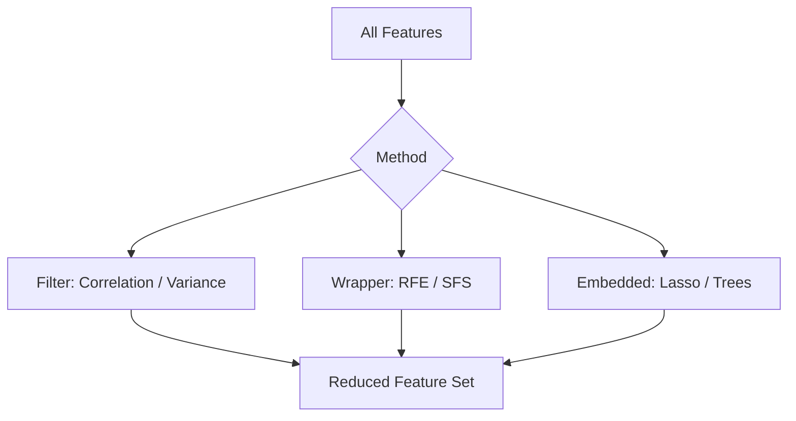
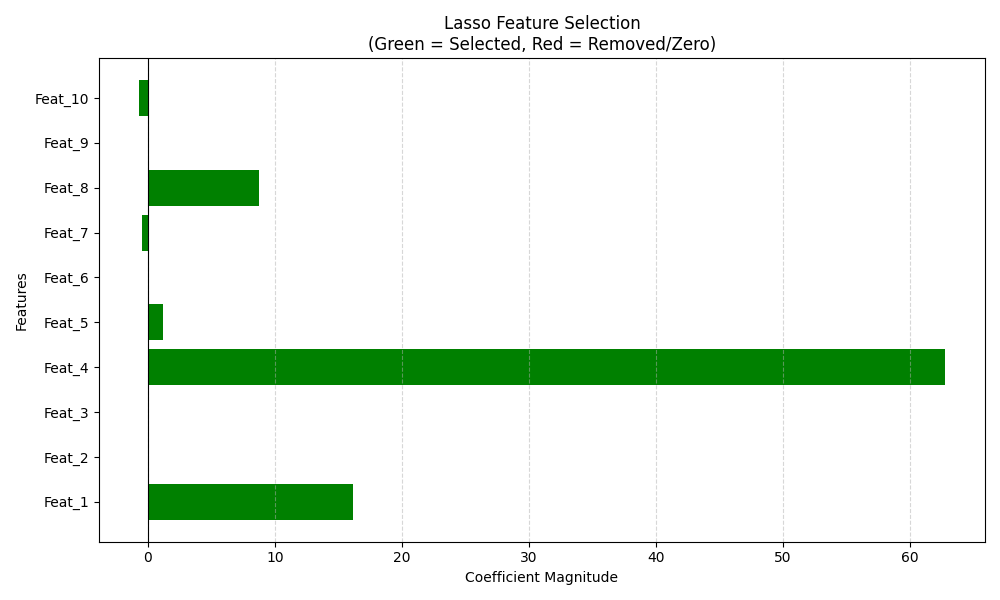
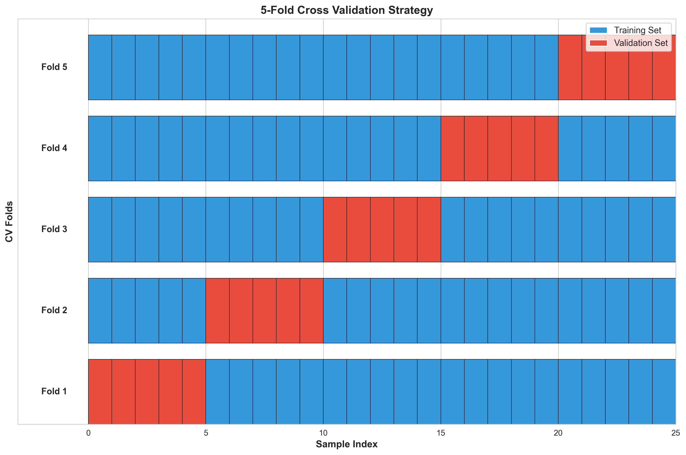
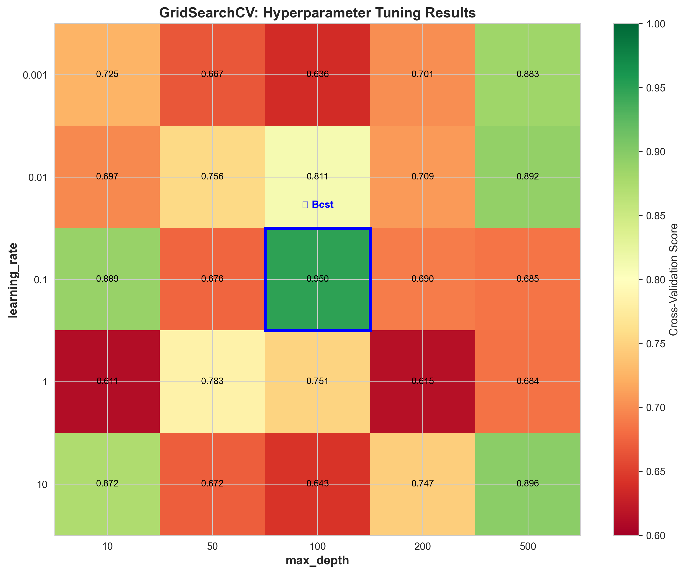
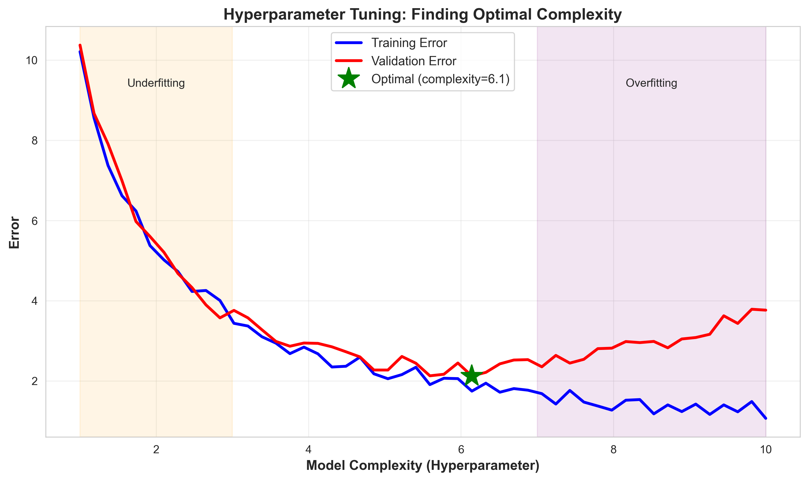
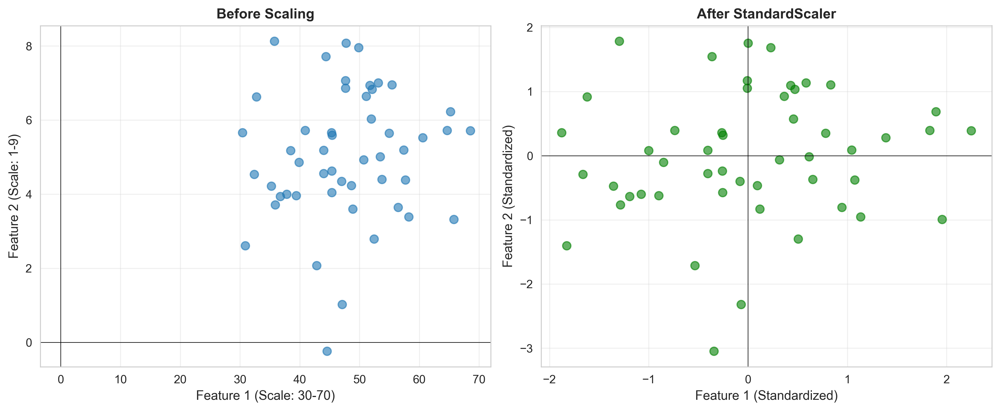
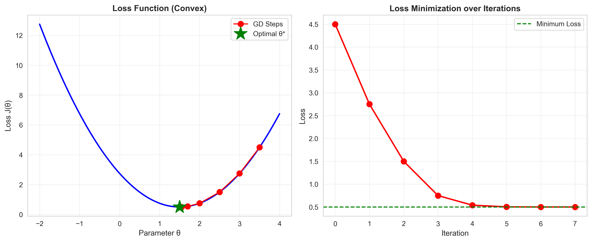
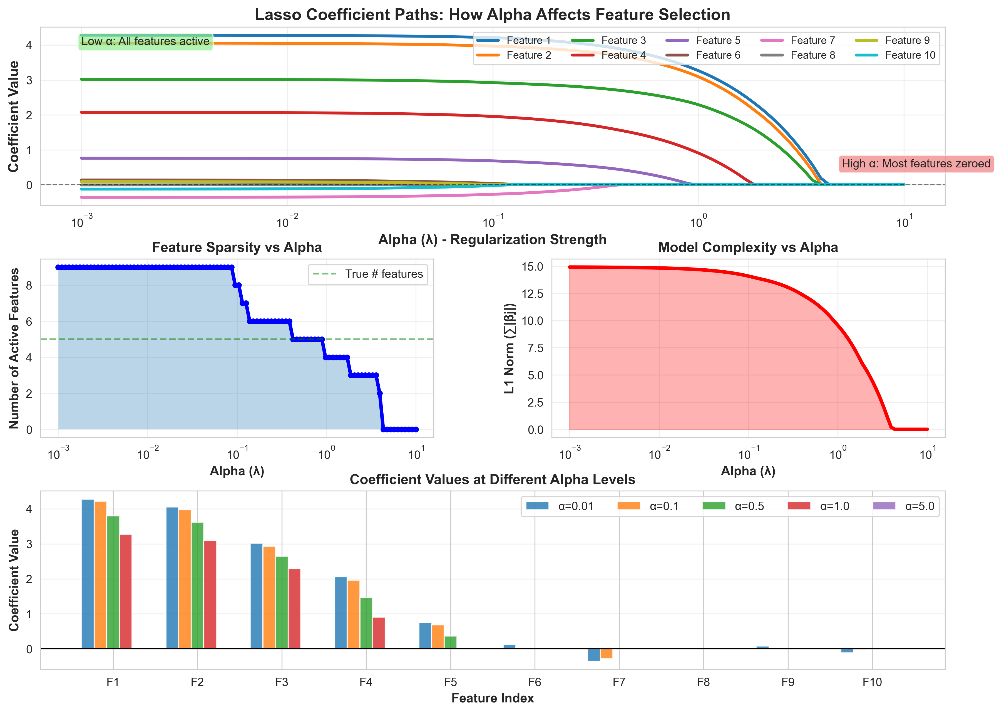
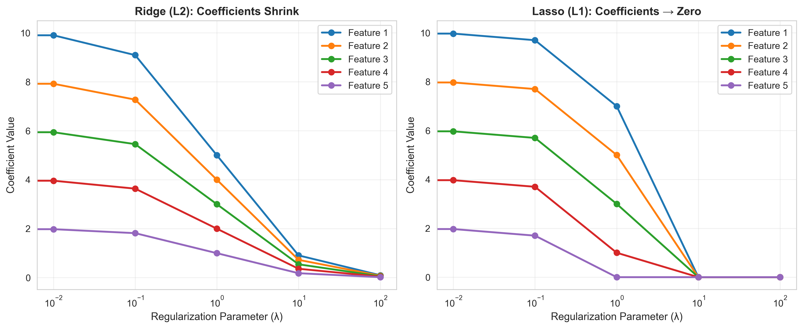

# Module 9: Feature Selection, Regularization & Model Optimization Summary

## Overview
Feature Selection is the process of reducing the number of input variables when developing a predictive model. It is desirable to reduce the number of input variables to both reduce the computational cost of modeling and, in some cases, to improve the performance of the model. This module also covers regularization techniques, hyperparameter tuning, and model optimization strategies.

## Key Concepts

### Feature Selection Strategies



### 1. The Curse of Dimensionality
As the number of features (dimensions) increases, the amount of data needed to generalize accurately grows exponentially.
*   **Consequence:** Models become complex, slower to train, and more prone to **overfitting**.
*   **Solution:** Feature Selection / Dimensionality Reduction.

### 2. Feature Selection Methods
*   **Filter Methods:** Select features based on statistical scores (e.g., Correlation, Chi-Square) independent of the model. Fast but ignores feature interactions.
*   **Wrapper Methods:** Evaluate subsets of features by training a model (e.g., SFS, RFE). Computationally expensive but usually accurate.
*   **Embedded Methods:** Perform feature selection during the model training process (e.g., Lasso, Tree-based importance).



---

## 1. Polynomial Regression

### Concept
Polynomial regression extends linear regression by adding polynomial terms to capture non-linear relationships between features and the target variable.

### Formula
For a single feature $x$, polynomial regression of degree $d$:

$$ y = \beta_0 + \beta_1 x + \beta_2 x^2 + \beta_3 x^3 + \cdots + \beta_d x^d + \epsilon $$

Where:
*   **$\beta_0, \beta_1, \ldots, \beta_d$**: Coefficients for each polynomial term
*   **$d$**: Degree of the polynomial
*   **$\epsilon$**: Error term

### Polynomial Features Transform
For multiple features, polynomial features include:
- **Original features**: $x_1, x_2, \ldots, x_n$
- **Interaction terms**: $x_1 x_2, x_1 x_3, \ldots$
- **Higher powers**: $x_1^2, x_2^2, \ldots$

**Example:** For features $[x_1, x_2]$ with degree 2:
$$ [1, x_1, x_2, x_1^2, x_1 x_2, x_2^2] $$

### Visualization


**Key Insights:**
- **Low degree (1)**: May underfit (high bias)
- **Optimal degree (2-3)**: Captures pattern without overfitting
- **High degree (9)**: Overfits training data (high variance)

### How Polynomial Degree Works

#### What is Polynomial Degree?
The **degree** of a polynomial is the highest power of the variable in the equation. It controls the **flexibility** and **complexity** of the model.

**Examples:**
- Degree 1: $y = \beta_0 + \beta_1 x$ (straight line)
- Degree 2: $y = \beta_0 + \beta_1 x + \beta_2 x^2$ (parabola/curve)
- Degree 3: $y = \beta_0 + \beta_1 x + \beta_2 x^2 + \beta_3 x^3$ (S-shaped curve)
- Degree $d$: Can have up to $d-1$ turning points

#### Number of Features Growth
For $n$ original features and degree $d$, the number of polynomial features grows rapidly:

$$ \text{Number of features} = \binom{n + d}{d} = \frac{(n + d)!}{n! \cdot d!} $$

**Example with 2 features:**
- Degree 1: **2 features** → $[x_1, x_2]$
- Degree 2: **6 features** → $[x_1, x_2, x_1^2, x_1 x_2, x_2^2, 1]$
- Degree 3: **10 features** → $[x_1, x_2, x_1^2, x_1 x_2, x_2^2, x_1^3, x_1^2 x_2, x_1 x_2^2, x_2^3, 1]$
- Degree 4: **15 features**
- Degree 5: **21 features**

**Example with 10 features:**
- Degree 1: **10 features**
- Degree 2: **66 features**
- Degree 3: **286 features**
- Degree 4: **1,001 features** (⚠️ feature explosion!)

#### The Bias-Variance Tradeoff

| Degree | Model Behavior | Bias | Variance | Risk |
|--------|---------------|------|----------|------|
| **Too Low (1)** | Straight line, simple | High | Low | **Underfitting** |
| **Optimal (2-4)** | Captures true pattern | Balanced | Balanced | Good generalization |
| **Too High (>5)** | Wiggly, fits noise | Low | High | **Overfitting** |

#### How Degree Affects the Model

**Degree 1 (Linear):**
- Assumes linear relationship
- Cannot capture curves
- Good when data is truly linear
- Fast to train, stable

**Degree 2 (Quadratic):**
- Can model U-shaped or inverted-U patterns
- Single curve/bend
- Often optimal for real-world data
- Examples: projectile motion, profit optimization

**Degree 3 (Cubic):**
- Can model S-shaped curves
- Up to 2 turning points
- Useful for growth curves, sigmoid-like patterns
- Examples: population growth, learning curves

**Degrees 4-6:**
- Multiple curves and turning points
- Higher risk of overfitting
- Only use with strong domain knowledge
- Requires more data to fit reliably

**Degrees 7+:**
- Extremely flexible, likely overfit
- Fits random noise in training data
- Poor generalization to new data
- Usually avoid unless specific domain need

#### Choosing the Right Degree

**Method 1: Cross-Validation**
```python
from sklearn.preprocessing import PolynomialFeatures
from sklearn.linear_model import LinearRegression
from sklearn.model_selection import cross_val_score

best_degree = 1
best_score = -np.inf

for degree in range(1, 10):
    poly = PolynomialFeatures(degree=degree)
    X_poly = poly.fit_transform(X)
    
    model = LinearRegression()
    scores = cross_val_score(model, X_poly, y, cv=5, scoring='r2')
    
    if scores.mean() > best_score:
        best_score = scores.mean()
        best_degree = degree

print(f"Optimal degree: {best_degree}")
```

**Method 2: Learning Curves**
- Plot training and validation error vs degree
- Choose degree where validation error is minimized
- Avoid degree where gap between train/val error is large

**Method 3: Domain Knowledge**
- Physics: Often degree 2 (quadratic relationships)
- Biology/economics: Often degree 2-3 (growth, saturation)
- Time series: Often degree 1-2 (trends)

#### Practical Guidelines

✅ **Do:**
- Start with degree 2 or 3
- Use cross-validation to select degree
- Combine with regularization (Ridge/Lasso) for higher degrees
- Scale features before polynomial transformation
- Check if simpler model (degree 1) is sufficient

❌ **Don't:**
- Use degree > 5 without strong justification
- Forget to scale features (polynomial values explode!)
- Ignore feature explosion with many original features
- Choose degree based on training error alone

#### Regularization with Polynomial Features

Higher degrees create many features → use regularization to prevent overfitting:

**Ridge Regression:**
```python
from sklearn.preprocessing import PolynomialFeatures, StandardScaler
from sklearn.linear_model import Ridge
from sklearn.pipeline import Pipeline

model = Pipeline([
    ('scaler', StandardScaler()),
    ('poly', PolynomialFeatures(degree=5)),
    ('ridge', Ridge(alpha=1.0))  # Regularization prevents overfitting
])
model.fit(X_train, y_train)
```

**Key Insight:** Regularization allows using higher degrees (more flexibility) while constraining coefficients to prevent overfitting.

---

## 2. Cross Validation

### Concept
Cross Validation is a resampling technique used to evaluate model performance on unseen data and mitigate overfitting. It splits data into multiple train/validation sets to get a more robust estimate of model performance.

### K-Fold Cross Validation Formula
For $k$ folds, the cross-validation score is:

$$ \text{CV Score} = \frac{1}{k} \sum_{i=1}^{k} \text{Score}_i $$

Where $\text{Score}_i$ is the performance metric (e.g., accuracy, R²) on the $i$-th fold.

### Types
*   **K-Fold CV**: Data split into $k$ equal folds; each fold used once as validation
*   **Stratified K-Fold**: Maintains class distribution in each fold (for classification)
*   **Leave-One-Out CV (LOOCV)**: $k = n$ (each sample is a fold)
*   **Time Series CV**: Respects temporal order (no future data in training)

### Visualization


**Benefits:**
- More reliable performance estimate than single train/test split
- Uses all data for both training and validation
- Reduces variance in model evaluation

---

## 3. GridSearchCV

### Concept
GridSearchCV performs an exhaustive search over a specified hyperparameter grid, evaluating each combination using cross-validation to find the optimal hyperparameters.

### Algorithm
1. Define hyperparameter grid: $\{(\lambda_1, \alpha_1), (\lambda_1, \alpha_2), \ldots, (\lambda_m, \alpha_n)\}$
2. For each combination:
   - Perform k-fold cross validation
   - Calculate average CV score
3. Select combination with best score

### Formula for Model Selection
For hyperparameter set $\theta$:

$$ \theta^* = \arg\max_{\theta} \text{CV-Score}(\theta) $$

Where CV-Score is the mean cross-validation score across all folds.

### Visualization


**Usage Pattern:**
```python
from sklearn.model_selection import GridSearchCV

param_grid = {
    'alpha': [0.001, 0.01, 0.1, 1, 10],
    'max_iter': [100, 500, 1000]
}

grid_search = GridSearchCV(
    estimator=Ridge(),
    param_grid=param_grid,
    cv=5,
    scoring='r2'
)
grid_search.fit(X_train, y_train)
print(f"Best params: {grid_search.best_params_}")
```

---

## 4. Hyperparameters

### Concept
Hyperparameters are configuration settings that are set **before** training and control the learning process. Unlike model parameters (weights), hyperparameters are not learned from data.

### Common Hyperparameters
*   **Regularization strength ($\lambda$ or `alpha`)**: Controls penalty magnitude
*   **Learning rate**: Step size in gradient descent
*   **Number of iterations/epochs**: How long to train
*   **Number of hidden layers/neurons**: Neural network architecture
*   **Tree depth**: Maximum depth for decision trees
*   **Number of neighbors ($k$)**: For k-NN algorithm

### Impact on Model Performance


**Key Trade-offs:**
- **Too simple** (low complexity): Underfitting → High training & validation error
- **Optimal**: Low validation error, generalizes well
- **Too complex** (high complexity): Overfitting → Low training error, high validation error

---

## 5. Feature Scaling

### Concept
Feature scaling normalizes the range of features to ensure all features contribute equally to the model. Essential for distance-based algorithms and gradient descent optimization.

### Common Scaling Methods

#### Standardization (Z-score Normalization)
$$ x_{\text{scaled}} = \frac{x - \mu}{\sigma} $$

Where:
*   **$\mu$**: Mean of feature
*   **$\sigma$**: Standard deviation of feature

**Result:** Mean = 0, Standard Deviation = 1

#### Min-Max Normalization
$$ x_{\text{scaled}} = \frac{x - x_{\min}}{x_{\max} - x_{\min}} $$

**Result:** Range = [0, 1]

#### Robust Scaling
$$ x_{\text{scaled}} = \frac{x - \text{median}}{\text{IQR}} $$

Where IQR = 75th percentile - 25th percentile

**Result:** Robust to outliers

### Visualization


**When to Scale:**
✓ Linear/Logistic Regression with regularization  
✓ K-Nearest Neighbors (KNN)  
✓ Support Vector Machines (SVM)  
✓ Neural Networks  
✓ Principal Component Analysis (PCA)

**When NOT to Scale:**
✗ Tree-based models (Decision Trees, Random Forests, XGBoost)

---

## 6. Loss Minimization

### Concept
The goal of training is to minimize a loss function $J(\theta)$ that quantifies the error between predictions and true values. Optimization algorithms (like gradient descent) iteratively update parameters to find the minimum.

### Common Loss Functions

#### Mean Squared Error (Regression)
$$ J(\beta) = \frac{1}{n} \sum_{i=1}^{n} (y_i - \hat{y}_i)^2 $$

#### Mean Absolute Error (Regression)
$$ J(\beta) = \frac{1}{n} \sum_{i=1}^{n} |y_i - \hat{y}_i| $$

#### Cross-Entropy Loss (Classification)
$$ J(\beta) = -\frac{1}{n} \sum_{i=1}^{n} \left[ y_i \log(\hat{y}_i) + (1-y_i) \log(1-\hat{y}_i) \right] $$

### Gradient Descent
Iterative optimization algorithm:

$$ \beta_{t+1} = \beta_t - \eta \nabla J(\beta_t) $$

Where:
*   **$\eta$** (eta): Learning rate (hyperparameter)
*   **$\nabla J(\beta_t)$**: Gradient of loss with respect to parameters

### Visualization


**Process:**
1. Initialize parameters randomly
2. Compute loss and gradient
3. Update parameters in direction that reduces loss
4. Repeat until convergence

---

## 7. Ridge Regression (L2 Regularization)

### Concept
Ridge regression adds a penalty proportional to the **square** of coefficient magnitudes to prevent overfitting. It shrinks coefficients but rarely sets them to exactly zero.

### Formula
$$ J(\beta) = \underbrace{\frac{1}{n} \sum_{i=1}^{n} (y_i - \hat{y}_i)^2}_{\text{MSE (Loss)}} + \underbrace{\lambda \sum_{j=1}^{p} \beta_j^2}_{\text{L2 Penalty}} $$

Where:
*   **$\lambda$** (lambda or `alpha`): Regularization strength (hyperparameter)
*   **$\beta_j$**: Model coefficients
*   **$p$**: Number of features

### Effect of $\lambda$
- **$\lambda = 0$**: No regularization (standard linear regression)
- **$\lambda \to 0$**: Minimal penalty, coefficients close to unregularized values
- **$\lambda$ large**: Strong penalty, coefficients shrink toward zero
- **$\lambda \to \infty$**: All coefficients → 0 (intercept-only model)

### When to Use Ridge
✓ Multicollinearity (highly correlated features)  
✓ More features than observations ($p > n$)  
✓ Want to keep all features but reduce their impact  
✓ Prevent overfitting in high-dimensional data

---

## 8. Regularization (Ridge vs Lasso)

### Concept
Regularization adds a penalty term to the loss function to constrain model complexity and prevent overfitting.

### Comparison

| Aspect | Ridge (L2) | Lasso (L1) |
|--------|-----------|-----------|
| **Penalty** | $\lambda \sum \beta_j^2$ | $\lambda \sum \|\beta_j\|$ |
| **Coefficient Behavior** | Shrinks toward zero | Sets some to **exactly zero** |
| **Feature Selection** | No | **Yes** (automatic) |
| **Solution** | Analytical (closed-form) | Numerical (iterative) |
| **Multicollinearity** | Handles well | Picks one from correlated group |
| **Use Case** | Keep all features | Select important features |

### Ridge Regression Formula
$$ J(\beta) = \text{MSE} + \lambda \sum_{j=1}^p \beta_j^2 $$

### Lasso Regression Formula
$$ J(\beta) = \text{MSE} + \lambda \sum_{j=1}^p |\beta_j| $$

Where:
*   **$\lambda$** (lambda, called `alpha` in sklearn): Regularization strength (hyperparameter)
*   **$|\beta_j|$**: Absolute value of each coefficient (L1 penalty)
*   **$p$**: Number of features

### How Alpha (λ) Works in Lasso

#### What is Alpha?
**Alpha** (`alpha` in scikit-learn, mathematically $\lambda$) is the regularization strength parameter that controls the tradeoff between:
1. **Fitting the data well** (minimizing MSE)
2. **Keeping coefficients small** (minimizing the sum of absolute coefficients)

The optimization problem Lasso solves:
$$ \min_{\beta} \left\{ \frac{1}{2n} \sum_{i=1}^{n} (y_i - \hat{y}_i)^2 + \alpha \sum_{j=1}^p |\beta_j| \right\} $$

#### Impact of Alpha Values

| Alpha (α) | Effect on Coefficients | Number of Features | Model Behavior |
|-----------|----------------------|-------------------|----------------|
| **α = 0** | No penalty (OLS) | All features | Overfitting risk, no selection |
| **α → 0** (very small, e.g., 0.001) | Slight shrinkage | Most features active | Similar to linear regression |
| **α small** (e.g., 0.01-0.1) | Moderate shrinkage | Many features active | Some feature selection |
| **α medium** (e.g., 0.5-2) | Strong shrinkage | Few important features | Good feature selection |
| **α large** (e.g., 5-10) | Very strong penalty | Very few features | Aggressive selection, may underfit |
| **α → ∞** | All coefficients → 0 | 0 features (intercept only) | Severe underfitting |

#### Visualization of Alpha Impact


**Key Observations from the Visualization:**
1. **Coefficient Paths (top)**: Shows how each feature's coefficient changes as α increases
   - Important features (blue/orange lines) remain non-zero longer
   - Less important features quickly go to zero
2. **Feature Sparsity (bottom-left)**: Number of active features decreases as α increases
3. **Model Complexity (bottom-right)**: Total magnitude of coefficients (L1 norm) decreases with α
4. **Coefficient Comparison (bottom)**: Side-by-side view at different α values

#### How Alpha Affects Feature Selection

**Low Alpha (0.01):**
```python
lasso = Lasso(alpha=0.01)
lasso.fit(X_scaled, y)
# Result: Most coefficients non-zero, minimal feature selection
# Example: [2.3, 1.8, 1.5, 0.9, 0.5, 0.3, 0.2, 0.1, 0.05, 0.02]
```

**Medium Alpha (1.0):**
```python
lasso = Lasso(alpha=1.0)
lasso.fit(X_scaled, y)
# Result: Only important features survive
# Example: [2.1, 1.5, 0.8, 0.0, 0.0, 0.0, 0.0, 0.0, 0.0, 0.0]
```

**High Alpha (10.0):**
```python
lasso = Lasso(alpha=10.0)
lasso.fit(X_scaled, y)
# Result: Very few or no features
# Example: [0.3, 0.0, 0.0, 0.0, 0.0, 0.0, 0.0, 0.0, 0.0, 0.0]
```

#### Choosing the Optimal Alpha

**Method 1: Cross-Validation (Recommended)**
```python
from sklearn.linear_model import LassoCV

# Automatically finds best alpha using CV
lasso_cv = LassoCV(alphas=np.logspace(-4, 1, 100), cv=5)
lasso_cv.fit(X_scaled, y)

print(f"Optimal alpha: {lasso_cv.alpha_:.4f}")
print(f"Number of selected features: {np.sum(lasso_cv.coef_ != 0)}")
```

**Method 2: GridSearchCV**
```python
from sklearn.model_selection import GridSearchCV

param_grid = {'alpha': [0.001, 0.01, 0.1, 0.5, 1, 5, 10]}
grid = GridSearchCV(Lasso(), param_grid, cv=5, scoring='neg_mean_squared_error')
grid.fit(X_scaled, y)

print(f"Best alpha: {grid.best_params_['alpha']}")
```

**Method 3: Regularization Path**
```python
from sklearn.linear_model import lasso_path

alphas, coefs, _ = lasso_path(X_scaled, y, alphas=np.logspace(-4, 1, 100))

# Plot to visualize when features drop to zero
plt.plot(alphas, coefs.T)
plt.xscale('log')
plt.xlabel('Alpha')
plt.ylabel('Coefficients')
plt.title('Lasso Regularization Path')
```

#### Practical Guidelines for Alpha Selection

✅ **Do:**
- Use **LassoCV** to automatically select optimal α via cross-validation
- Start with a wide range: `alphas=np.logspace(-4, 2, 100)`
- **Always scale features** before applying Lasso (use `StandardScaler`)
- Check how many features are selected at different α values
- Validate on test set after selecting α on training/validation data

❌ **Don't:**
- Choose α based on training error alone (will select α=0)
- Use the same α value for different datasets without tuning
- Forget to scale features (different scales → unfair penalization)
- Use extremely small α (loses regularization benefit)
- Use extremely large α (may eliminate all features)

#### Alpha in Different Scenarios

**High-Dimensional Data (p >> n):**
- Use higher α values (e.g., 1-10)
- Goal: Aggressive feature selection to reduce overfitting
- Example: Gene expression data (20,000 features, 100 samples)

**Moderate Dimensions (p ≈ n):**
- Use medium α values (e.g., 0.1-1)
- Goal: Balance between selection and retention
- Example: Marketing data (50 features, 100 samples)

**Low Dimensions (p << n):**
- Use lower α values (e.g., 0.01-0.1)
- Goal: Slight regularization, minimal selection
- Example: Simple prediction (5 features, 1000 samples)

#### Relationship: Alpha vs Number of Features

As a rule of thumb:
$$ \alpha_{\text{optimal}} \propto \frac{1}{\sqrt{n}} $$

Where $n$ is the number of samples. More data → can use smaller α (less regularization needed).

#### Warning: Feature Scaling is CRITICAL

**Without Scaling:**
```python
# BAD: Features on different scales
lasso = Lasso(alpha=1.0)
lasso.fit(X, y)  # Feature 1 (0-1000), Feature 2 (0-1)
# Result: Feature 2 heavily penalized due to already small scale!
```

**With Scaling:**
```python
# GOOD: All features on same scale
scaler = StandardScaler()
X_scaled = scaler.fit_transform(X)
lasso = Lasso(alpha=1.0)
lasso.fit(X_scaled, y)
# Result: Fair penalization based on actual importance
```


### Elastic Net (Combination)
Combines both L1 and L2 penalties:

$$ J(\beta) = \text{MSE} + \lambda_1 \sum_{j=1}^p |\beta_j| + \lambda_2 \sum_{j=1}^p \beta_j^2 $$

Or equivalently:

$$ J(\beta) = \text{MSE} + \lambda \left[ \alpha \sum_{j=1}^p |\beta_j| + (1-\alpha) \sum_{j=1}^p \beta_j^2 \right] $$

Where $\alpha \in [0, 1]$ controls the L1/L2 ratio.

### Visualization


**Key Insights:**
- **Ridge**: All coefficients shrink smoothly but remain non-zero
- **Lasso**: Coefficients rapidly go to zero as $\lambda$ increases
- **Feature Selection**: Only Lasso can eliminate features completely

## Code for Learning

### Setup and Import
```python
import pandas as pd
import numpy as np
import matplotlib.pyplot as plt
import seaborn as sns
from sklearn.feature_selection import SequentialFeatureSelector, RFE, SelectKBest, f_regression
from sklearn.linear_model import LinearRegression, Lasso, Ridge
from sklearn.preprocessing import StandardScaler, PolynomialFeatures
from sklearn.model_selection import train_test_split, GridSearchCV
from sklearn.metrics import mean_squared_error
from sklearn.pipeline import Pipeline
```

### 1. Sequential Feature Selection (SFS) - Wrapper
Iteratively adds (Forward) or removes (Backward) features.

```python
# Load Dataset
df = sns.load_dataset('mpg').dropna()
X = df.drop(['mpg', 'name', 'origin'], axis=1)
y = df['mpg']

# Base Model
model = LinearRegression()

# Forward Selection: Select best 3 features
sfs = SequentialFeatureSelector(model, n_features_to_select=3, direction='forward', cv=5)
sfs.fit(X, y)

print("Selected Features (SFS):", sfs.get_feature_names_out())
```

### 2. Recursive Feature Elimination (RFE) - Wrapper
Recursively removes the least important feature based on model weights.

```python
# RFE to select top 3 features
rfe = RFE(estimator=model, n_features_to_select=3)
rfe.fit(X, y)

print("Selected Features (RFE):", rfe.get_feature_names_out())

# Ranking of all features (1 = selected)
feature_ranking = pd.DataFrame({'Feature': X.columns, 'Rank': rfe.ranking_})
print(feature_ranking.sort_values('Rank'))
```

### 3. Lasso Regression - Embedded
Using L1 regularization to zero out unimportant coefficients.

```python
# Scale data (Crucial for Regularization)
scaler = StandardScaler()
X_scaled = scaler.fit_transform(X)

# Train Lasso with specific alpha (lambda)
lasso = Lasso(alpha=0.1)
lasso.fit(X_scaled, y)

# Check Coefficients
coefs = pd.DataFrame({'Feature': X.columns, 'Coefficient': lasso.coef_})
print(coefs)

# Visualize Coefficients
plt.figure(figsize=(8, 5))
plt.barh(X.columns, lasso.coef_)
plt.axvline(0, color='black', linewidth=0.8)
plt.title("Lasso Coefficients (Zero = Functionally Removed)")
plt.show()
```

### 4. Polynomial Features & selection
Handling non-linear relationships and interactions.

```python
# Generate Polynomial Features (Degree 2 results in interactions)
poly = PolynomialFeatures(degree=2, include_bias=False)
X_poly = poly.fit_transform(X)
feature_names = poly.get_feature_names_out(X.columns)

print(f"Original features: {X.shape[1]}")
print(f"Poly features: {X_poly.shape[1]}") # Explodes to many features

# Use Lasso to select only useful polynomial features
lasso_poly = Lasso(alpha=0.5, max_iter=10000)
lasso_poly.fit(scaler.fit_transform(X_poly), y)

# Identify selected features (non-zero coeff)
selected_mask = lasso_poly.coef_ != 0
selected_features = feature_names[selected_mask]
print(f"Selected Poly Features ({len(selected_features)}):")
print(selected_features)
```
